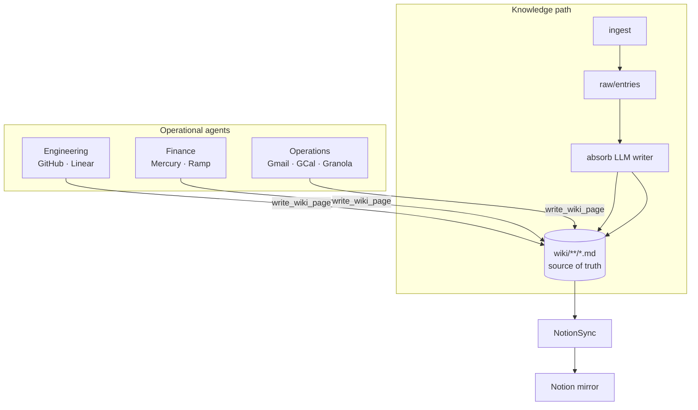

# FourSeven 四库七阁

The automated platform that covers any information circulation within a company.

FourSeven (seven archives of four repositories) is the maintenance layer for an internal company wiki. The wiki is a directory of **Markdown files (the source of truth)** that is mirrored to [Notion](https://www.notion.so). Agents ingest information from various sources, compile it into structured wiki articles, and sync those Markdown pages to your Notion workspace via the [Notion CLI](https://developers.notion.com/cli/get-started/overview).

The *seven archives of the four repositories* (四库七阁) was the largest library in Chinese history. It refers to the *Siku Quanshu* (四库全书, "Complete Library of the Four Treasuries"), commissioned by the Qianlong Emperor and compiled between 1772 and 1782, which organized its contents into four repositories. Seven hand-copied sets of the collection were produced, each housed in its own imperial archive (阁) — the seven archives that give FourSeven its name.

## Expectations

FourSeven is built to boost startup operational efficiency. It does not replace all
the work that still needs doing. Agents can save you and your team a lot of time, but
they only help when you are willing to work with them. An agent cannot chase you down
or hold you accountable — you can ignore its messages with no consequences. The people
who benefit most are the ones who want to be helped.

Operations work is part of a startup's day-to-day. Most of the boring items are already
handled here; get your head down and finish the rest.

That posture is deliberate. Features like `pending_reply_monitor`, `follow_up_nudger`,
`daily_brief`, `stale_action_escalator`, and draft-unsent nudges are intentionally out
of scope: agents should not chase people to do their work. You should be proactively
doing work and treat agents as valuable assistance — not as a nagging layer you can
tune out. We keep the features that earn their place and skip code that adds noise
without enough payoff.

## Data flow

Information always flows **MD first, Notion second**:



```
intake -> raw/entries/*.md -> absorb (LLM writer) -> wiki/**/*.md (source of truth) -> NotionSync -> Notion (mirror)
```

- **Knowledge path**: `ingest` mechanically writes raw Markdown entries; `absorb` is an LLM writer that synthesizes them into wiki articles (theme-organized, `[[wikilinks]]`, cited sources).
- **Operational path**: department agents write their pages (open PRs, expense reports) directly as Markdown via `write_wiki_page`, then sync.

The wiki Markdown lives on a shared volume (`COMPANY_BRAIN_WIKI_DIR`, e.g. `/workspace/wiki` on a smol cloud VM). The binding to each Notion page is stored in the file's frontmatter (`notion_page_id`).

## Agents

Agents are organized **department → platform → agents**. Each department has one or
more persistent **managers** that dispatch specialist agents based on what they find.
This section is a high-level map of the departments and the platforms they cover —
for the detailed work, scope, sources, and destinations of every agent, see the
**[Agent Handbook](docs/agents/README.md)** (`docs/agents/` — one file per department).

### Engineering

- **GitHub** — open PR tracking, branch/environment status, weekly feature updates, and a user-facing product features list. Dispatched by `github_manager.py`.
- **Linear** — the cross-platform task hub. `linear_manager.py` polls for terminal issues and propagates completion to the originating platform; specialists handle slot checks, stale audits, manual management, and workspace structure proposals. A `task_bindings` registry gives every task one identity across Gmail, Granola, Slack, and Notion (`engineering/linear/`).

### Finance

- **Mercury** — bank transactions, IO card spend, and total-asset snapshots (bank + treasury).
- **Ramp** — card spend categorized by QuickBooks category (via the Ramp MCP server).

Finance has two managers — `monthly_expense.py` and `quarterly_calculation.py` — that
span both platforms, plus department-level cross-platform agents (budget summary,
subscription audit, manual-accounting requests). All read-only at the source.

### Operations

The catch-all department for general platforms that don't belong to a more specific
department (Gmail, Slack ops, Notion ops, ...).

- **Gmail** — MCP + REST executive assistant (Phases 0–5): triage, CRM, Linear task creation (via the engineering Linear client), receipt routing, meeting scheduling (`ext_meeting_scheduler` + GCal), and **service profiles** (EA / employee / service account). Posture: **read + labels + draft compose only — never send**.
- **Google Calendar** — availability lookup, meeting booking (with Meet links), optional morning Slack agenda DM (off by default).
- **Granola** — meeting notes ingested after each meeting ends (calendar-driven), with a weekly miss check as backstop (business: per-member API keys; enterprise: single company-wide key); meeting action items become Linear tasks. Read-only at the source.
- **Slack** — watches configured channels for action-item threads and turns them into Linear tasks; replies to the thread when the task is completed.
- **Notion** — multi-database task registry: links existing task rows into `task_bindings` by Linear ID (read-first) and propagates Linear status back to the correct database row.

## Self-maintaining foundation

Agents run a closed, eval-gated loop in `BaseAgent.execute()`: `should_run` (cheap cost gate) -> `run` -> `verify` (triage: ok / rework / noise), up to `max_iterations`.

- **Eval gate**: state-changing agents implement `verify()`; consequential changes can be verified in an ephemeral [smol](https://github.com/smol-machines/smolvm) sandbox (`COMPANY_BRAIN_SANDBOX=smolvm`) before committing — reproduce, then commit only if it passes.
- **Cost gates**: expensive agents implement `should_run()` using cheap change-detection (`agents/gates.py`) so no LLM is invoked when nothing changed; re-fires dedup via stored "handled" state.
- **Notify selectively**: **every** human-facing message goes through `notify.Notifier` / `Signal` (never a direct Slack call) — detect everything, deliver only what's `actionable`/`alert`; `info` and routine ticks are silent.

## Cloud direction (smol VMs)

The target state runs every agent in an isolated [smol](https://github.com/smol-machines/smolvm) cloud VM: company-brain spans a multi-VM fleet, managers spin up specialist VMs on demand (via the forthcoming `smol machine` CLI), and all VMs share the wiki volume. Agents dispatch through an `AgentRuntime` (`COMPANY_BRAIN_RUNTIME=local|smolcloud`) so the same code runs in-process today and on a VM later. VM config lives in the `Smolfile`.

## Setup (agent-assisted)

company-brain is designed to be installed with the help of an AI coding agent.
Open this repo in your AI coding agent and ask it to **"set up company-brain"** —
it follows [`project_install.md`](project_install.md), a step-by-step runbook that picks the mode,
installs the CLIs, connects your platforms (with read-only finance tokens), runs
the onboarding agents, and verifies everything with `company-brain doctor`.

Manual fallback:

```bash
pip install -e .
cp .env.example .env      # fill in tokens
company-brain doctor      # shows mode, wiki location, and what's connected
ntn login && company-brain init
```

### Local vs cloud

- **Local** (default): the wiki Markdown lives in `./wiki` inside the project
  folder (gitignored). Run everything on one machine.
- **Cloud**: the wiki Markdown lives on the smol cloud VM's persistent storage at
  `/workspace/wiki`. Set `COMPANY_BRAIN_MODE=cloud`.

`company-brain doctor` reports the active mode and connection status. See
`.env.example` for all environment variables.

### Models (which LLM powers the agents)

Agents run on **two SDKs**: the Claude Agent SDK (MCP-native, big-context
reasoning agents) and the OpenAI Agents SDK (provider-flexible specialists). One
knob — `COMPANY_BRAIN_LLM_PROVIDER`, resolved against `config/models.yaml` —
switches the model:

- **`anthropic` / `openai`** — hosted provider APIs via your key. Default for
  **local** installs (no GPU needed).
- **`glm`** — open-source [GLM-5](https://github.com/zai-org/GLM-5) behind an
  OpenAI-compatible endpoint, so **no external tokens are billed**. Easiest install
  is via [Ollama](https://ollama.com) (`ollama pull glm-5`, served at `:11434/v1`).
  It is the **cloud** option (self-hosted on the GPU VM) or a remote open-source
  host a local install connects to via `GLM_BASE_URL`. Locally installing GLM-5 is
  not realistic.

## Commands

| Command                          | Description                                                          |
| -------------------------------- | -------------------------------------------------------------------- |
| `company-brain doctor`           | Show mode, wiki location, runtime, and platform connection status    |
| `company-brain init`             | Discover existing workspace content, set up Notion wiki structure    |
| `company-brain ingest <source>`  | Run an ingestion agent; writes raw Markdown entries to `raw/entries/`|
| `company-brain absorb`           | LLM writer compiles raw entries into wiki Markdown articles, then syncs to Notion |
| `company-brain query <question>` | Query the wiki (reads the Markdown index/backlinks)                  |
| `company-brain sync`             | Push changed wiki Markdown pages to Notion (MD is the source of truth)|
| `company-brain status`           | Show wiki statistics                                                 |
| `company-brain cleanup`          | Audit and enrich articles                                            |


## Project Structure

```
company-brain/
  project_install.md      # Agent-assisted setup runbook
  Smolfile                # smol VM image, network allow-list, shared wiki volume
  config/                 # wiki, notion, finance, engineering, operations, models
  src/company_brain/
    cli.py · config.py · runtime/ · wiki/ · notion/ · doctor/ · llm/
    agents/               # department → platform → agent
      engineering/        # github_manager, github/, linear/
      finance/            # monthly_expense, quarterly_calculation, mercury/, ramp/
      operations/         # gmail_manager, gmail/, gcal/, granola/
  docs/agents/            # Agent handbook — schedules, diagrams, per-agent detail
  wiki/ · raw/entries/    # Gitignored locally; shared volume in cloud
```

Agent filenames, schedules, and data flow diagrams live in [`docs/agents/`](docs/agents/README.md), not here.

## Configuration

- **`config/wiki.yaml`** defines the wiki taxonomy: sections, article types, and writing conventions.
- **`config/notion.yaml`** maps wiki sections to Notion page IDs. Generated by `company-brain init`.
- **`config/engineering.yaml`** holds engineering settings (Linear team defaults). Secrets stay in `.env`.
- **`config/finance.yaml`** holds finance schedules, the Slack channel, Notion page titles, and learned categories.
- **`config/operations.yaml`** holds operations settings (e.g. the Gmail connection provider and write posture). Secrets stay in `.env`.
- **`config/models.yaml`** selects the LLM provider behind every agent via `COMPANY_BRAIN_LLM_PROVIDER`.
- The wiki Markdown lives under `COMPANY_BRAIN_WIKI_DIR` (default `./wiki`), with control files `_index.md`, `_backlinks.json`, and `_absorb_log.json`.

## License

MIT