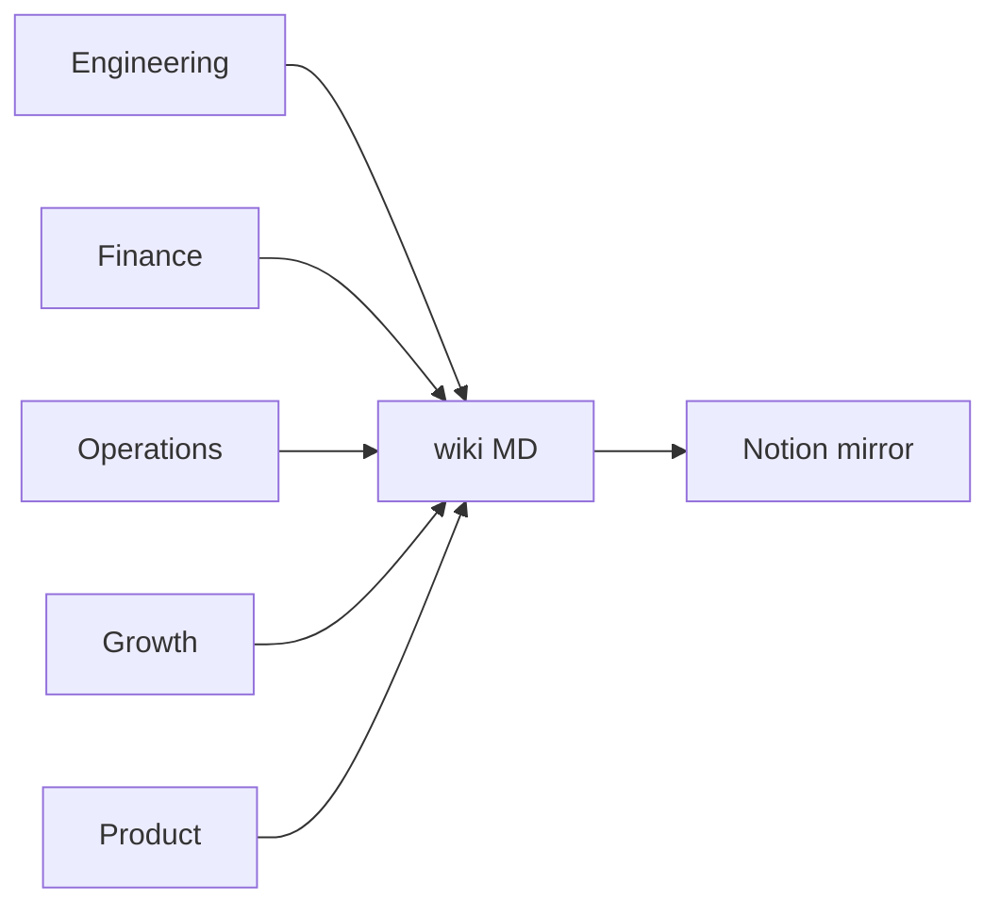

# Agent Handbook

Detailed documentation for every agent in company-brain — how they run, what they
read, what they write, and department-specific conventions (label schemas, schedules,
profiles). For the high-level pitch and data-flow overview, see [`README.md`](../../README.md).

## Departments

| Department | Scope | Handbook |
|------------|-------|----------|
| **Engineering** | GitHub — PRs, branches, feature updates | [engineering.md](engineering.md) |
| **Finance** | Mercury + Ramp — expenses, quarterly metrics, subscriptions | [finance.md](finance.md) |
| **Growth** | Discord + Google Ads; activity / content / competitor / lead workstreams | [growth.md](growth.md) |
| **Product** | PostHog + workstreams (update, use cases, docs, progress, attribution) | [product.md](product.md) |
| **Operations** | Gmail, Slack, Granola, Notion (wiki mirror + task/CRM/Weave) | [operations.md](operations.md) |
| **Admin** | Guided install, admin console, Weave (`@weave`), LLM ops + scouts/self-heal, investor draft, knowledge paste, daily `wiki_commit` | [admin.md](admin.md) |
| **HR** | Status, LinkedIn bio/voice, offboard confirm + wiki archive | [hr.md](hr.md) |
| **Employee Wiki** | Per-member work buildings — ledger materializers, zip import | [employee_wiki.md](employee_wiki.md) |
| **External Wiki** | Admin one-shot external wiki mounts + content catalog | [external_wiki.md](external_wiki.md) |
| **Member Bridge** | Scoped MCP for member coding agents — blockers, priorities, practices | [bridge.md](bridge.md) |

## Conventions (all departments)

**Organization:** `department → platform → agent`. Managers live directly under the
department folder; specialists live under their platform folder. **Workstream**
packages (multi-source, not a connected platform) are also allowed — e.g. growth
`activity` / `content` / `competitor` / `leads`.

**Lifecycle:** Every agent runs `should_run` (cost gate) → `setup` → `run` → `verify`
via `BaseAgent.execute()`. Persistent agents sleep between scheduled wakes; ephemeral
agents run to completion when dispatched.

**Wiki flow:** Markdown is the source of truth; Notion is a synced mirror. Agents call
`write_wiki_page()` — never write Notion directly.

**Agent fields used in each handbook:**

| Field | Meaning |
|-------|---------|
| **State** | `persistent` (idles, wakes on schedule) or `ephemeral` (runs once to completion) |
| **Schedule** | When it starts and what triggers it |
| **Source** | Where it reads data |
| **Destination** | Wiki path(s) it writes |
| **Notion** | Mirrored page title (if any) |
| **Write mode** | `update` (overwrite page) or `append` (prepend section, newest on top) |

**Adding an agent:** Update the department handbook, [`README.md`](../../README.md)
(high-level map), and [`project_install.md`](../../project_install.md) (connect steps).
Onboarding agents always appear **last** in their platform section.

**Extending the system:** design via [`docs/design_process.md`](../design_process.md),
then build/test/clean via [`docs/hygiene_checklist.md`](../hygiene_checklist.md) (ruff,
pytest, `company-brain doctor`). Deferred work: [`docs/tabled.md`](../tabled.md). Doc
format: [`docs/doc_style.md`](../doc_style.md).
