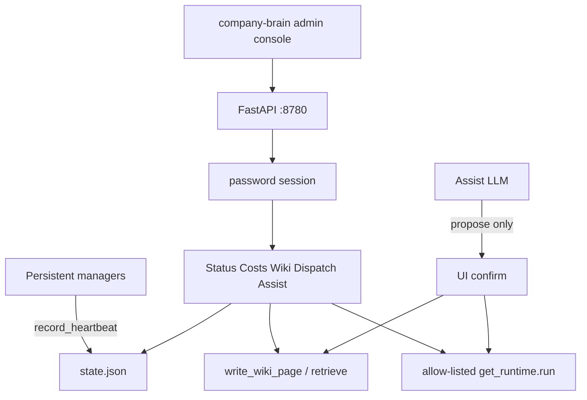
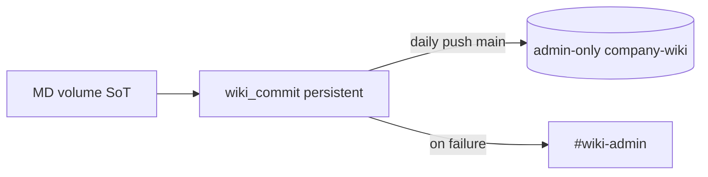
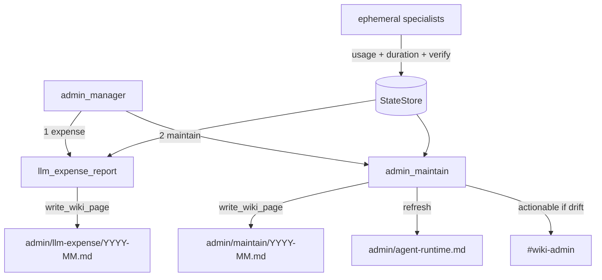
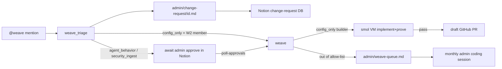

# Admin department — agents

System-change intake via **Weave** (`@weave` Slack app), monthly **LLM ops**
maintenance (expense report + coding-session request), daily **wiki commit**
(MD volume → admin-only company-wiki GitHub backup), and the **admin console**
(logged-in web ops cockpit on the wiki host). Wiki MD volume is source of
truth; Notion mirrors when configured; GitHub wiki repo is backup only.

---

## Admin console — how it runs

Logged-in HTMX UI + FastAPI on the wiki host (not the member bridge). Panes:
Status, Costs, Wiki, Dispatch, Assist.

| Surface | Description |
|---------|-------------|
| Status | Manager catalog + heartbeats (stale after `stale_minutes`) |
| Costs | LLM `budget_status` + optional Mercury reconcile + expense wiki page |
| Wiki | Full-tree search (`retrieve`) / read / edit via `write_wiki_page` |
| Dispatch | Allow-list in `config/admin_console.yaml`; Force bypasses `should_run` (audited) |
| Assist | LLM tools; wiki edits + dispatches require UI confirm |

**Package:** `src/company_brain/admin_console/` (not an agent).
**CLI:** `company-brain admin console [--host] [--port]`
**Config:** `config/admin_console.yaml`
**Env:** `ADMIN_CONSOLE_PASSWORD`, optional `ADMIN_CONSOLE_SESSION_SECRET`
**Extra:** `pip install 'company-brain[admin-console]'`
**Audit:** `config/admin_console_events.jsonl` (gitignored)
**Bind:** default `127.0.0.1:8780` — expose via Tailscale/mesh only.

Heartbeats are written by wired managers (`admin_manager`, `google_ads_manager`,
`discord_manager`); others show `no_heartbeat` until instrumented.

**Does not:** replace Weave implement+prove, start persistent manager loops, or
expose member/bridge access.

Connect steps: [`project_install.md`](../../project_install.md) → Admin console.

## Wiki commit — how it runs

Persistent **`wiki_commit`** (independent of other agents). After `hour_utc`, if
the volume changed since the last successful push, mirrors `wiki/`,
`employee_wiki/`, and `raw/` into a local clone and pushes one commit to `main`.
Never force-pushes. Failures notify `#wiki-admin` (one retry); success is silent.

| Agent | Schedule | Description |
|-------|----------|-------------|
| `wiki_commit.py` | Persistent (`admin.wiki_commit`) | Daily export of MD volume → GitHub backup |

**CLI:** `company-brain admin wiki-commit [--force] [--loop]`

**Config:** `config/operations.yaml` → `admin.wiki_commit` (`enabled`, `hour_utc`,
`remote_url`, `work_dir`, `branch`). Env: `COMPANY_BRAIN_WIKI_GIT_TOKEN`,
optional `COMPANY_BRAIN_WIKI_GIT_DIR`. Wiki bot must not access the private 4r7a repo.

**Tabled:** empty-repo bootstrap (admin onboarding), volume rollback agents — see
`docs/tabled.md`.

---

## LLM ops — how it runs

Monthly maintenance period (default 1st at 09:00, `config/operations.yaml` → `admin.llm_ops`).
Persistent **`admin_manager`** dispatches two specialists in order.

| Agent | Schedule | Description |
|-------|----------|-------------|
| `admin_manager.py` | Monthly (`admin.llm_ops`) | Dispatch expense then maintain |
| `llm_expense_report.py` | Via manager | Month spend by agent/category; verify + duration summary |
| `admin_maintain.py` | Via manager | Drift list + agent-runtime page; request admin coding session |

**CLI:** `company-brain admin manager`, `company-brain admin expense-report`, `company-brain admin maintain`

**Notify:** `#wiki-admin` actionable only on budget pressure, duration drift, or verify fail rates; quiet months stay silent.

**Tabled:** Monthly optimization scout — see `docs/tabled.md`.

---

## Weave — how it runs

| Agent | Schedule | Description |
|-------|----------|-------------|
| `weave_triage.py` | `@weave` mention (Weave Events) | Classify change class; write change-request MD + Notion row |
| `weave.py` | On approval / auto `config_only` | Dispatcher: implement+prove (default Codex) or proposal PR |

**Helpers (not agents):** `weave_allowlist`, `weave_prove`, `weave_escalate`, `weave_codex`,
`weave_in_house`, `weave_worktree`, `weave_builder_config`; runtime
`builder_session`.

**CLI:** `company-brain weave events`, `company-brain weave poll-approvals [--builder codex|in_house|off]`

**Auth:** Active `members.yaml` W2 only — `config/roster.yaml` cannot invoke Weave.

**Change classes:** `config_only` (auto implement+prove for W2), `agent_behavior`,
`security_ingest` (admin Notion approval via `weave poll-approvals` — proposal PR in v1,
no auto coding).

**Builder backends** (`config/operations.yaml` → `slack_platform.weave.builder`, env
`WEAVE_BUILDER`):
- **`codex` (default)** — guest VM from smol registry Codex image; Weave injects
  `OPENAI_API_KEY` / `WEAVE_OPENAI_API_KEY`. Fail closed if smolvm sandbox unavailable.
- **`in_house`** — company-brain guest runner on an ephemeral worktree (opt-in).
- **`off`** — markdown proposal PR only (legacy).

**Allow-list:** `config/**/*.{yaml,yml,json}` (+ `docs/weave-requests/`). Violations and
oversized work escalate to `admin/weave-queue.md` for the monthly admin session
(`admin_maintain` checklist).

**Prove (fail closed):** `ruff check`, `pytest`, `company-brain doctor code --min-score 85`
on the ephemeral worktree before opening a draft PR. No merge automation.

Config: `config/notion.yaml` → `change_request_database`; `config/operations.yaml` →
`slack_platform.weave` (builder, allow-list, `builder_allow_hosts`, `queue_path`).

**Tabled:** Weave hot-reload / agent pause-resume (option B) — see `docs/tabled.md`.
