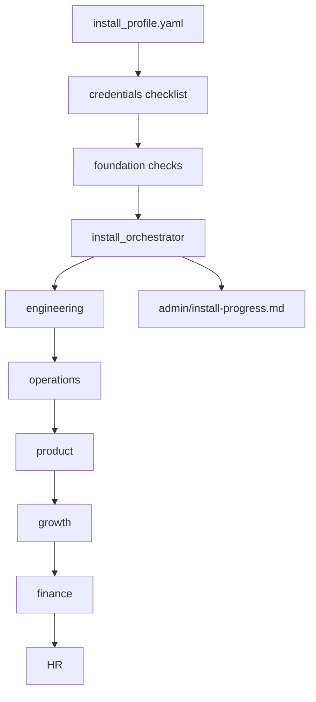
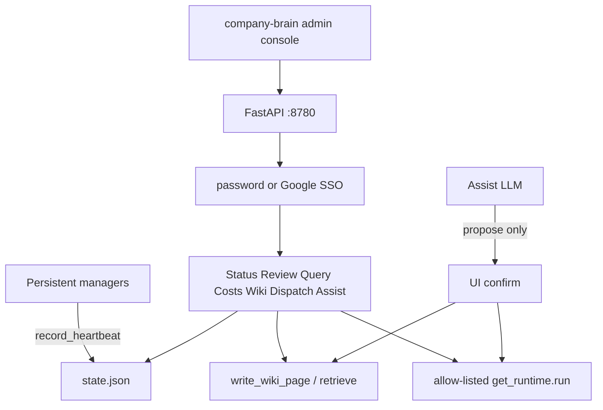
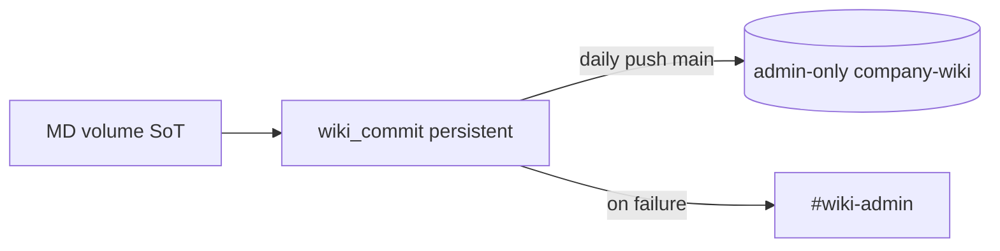
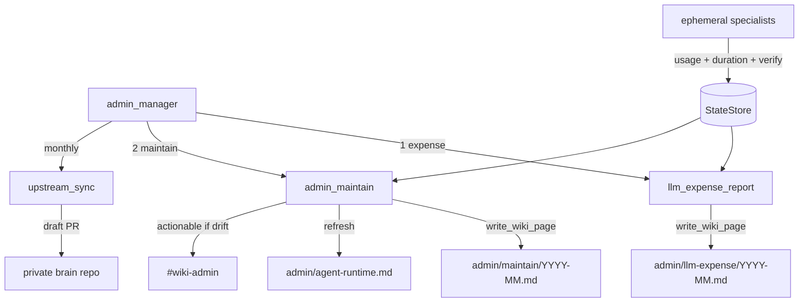
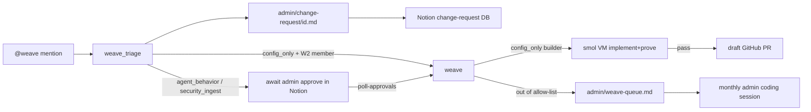

# Admin department — agents

System-change intake via **Weave** (`@weave` Slack app), guided **install**
operators (`install_profile` + orchestrator), monthly **LLM ops** and
**investor newsletter**, safe **knowledge paste**, daily **wiki commit**
(MD volume → admin-only company-wiki GitHub backup), and the **admin console**
(logged-in web ops cockpit on the wiki host). Wiki MD volume is source of
truth; Notion mirrors when configured; GitHub wiki repo is backup only.

Coding-agent companion: [`.cursor/skills/4r7a-install/SKILL.md`](../../.cursor/skills/4r7a-install/SKILL.md).

---

## Install — how it runs

One-shot guided setup (not a persistent manager). Admin creates the private 4r7a
brain repo; company-wiki may be created manually or by `install foundation`
(`gh repo create`). The installer asks for URLs, compiles
`config/install_profile.yaml`, emits credentials, validates foundation, then
onboards departments in order.

| Agent / surface | Schedule | Description |
|-----------------|----------|-------------|
| `install_profile.py` | On demand | Load/save profile; interactive decision compiler |
| `install_orchestrator.py` | On demand | Sequence platform onboardings; progress + cleanup checklist |

**CLI:** `company-brain install profile|credentials|foundation|verify|onboard|status|cleanup`

**Order after foundation:** engineering → operations → product → growth → finance → HR.
Unused platforms are skipped. Cleanup deletion requires `--confirm` / `--confirm-cleanup`
and still never auto-deletes files.

**New platforms later:** check upstream 4r7a first; else design via
`docs/design_process.md` with the admin’s coding agent; optional upstream PR ask.

Connect steps: [`project_install.md`](../../project_install.md) Step 0–3.

---

## Admin console — how it runs

Logged-in HTMX UI + FastAPI on the wiki host (not the member bridge). Panes:
Status, Review, Query, Costs, Wiki, Dispatch, Assist.

| Surface | Description |
|---------|-------------|
| Status | Fleet pause/resume + redeploy cue; manager heartbeats (stale after `stale_minutes`) |
| Review | Union of admin action items (import/mount/knowledge reviews, conflicts, weave queue, offboard, redeploy, …); triage + deep-links only |
| Query | Citation-only search (`wiki/citation_query.py`); snippets + Notion cite; expand one result; admin bypasses `query_grants` |
| Costs | LLM `budget_status` + optional VM estimate (`costs.vm_hourly_usd`) + Mercury reconcile |
| Wiki | Full-tree search (`retrieve`) / read / edit via `write_wiki_page` |
| Dispatch | Allow-list in `config/admin_console.yaml`; Force bypasses `should_run` (audited) |
| Assist | LLM tools; wiki edits + dispatches require UI confirm |

**CLI twin:** `company-brain query "…" [--as-member KEY] [--expand PATH]`

**Package:** `src/company_brain/admin_console/` (not an agent).
**CLI:** `company-brain admin console [--host] [--port]`
**Config:** `config/admin_console.yaml` (`admins`, `password_login`, `sso`, `costs`)
**Env:** `ADMIN_CONSOLE_PASSWORD` (local-dev), `ADMIN_CONSOLE_SESSION_SECRET`,
`ADMIN_CONSOLE_GOOGLE_CLIENT_ID` / `SECRET`, `ADMIN_CONSOLE_PUBLIC_BASE_URL`
**Extra:** `pip install 'company-brain[admin-console]'`
**Audit:** `config/admin_console_events.jsonl` (gitignored)
**Bind:** default `127.0.0.1:8780` — expose via Tailscale/mesh only.

Heartbeats are written by wired managers (`admin_manager`, `google_ads_manager`,
`discord_manager`); others show `no_heartbeat` until instrumented.

**Does not:** replace Weave implement+prove, start persistent manager loops, or
expose member/bridge access.

**Fleet CLI:** `company-brain admin fleet status|pause|resume|request-redeploy|clear-redeploy`

Connect steps: [`project_install.md`](../../project_install.md) → Admin console.

## Wiki commit — how it runs

Persistent **`wiki_commit`** (independent of other agents). After `hour_utc`, if
the volume changed since the last successful push, mirrors `wiki/`,
`employee_wiki/`, and `raw/` into a local clone and pushes one commit to `main`.
Never force-pushes. Failures notify `#wiki-admin` (one retry); success is silent.

| Agent | Schedule | Description |
|-------|----------|-------------|
| `wiki_commit.py` | Persistent (`admin.wiki_commit`) | Daily export of MD volume → GitHub backup |

**CLI:** `company-brain admin wiki-commit [--force] [--loop]`

**Config:** `config/operations.yaml` → `admin.wiki_commit` (`enabled`, `hour_utc`,
`remote_url`, `work_dir`, `branch`). Env: `COMPANY_BRAIN_WIKI_GIT_TOKEN`,
optional `COMPANY_BRAIN_WIKI_GIT_DIR`. Wiki bot must not access the private 4r7a repo.

**Repos:** empty private company-wiki via admin or `install foundation` auto-create;
clone it, set token + `remote_url` in profile/ops config. Volume rollback stays
**manual** — see `project_install.md` recovery notes. History SoT is GitHub
(`wiki_commit`); no in-wiki versioning agents.

---

## LLM ops — how it runs

Monthly maintenance period (default 1st at 09:00, `config/operations.yaml` → `admin.llm_ops`).
Persistent **`admin_manager`** dispatches expense/maintain, investor newsletter,
and monthly **upstream_sync**.

| Agent | Schedule | Description |
|-------|----------|-------------|
| `admin_manager.py` | Monthly (`admin.llm_ops` + investor + upstream) | Dispatch expense, maintain, investor, upstream_sync |
| `llm_expense_report.py` | Via manager | Month spend by agent/category; verify + duration summary |
| `admin_maintain.py` | Via manager | Drift list + agent-runtime page; request admin coding session |
| `investor_newsletter.py` | Via manager (`admin.investor_newsletter`, default day 3) | Concise admin_only investor draft; never sends |
| `upstream_sync.py` | Via manager (`admin.upstream_sync`, default day 15) | Filtered draft PR from public upstream; never auto-merge |
| `knowledge_paste.py` | On demand | Quarantine → scan → review → promote misc external notes |

**CLI:** `company-brain admin manager`, `admin expense-report`, `admin maintain`,
`admin investor-newsletter`, `admin upstream-sync`, `admin knowledge paste|approve`

**Notify:** `#wiki-admin` actionable on budget/duration/verify drift, investor draft
ready, and knowledge-paste review; quiet months stay silent for LLM ops.

**Knowledge paste:** default promote `admin/knowledge/{slug}.md` (`sync: admin_only`);
`--dest` / `--sync-label` for broader company wiki; `--to-raw` for absorb intake.
Admin console Wiki save blocks untrusted namespaces (`external/`, `admin/knowledge/`, `raw/`).

**Program (in progress):** deeper process scout / self-heal — see
[`docs/plans/tabled-revisit-2026-07.md`](../plans/tabled-revisit-2026-07.md).

---

## Weave — how it runs

| Agent | Schedule | Description |
|-------|----------|-------------|
| `weave_triage.py` | `@weave` mention (Weave Events) | Classify change class; write change-request MD + Notion row |
| `weave.py` | On approval / auto `config_only` | Dispatcher: implement+prove (default Codex) or proposal PR |

**Helpers (not agents):** `weave_allowlist`, `weave_prove`, `weave_escalate`, `weave_codex`,
`weave_in_house`, `weave_worktree`, `weave_builder_config`; runtime
`builder_session`.

**CLI:** `company-brain weave events`, `company-brain weave poll-approvals [--builder codex|in_house|off]`

**Auth:** Active `members.yaml` W2 only — `config/roster.yaml` cannot invoke Weave.

**Change classes:** `config_only` (auto implement+prove for W2), `agent_behavior`,
`security_ingest` (admin Notion approval via `weave poll-approvals` — proposal PR in v1,
no auto coding).

**Builder backends** (`config/operations.yaml` → `slack_platform.weave.builder`, env
`WEAVE_BUILDER`):
- **`codex` (default)** — guest VM from smol registry Codex image; Weave injects
  `OPENAI_API_KEY` / `WEAVE_OPENAI_API_KEY`. Fail closed if smolvm sandbox unavailable.
- **`in_house`** — company-brain guest runner on an ephemeral worktree (opt-in).
- **`off`** — markdown proposal PR only (legacy).

**Allow-list:** `config/**/*.{yaml,yml,json}` (+ `docs/weave-requests/`). Violations and
oversized work escalate to `admin/weave-queue.md` for the monthly admin session
(`admin_maintain` checklist).

**Prove (fail closed):** `ruff check`, `pytest`, `company-brain doctor code --min-score 85`
on the ephemeral worktree before opening a draft PR. No merge automation.

Config: `config/notion.yaml` → `change_request_database`; `config/operations.yaml` →
`slack_platform.weave` (builder, allow-list, `builder_allow_hosts`, `queue_path`).

**Tabled:** Weave hot-reload / agent pause-resume (option B) — see `docs/tabled.md`.
