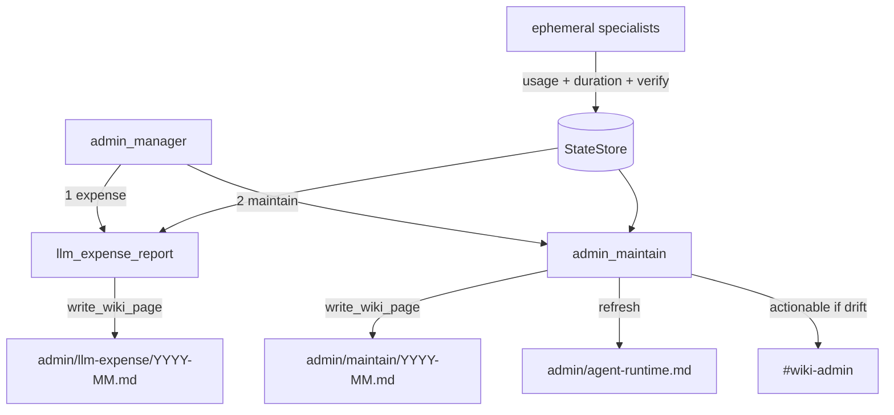
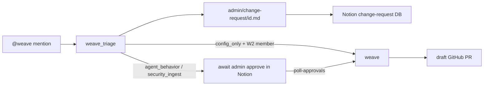

# Admin department — agents

System-change intake via **Weave** (`@weave` Slack app), plus monthly **LLM ops**
maintenance (expense report + coding-session request). Wiki MD is source of truth;
Notion mirrors when configured.

## LLM ops — how it runs

Monthly maintenance period (default 1st at 09:00, `config/operations.yaml` → `admin.llm_ops`).
Persistent **`admin_manager`** dispatches two specialists in order.

| Agent | Schedule | Description |
|-------|----------|-------------|
| `admin_manager.py` | Monthly (`admin.llm_ops`) | Dispatch expense then maintain |
| `llm_expense_report.py` | Via manager | Month spend by agent/category; verify + duration summary |
| `admin_maintain.py` | Via manager | Drift list + agent-runtime page; request admin coding session |

**CLI:** `company-brain admin manager`, `company-brain admin expense-report`, `company-brain admin maintain`

**Notify:** `#wiki-admin` actionable only on budget pressure, duration drift, or verify fail rates; quiet months stay silent.

**Tabled:** Monthly optimization scout — see `docs/tabled.md`.

---

## Weave — how it runs

| Agent | Schedule | Description |
|-------|----------|-------------|
| `weave_triage.py` | `@weave` mention (Weave Events) | Classify change class; write change-request MD + Notion row |
| `weave.py` | On approval / auto `config_only` | Draft PR + optional VM sandbox verify |

**CLI:** `company-brain weave events`, `company-brain weave poll-approvals`

**Auth:** Active `members.yaml` W2 only — `config/roster.yaml` cannot invoke Weave.

**Change classes:** `config_only` (auto PR for W2), `agent_behavior`, `security_ingest`
(admin Notion approval via `weave poll-approvals`).

Config: `config/notion.yaml` → `change_request_database`; `config/operations.yaml` → `slack_platform.weave`.

**Tabled:** Weave hot-reload / agent pause-resume (option B) — see `docs/tabled.md`.
