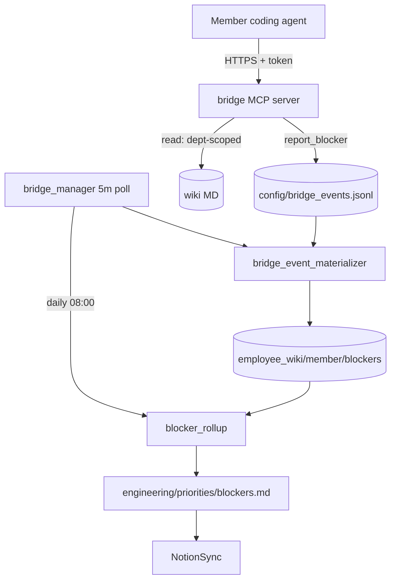

# Member Bridge — Agent Handbook

The member bridge is a scoped **MCP server** that lets a member's AI coding agent
(Cursor, Claude Desktop, other MCP clients) converse with company-brain **without
direct access to the Markdown wiki**. Humans read the wiki through Notion; member
AI agents read/write through the bridge only.

Code lives under `src/company_brain/bridge/` (server, auth, read gate, index,
tools) with agents under `src/company_brain/agents/bridge/`.

**Config:** [`config/bridge.yaml`](../../config/bridge.yaml) (paths, rate limits,
allow-list prefixes, rollup schedule); [`config/members.yaml`](../../config/members.yaml)
→ `bridge.departments` per member.
**Access model:** [`.cursor/rules/access-control.mdc`](../../.cursor/rules/access-control.mdc)
(Member bridge MCP section).
**Client skill:** [`.cursor/skills/4r7a-bridge/SKILL.md`](../../.cursor/skills/4r7a-bridge/SKILL.md).

---

## Bridge — how it runs

The MCP server is **co-located with the wiki** (cloud VM or always-on NAS) and
reachable over a private mesh (e.g. Tailscale). Coding agents authenticate with a
per-member bearer token. Blocker writes append to a ledger; `bridge_manager` polls
and dispatches the materializer, then runs the daily rollup after 08:00.

**Read scope (per token):** company-wide (`sync: company` on allow-list prefixes),
department (`sync: location:{dept}` when in the member's `bridge.departments`), and
the member's own `employee_wiki/{member}/`. Denies `admin_only`, `not_synced`, other
departments, and other members' private pages.

**Tools (v1):** `report_blocker`, `get_priority`, `search_practices`, `list_skills`,
`get_skill`. Blockers are a summary compilation layer — Linear issue tracking stays
in each coding agent's own Linear integration.

---

## Managers

**`bridge_manager.py`** — Persistent manager (polls `config/bridge_events.jsonl`
every `poll_interval_minutes`, idles otherwise). Dispatches the materializer for
each unprocessed event, and runs `blocker_rollup` once per day after the configured
rollup time.

| | |
|---|---|
| **State** | persistent |
| **Schedule** | Poll every 5 min; rollup daily after 08:00 |
| **Action** | Dispatch materializer per event; daily rollup |

---

## Specialists (`agents/bridge/`)

| Agent | Schedule | Description |
|-------|----------|-------------|
| `bridge_event_materializer.py` | On demand (via manager) | Writes a ledger blocker event to `employee_wiki/{member}/blockers/{id}.md` (`sync: private`); marks the event materialized |
| `blocker_rollup.py` | Daily (via manager) | Deterministic company snapshot → `engineering/priorities/blockers.md` (`sync: location:engineering`); embeds the `sync: company` lead-focus master table. No LLM summarization of member text |

---

## Admin runbook

1. Add each engineer to `config/members.yaml` with `bridge.departments: [engineering]`.
2. Issue a token: `company-brain bridge issue-token <member>` (plaintext shown once).
3. Serve the MCP: `company-brain bridge serve` (behind Tailscale on the wiki host).
4. Seed wiki pages: `engineering/practices/**` (`sync: location:engineering`),
   `engineering/priorities/lead-focus.md` (`sync: company`), and the skills manifest
   `engineering/practices/skills/_index.yaml`.
5. Build the search index: `company-brain bridge rebuild-index`.
6. Start the manager: `company-brain bridge manager`.
7. Verify: `company-brain doctor bridge`.

Member client setup: install `.cursor/skills/4r7a-bridge/SKILL.md`, set
`COMPANY_BRAIN_MEMBER_TOKEN`, point the MCP client at the bridge URL.

---

## What this does and does not do

- **Does:** scoped read (company + department + own employee tree), structured
  blocker intake, daily deterministic rollup, per-member tokens + rate limits
  (60 reads/min, 20 reports/day), audit log.
- **Does not:** expose raw wiki paths, touch Linear, run any LLM over untrusted
  blocker text, or serve admin/other-department content.
