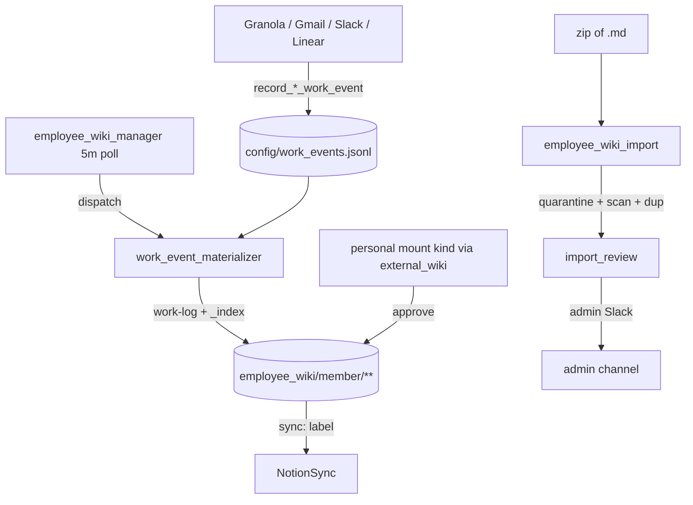

# Employee Wiki — Agent Handbook

Cross-cutting substrate giving every employee a **work building**
(`employee_wiki/{member}/`) alongside the **company building** (`wiki/**`). Both are
Markdown source-of-truth, Notion-mirrored, cross-linked. Code lives under
`src/company_brain/agents/employee_wiki/` with helpers in `src/company_brain/wiki/`.

Employee wikis are **documentation, not evaluation**: factual work records that answer
manager questions via citation-only query. Platform ingest feeds them through a
**ledger + materializers** pattern — platform agents never dual-write employee pages.

**Config:** [`config/members.yaml`](../../config/members.yaml) (member index),
[`config/operations.yaml`](../../config/operations.yaml) → `employee_wiki`.
**Env:** `COMPANY_BRAIN_EMPLOYEE_WIKI_DIR` (defaults to a sibling of the company wiki).

---

## Employee Wiki — how it runs

Platform specialists append an attributed event to the ledger when they create a task;
the manager polls and dispatches the materializer, which writes the employee work log and
refreshes the `_index.md` snapshot. Imports are quarantined, scanned, and de-duplicated
before an admin approves promotion.

**Personal wiki mounts:** reuse the external mount pipeline with
`kind: personal` + `member_key` (see [external wiki handbook](external_wiki.md)).
Promoted pages land under `employee_wiki/{member}/` with default `sync: private`
and migrate-names applied on promote.

**Managers** (dispatch specialists based on gathered information):

**`employee_wiki_manager.py`** — Persistent manager (polls the work-event ledger every
`employee_wiki.poll_interval_minutes`, idles otherwise). Dispatches the materializer for
each unmaterialized event via `get_runtime().run()`. Must be started explicitly like other
managers.

---

## Specialists (`agents/employee_wiki/`)

| Agent | Schedule | Description |
|-------|----------|-------------|
| `work_event_materializer.py` | On demand (via manager) | Materializes ledger events (Linear, Granola, Gmail, Slack) into `work-log/YYYY-QN.md` + refreshes `_index.md`; honors per-member `ingest` scope and contributor attribution |
| `employee_wiki_import.py` | On demand | Extracts a zip of `.md` files into `imports/_quarantine/`, runs security scan + duplicate detection, gates first import behind admin review |
| `import_review.py` | On demand (via import) | Writes the admin import-review page and pings the admin Slack channel |
| `employee_wiki_onboarding.py` | Once per member | Bootstraps `people/` stub + employee `_index.md`, discovers/creates the member's Notion teamspace, syncs the index |

**Helpers:** `employee_wiki_config.py` (reads the `employee_wiki.import` config block),
`employee_wiki_slack.py` (admin-channel `Notifier`). Wiki-layer helpers live under
`src/company_brain/wiki/`: `work_events.py` (ledger), `employee_store.py` /
`employee_publish.py` / `employee_paths.py` (per-member store), `member_bootstrap.py`,
`people.py`, `import_scan.py`, `duplicate_detect.py`, `import_promote.py`, and
`employee_notion_sync.py`.

---

## Notion sync labels

Employee pages carry a `sync:` frontmatter label resolved by
`src/company_brain/notion/sync_routing.py`:

| `sync:` | Mirrors to |
|---------|-----------|
| `private` (default) | Member's personal Notion teamspace (`member_{key}`) |
| `company` | Company teamspace |
| `admin_only` | Admin teamspace |
| `location:{key}` | Named teamspace `key` |
| `not_synced` | Nothing (MD-only) |

---

## Citation Query (admin / grants)

Managers/admins search employee (and company) scopes via console **Query** or
`company-brain query`. Enforcement uses `members.yaml` `query_grants` (owner grants
prefixes to other member keys) with **admin bypass**. Results are snippets + Notion
citations (MD path when unbound); expand one page at a time. After offboard,
`wiki_archive` pushes `archive/employee/{member}` — Query can materialize that git
branch when the live tree is gone.

## What this does and does not do

- **Does:** record attributed work events, materialize factual work logs, quarantine and
  vet imports, mirror per `sync:` labels; citation-only Query under grants.
- **Does not:** evaluate or score employees, dual-write from platform agents, auto-promote
  to the company wiki without an explicit submit + admin approval, or pull Notion → MD
  (deferred).
