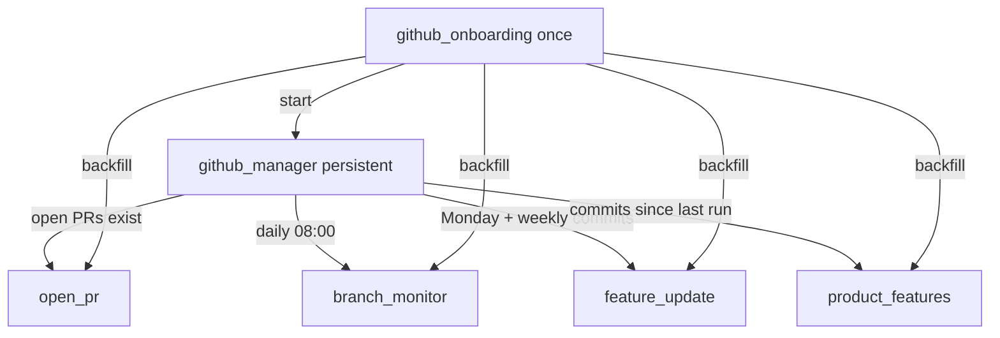

# Engineering — Agent Handbook

GitHub and Linear agents under `src/company_brain/agents/engineering/`. GitHub access is
**read-only** via the `gh` CLI.

**Config:** GitHub repo scope and schedules are set in agent code and environment (`gh auth`).
Linear team defaults live in [`config/engineering.yaml`](../../config/engineering.yaml)
(`linear.team_key` / `linear.team_id`).

---

## Linear connection (`engineering/linear/`)

Connection layer only — **no engineering Linear agents yet** (you will spec those next).

### `linear_client.py`

Not an agent — shared connection layer for GraphQL, MCP, and optional CLI:

| Path | When | Auth |
|------|------|------|
| **GraphQL API** (default) | Deterministic agents, issue create/read | `LINEAR_API_KEY` → `api.linear.app/graphql` |
| **Official MCP** | Claude Agent SDK agents | Same key → `https://mcp.linear.app/mcp` |
| **Community CLI** | `LINEAR_USE_CLI=1` + `linear` on PATH | `linear auth login` (e.g. [joa23/linear-cli](https://github.com/joa23/linear-cli)) |

**Read helpers:** `viewer()`, `list_teams()`, `list_issues()`, `get_issue()`.

**Write (cross-department):** `create_issue()` — used today by operations Gmail agents
(`inbox_task`, `team_on_it`).

Docs index: https://linear.app/llms.txt

---

## GitHub — how it runs

The manager is the only persistent agent. It checks GitHub each workday morning,
refreshes branch status unconditionally, and dispatches specialists only when their
cost gate passes (open PRs exist, weekly activity, new commits).

---

## Manager

### `github_manager.py`

| | |
|---|---|
| **State** | persistent |
| **Schedule** | Starts at deploy; wakes daily at **08:00** |
| **Source** | GitHub (read-only `gh` CLI) |
| **Destination** | — (dispatches specialists) |

On each morning check:

1. Always runs **`branch_monitor`** (environment/branch snapshot).
2. Dispatches **`open_pr`** when open PRs exist.
3. Dispatches **`feature_update`** on **Mondays** when there was commit activity in the last 7 days.
4. Dispatches **`product_features`** when commits advanced since the last stored signature.

Idles between checks. Specialists are started via `get_runtime().run()`.

---

## GitHub specialists (`engineering/github/`)

### `open_pr.py`

| | |
|---|---|
| **State** | ephemeral |
| **Schedule** | Dispatched by `github_manager` when open PRs exist |
| **Source** | GitHub open PRs |
| **Destination** | `engineering/github/open-prs.md` |
| **Notion** | Open PRs |
| **Write mode** | update |

Lists every open pull request with author, branch, and review decision. Overwrites the
page each run (current snapshot).

### `branch_monitor.py`

| | |
|---|---|
| **State** | ephemeral |
| **Schedule** | Dispatched by `github_manager` every morning |
| **Source** | GitHub branches, PRs, `compare` API |
| **Destination** | `engineering/github/branch-status.md` |
| **Notion** | Branch Status |
| **Write mode** | update |

Per repo: **Environments** table (Prod/Preview/Dev deploys with ahead/behind vs prod)
and **Branches/PRs** table (target env, ahead/behind, last activity, risk verdict).

### `feature_update.py`

| | |
|---|---|
| **State** | ephemeral |
| **Schedule** | Dispatched by `github_manager` on Mondays when weekly commit activity exists |
| **Source** | GitHub commits (last 7 days) |
| **Destination** | `engineering/github/feature-updates.md` |
| **Notion** | Feature Updates |
| **Write mode** | append |

Digests the past week's commits, filters merges/dependency bumps/trivia, prepends a
weekly section of major implementations (newest on top).

### `product_features.py`

| | |
|---|---|
| **State** | ephemeral |
| **Schedule** | Dispatched when commits advanced since last run |
| **Source** | GitHub commits (recent window) |
| **Destination** | `engineering/github/product-features.md` |
| **Notion** | Product Features |
| **Write mode** | append |

Classifies commits into user-facing features; prepends newly detected ones to a ranked
list for end users.

---

## Onboarding

### `github_onboarding.py`

| | |
|---|---|
| **State** | ephemeral |
| **Schedule** | Once, on first GitHub connection |
| **Source** | All repos under the company account |

Scans repos, then runs `open_pr`, `branch_monitor`, `feature_update`, and
`product_features` once to seed their wiki pages with real data (same output as
steady-state). Starts **`github_manager`** via `get_runtime().start()` (non-blocking;
manager idles until next 08:00) and exits. Does not run again.
