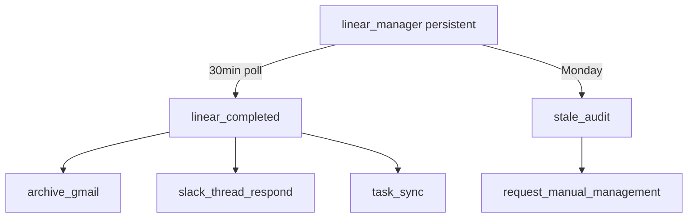
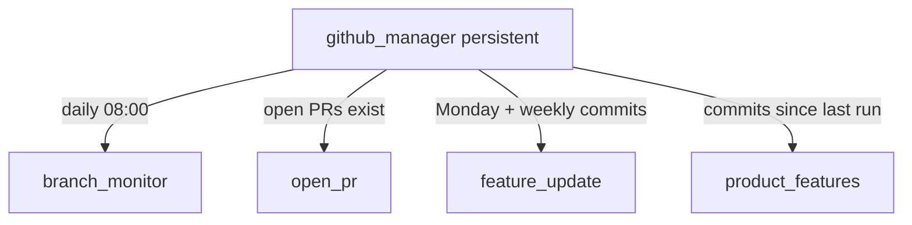

# Engineering — Agent Handbook

GitHub and Linear agents under `src/company_brain/agents/engineering/`. GitHub access is
**read-only** via the `gh` CLI.

**Config:** GitHub repo scope and schedules are set in agent code and environment (`gh auth`).
Linear team defaults live in [`config/engineering.yaml`](../../config/engineering.yaml)
(`linear.team_key` / `linear.team_id`).

**Wiki sync:** Engineering agent pages use **`sync: location:engineering`** (engineering
Notion teamspace). Member AI agents read them via bridge MCP only when
`bridge.departments` includes `engineering` at onboarding. Company-wide pages
(e.g. cross-department priority master table) use `sync: company` explicitly.

---

## Linear — how it runs

**`linear_manager`** is the only persistent Linear agent. It polls for terminal issue
states every 30 minutes and dispatches **`linear_completed`** handlers; weekly **`stale_audit`**
feeds **`request_manual_management`**. PR/issue status sync is Linear-native — agents do
not mirror GitHub state.

### Connection — `linear_client.py`

Not an agent — shared connection layer for GraphQL, MCP, and optional CLI:

| Path | When | Auth |
|------|------|------|
| **GraphQL API** (default) | Deterministic agents, issue create/read | `LINEAR_API_KEY` → `api.linear.app/graphql` |
| **Official MCP** | Claude Agent SDK agents | Same key → `https://mcp.linear.app/mcp` |
| **Community CLI** | `LINEAR_USE_CLI=1` + `linear` on PATH | `linear auth login` (e.g. [joa23/linear-cli](https://github.com/joa23/linear-cli)) |

**Read helpers:** `viewer()`, `list_teams()`, `list_issues()`, `get_issue()`,
`list_issues_updated_since()`.

**Write:** `create_issue()`, `update_issue()` — used by Gmail task agents and completion flow.

Docs index: https://linear.app/llms.txt

### Task registry — `task_bindings.py`

Cross-platform task identity in `config/task_bindings.json` with wiki mirror under
`engineering/tasks/`. Gmail agents store `task_id` on routing records when creating
Linear issues.

### Manager — `linear_manager.py`

| | |
|---|---|
| **State** | persistent |
| **Schedule** | Poll Linear every **30 min**; stale audit **Monday 09:00** |
| **Action** | Dispatch `linear_completed` on Done/Canceled; weekly `stale_audit` |

### Specialists

| Agent | Schedule | Description |
|-------|----------|-------------|
| `slot_check.py` | Via manager / on demand | Propose-only team/project validation report |
| `stale_audit.py` | Weekly (via manager) | Stale issues report; dispatches manual management |
| `request_manual_management.py` | On demand | Wiki checklist → Slack → apply approved status changes |
| `structure_organization.py` | Onboarding / on demand | Propose Linear workspace (`structure-proposal.md`) |
| `linear_completed/dispatcher.py` | On terminal Linear state | Routes to platform completion handlers |
| `linear_completed/archive_gmail.py` | Via dispatcher | Archive bound Gmail; system propagation ledger |
| `linear_completed/slack_thread_respond.py` | Via dispatcher | Thread reply on Linear Done (Slack-sourced tasks) |
| `linear_completed/` → `task_sync` | Via dispatcher | Update Notion task row on Linear Done (meeting tasks) |

### Onboarding — `linear_onboarding.py`

| | |
|---|---|
| **State** | ephemeral |
| **Schedule** | Once, on first Linear connection |

1. Backfill Gmail routing records → `task_bindings`
2. Run **`structure_organization`** (propose-only; does not block)
3. Run **`slot_check`** once
4. Start **`linear_manager`** and **`task_scanner`** (when task DBs configured) via `get_runtime().start()` and exit

Plan reference: [`docs/plans/linear-task-platform.md`](../plans/linear-task-platform.md).

---

## GitHub — how it runs

The manager is the only persistent agent. It checks GitHub each workday morning,
refreshes branch status unconditionally, and dispatches specialists only when their
cost gate passes (open PRs exist, weekly activity, new commits).

---

## Manager

### `github_manager.py`

| | |
|---|---|
| **State** | persistent |
| **Schedule** | Starts at deploy; wakes daily at **08:00** |
| **Source** | GitHub (read-only `gh` CLI) |
| **Destination** | — (dispatches specialists) |

On each morning check:

1. Always runs **`branch_monitor`** (environment/branch snapshot).
2. Dispatches **`open_pr`** when open PRs exist.
3. Dispatches **`feature_update`** on **Mondays** when there was commit activity in the last 7 days.
4. Dispatches **`product_features`** when commits advanced since the last stored signature.

Idles between checks. Specialists are started via `get_runtime().run()`.

---

## GitHub specialists (`engineering/github/`)

### `open_pr.py`

| | |
|---|---|
| **State** | ephemeral |
| **Schedule** | Dispatched by `github_manager` when open PRs exist |
| **Source** | GitHub open PRs |
| **Destination** | `engineering/github/open-pr.md` |
| **Notion** | Open PRs |
| **Write mode** | update |

Lists every open pull request with author, branch, and review decision. Overwrites the
page each run (current snapshot).

### `branch_monitor.py`

| | |
|---|---|
| **State** | ephemeral |
| **Schedule** | Dispatched by `github_manager` every morning |
| **Source** | GitHub branches, PRs, `compare` API |
| **Destination** | `engineering/github/branch-status.md` |
| **Notion** | Branch Status |
| **Write mode** | update |

Per repo: **Environments** table (Prod/Preview/Dev deploys with ahead/behind vs prod)
and **Branches/PRs** table (target env, ahead/behind, last activity, risk verdict).

### `feature_update.py`

| | |
|---|---|
| **State** | ephemeral |
| **Schedule** | Dispatched by `github_manager` on Mondays when weekly commit activity exists |
| **Source** | GitHub commits (last 7 days) |
| **Destination** | `engineering/github/feature-update.md` |
| **Notion** | Feature Updates |
| **Write mode** | append |

Digests the past week's commits, filters merges/dependency bumps/trivia, prepends a
weekly section of major implementations (newest on top).

### `product_features.py`

| | |
|---|---|
| **State** | ephemeral |
| **Schedule** | Dispatched when commits advanced since last run |
| **Source** | GitHub commits (recent window) |
| **Destination** | `product/feature.md` |
| **Notion** | Product Features |
| **Write mode** | append |

Classifies commits into user-facing features; prepends newly detected ones to a ranked
list for end users.

### `issue_sync.py`

| | |
|---|---|
| **State** | ephemeral |
| **Schedule** | Daily via `github_manager` (when `repo` configured) |
| **Source** | `gh issue list` (open issues) |
| **Destination** | `engineering/issue/{slug}.md` + `engineering/issue/_index.md` |
| **Write mode** | update |

Mirrors GitHub issues into the unified issue wiki home.

---

## Onboarding

### `github_onboarding.py`

| | |
|---|---|
| **State** | ephemeral |
| **Schedule** | Once, on first GitHub connection |
| **Source** | All repos under the company account |

Scans repos, then runs `open_pr`, `branch_monitor`, `feature_update`, and
`product_features` once to seed their wiki pages with real data (same output as
steady-state). Starts **`github_manager`** via `get_runtime().start()` (non-blocking;
manager idles until next 08:00) and exits. Does not run again.
