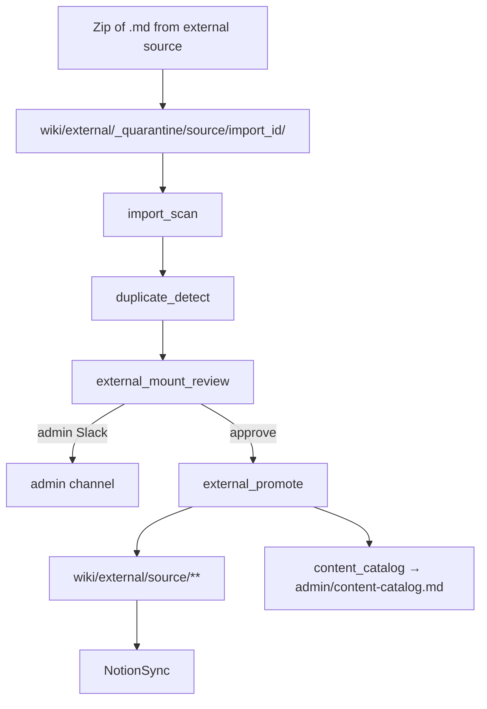

# External Wiki Mount — Agent Handbook

Admin-only one-shot import of Markdown wikis. Default **`kind: external`** promotes
into the **company building** at `wiki/external/{source}/`. **`kind: personal`**
(with `member_key`) promotes into `employee_wiki/{member}/` with `sync: private`
after the same quarantine → scan → admin review path. Shared helpers reuse the
employee zip import scan and duplicate detection patterns.

**Config:** [`config/external_sources.yaml`](../../config/external_sources.yaml) (source registry),
[`config/operations.yaml`](../../config/operations.yaml) → `external_wiki`.
**Plan:** [`docs/plans/external-wiki-mount.md`](../plans/external-wiki-mount.md).

---

## External Wiki — how it runs

Every mount requires admin approval in v1. Promoted pages carry provenance frontmatter
(`external_source`, `import_id`, `sync:`). The admin content catalog at
`admin/content-catalog.md` is regenerated after each mount (when
`external_wiki.catalog.rebuild_on_mount` is true).

---

## Specialists (`agents/external_wiki/`)

| Agent | Schedule | Description |
|-------|----------|-------------|
| `external_wiki_import.py` | On demand (admin) | Extracts zip into quarantine, security scan + duplicate detection, always dispatches admin review |
| `external_mount_review.py` | On demand (via import) | Writes `admin/mount-review/{id}.md` and pings admin Slack |
| `content_catalog.py` | On demand / after mount | Regenerates `admin/content-catalog.md` (view-only fleet catalog) |

**Helpers:** `external_wiki_config.py`, `external_wiki_slack.py`. Wiki-layer helpers:
`external_paths.py`, `external_promote.py`, `content_catalog.py`, `import_zip.py`,
plus reused `import_scan.py` and `duplicate_detect.py` (`detect_external_duplicates`).

---

## Admin runbook

1. Register or confirm the source key in `config/external_sources.yaml`.
2. Run `ExternalWikiImportAgent` with `source_key` and a zip of `.md` files.
3. Review the admin page at `admin/mount-review/{import_id}.md` and the Slack ping.
4. Approve via `ExternalWikiImportAgent.approve(source_key=..., import_id=...)`.
5. Optionally rebuild the catalog manually: `company-brain catalog`.

Employee zip import reviews live under `admin/import-review/` (top-level `admin` section).

---

## Default sync policy

| Content | Default `sync:` | Notion teamspace |
|---------|-----------------|------------------|
| Promoted external pages (`kind: external`) | `company` (per-source override in registry) | Company |
| Promoted personal pages (`kind: personal`) | `private` | Member personal teamspace (when mirrored) |
| Mount review pages | `admin_only` | Admin |
| Content catalog | `admin_only` | Admin (`section_teamspace: admin → admin`) |

Register personal sources with `kind: personal` and `member_key` in
`config/external_sources.yaml`. Promote still requires admin approval.

---

## What this does and does not do

**Does:** one-shot mount (company or personal), duplicate linking (external kind),
provenance stamping, admin audit trail, fleet TOC.

**Does not (v1):** live sync, bidirectional Notion pull, member-initiated self-mount,
cryptographic provenance.
