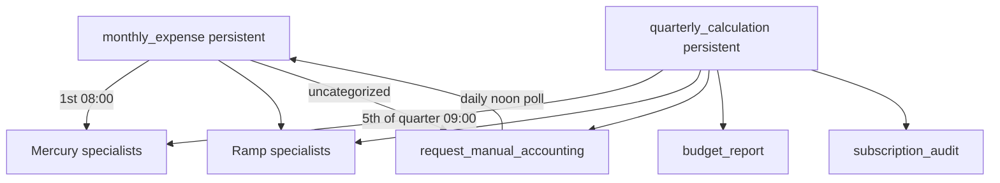

# Finance — Agent Handbook

Finance agents under `src/company_brain/agents/finance/`. Mercury and Ramp are
**read-only at the source** — agents never move money or mutate bank/card state.

**Config:** [`config/finance.yaml`](../../config/finance.yaml) (schedules, Slack
channel, wiki paths, and learned categories).

**Notifications:** every Slack `#finance` message is severity-gated through
`from_finance_config(cfg).emit(Signal(...))` (never a direct Slack call) — `info` is
logged-only, `actionable` / `alert` are delivered. Detect everything, notify selectively.

---

## Finance — how it runs

Two persistent **managers** span Mercury + Ramp. Cross-platform agents at the
department level handle budget narrative, subscription audit, and the manual
accounting feedback loop.

---

## Managers

### `monthly_expense.py`

| | |
|---|---|
| **State** | persistent |
| **Schedule** | **1st of each month at 08:00** (`config/finance.yaml`) |
| **Source** | Mercury bank + Mercury IO card + Ramp card (via specialists) |
| **Destination** | `finance/expense-report/<YYYY-MM>.md` |
| **Notion** | `{Month} Expenses` (under Monthly Expense Reports) |
| **Write mode** | update (one page per month) |

Dispatches transaction specialists for the **previous calendar month**, sorts outbound
spend into budget categories, posts summary to Slack `#finance`, writes the expense
report page. If any spend is uncategorized, starts **`request_manual_accounting`**.

### `quarterly_calculation.py`

| | |
|---|---|
| **State** | persistent |
| **Schedule** | **5th of each quarter-start month at 09:00** (Jan/Apr/Jul/Oct) |
| **Source** | Mercury + Ramp transactions (via specialists) |
| **Destination** | `finance/quarterly-metric.md` |
| **Notion** | Quarterly Metric |
| **Write mode** | append |

Computes previous quarter Revenue, Expenses, Net Income, EBITDA, Net Burn with
per-month breakdown; cross-verifies against monthly expense reports. Then starts
**`request_manual_accounting`** (if uncategorized spend) or **`budget_report`** +
**`subscription_audit`**.

---

## Cross-platform agents (`finance/`)

| Agent | Schedule | Description |
|-------|----------|-------------|
| `budget_report.py` | Quarterly via manager | Append a budget narrative from quarterly metrics and company events |
| `subscription_audit.py` | Quarterly via manager | Refresh recurring-vendor and overlap review |
| `request_manual_accounting.py` | On uncategorized spend; daily noon checks | Collect human category corrections and rerun the source manager |

### `budget_report.py`

| | |
|---|---|
| **State** | ephemeral |
| **Schedule** | Started by `quarterly_calculation` (cost-gated: quarter signature changed) |
| **Source** | Quarterly Metric + Company Timeline wiki pages |
| **Destination** | `finance/budget-summary.md` |
| **Notion** | Budget Summary |
| **Write mode** | append |
| **SDK** | Claude Agent SDK (deterministic fallback) |

Matches quarter spend to major company events; prepends a per-quarter budget section.

### `subscription_audit.py`

| | |
|---|---|
| **State** | ephemeral |
| **Schedule** | Started by `quarterly_calculation` |
| **Source** | Mercury + Ramp transactions (3 months) + web search |
| **Destination** | `finance/subscription.md` |
| **Notion** | Subscriptions |
| **Write mode** | update |

Detects recurring vendors, verifies pricing via web search, flags overlaps, posts to
Slack `#finance`. Vendor **cost/recurrence** lives here; operations **`vendor_tracker`**
writes billing/renewal comms to **`finance/vendor/<slug>.md`** (not CRM).

### `vendor_tracker.py` (operations agent, finance wiki path)

Gmail **`Vendor`**-tagged mail → per-vendor pages under **`finance/vendor/`** (append comms
log). Config: `config/finance.yaml` → `wiki.vendor_dir`.

### `request_manual_accounting.py`

| | |
|---|---|
| **State** | ephemeral |
| **Schedule** | Started by managers on uncategorized spend; polls **daily at noon** |
| **Source** | Manual Accounting wiki page (human edits pulled from the Notion mirror) + Slack |
| **Destination** | `finance/manual-accounting.md` |
| **Notion** | Manual Accounting |
| **Write mode** | update |

Writes uncategorized transactions as a checklist, requests help in Slack `#finance`,
bumps daily until complete. On completion, records vendor→category mappings and reruns
the source manager.

---

## Mercury specialists (`finance/mercury/`)

| Agent | Schedule | Description |
|-------|----------|-------------|
| `asset_compile.py` | Monthly via manager / on demand | Append total-asset snapshots |
| `bank_transaction.py` | On demand via managers | Return normalized bank transactions |
| `card_spend.py` | On demand via managers | Return categorized Mercury IO card spend |

### `asset_compile.py`

| | |
|---|---|
| **State** | ephemeral |
| **Schedule** | Monthly via `monthly_expense` (start-of-month snapshot); also on demand (quarter-end) |
| **Source** | Mercury bank + treasury balances/statements |
| **Destination** | `finance/total-asset.md` |
| **Notion** | Total Assets |
| **Write mode** | append |

Snapshots total assets for month-end, quarter-end, or current date. Dispatched by
`monthly_expense` each month so the Total Assets page gets a start-of-month balance
alongside the expense report.

### `bank_transaction.py`

| | |
|---|---|
| **State** | ephemeral |
| **Schedule** | On demand (called by managers and audits) |
| **Source** | Mercury bank accounts |
| **Destination** | — (returns data to caller) |

Normalized inbound/outbound bank transactions for a date range; excludes internal/treasury
transfers.

### `card_spend.py`

| | |
|---|---|
| **State** | ephemeral |
| **Schedule** | On demand (called by managers and audits) |
| **Source** | Mercury IO credit card |
| **Destination** | — (returns data to caller) |

Mercury IO card outflows, categorized by Mercury transaction categories.

---

## Ramp specialists (`finance/ramp/`)

| Agent | Schedule | Description |
|-------|----------|-------------|
| `card_spend.py` | On demand via managers | Return Ramp card spend by QuickBooks category |

### `card_spend.py`

| | |
|---|---|
| **State** | ephemeral |
| **Schedule** | On demand (called by managers and audits) |
| **Source** | Ramp (via MCP) |
| **Destination** | — (returns data to caller) |

Ramp card transactions categorized by QuickBooks accounting category. Completed
date-range results are cached by the agent-level cost gate; callers may pass
`force=True` to refresh late-settling transactions.

**LLM vendor reconcile (admin Costs):** `company_brain.llm.reconcile` sums Mercury
+ Ramp card spend for known LLM vendors (read-only). Surfaces drift vs tracked
token estimates; labeled as estimates until invoice reconcile.

---

## Onboarding

### `finance_onboarding.py`

| | |
|---|---|
| **State** | ephemeral |
| **Schedule** | Once, on first finance connection |
| **Source** | Mercury history for the start month; Mercury + Ramp specialists for backfill |

Backfills by running **`monthly_expense`** and **`quarterly_calculation`** for every
historical month/quarter (`escalate=False` so historical periods don't spam manual
accounting). Starts both persistent managers via `get_runtime().start()` and exits.

## Deferred work

See [`docs/tabled.md`](../tabled.md) for finance items that remain intentionally
deferred or out of scope.
