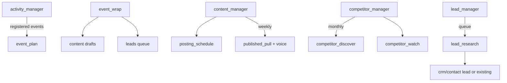
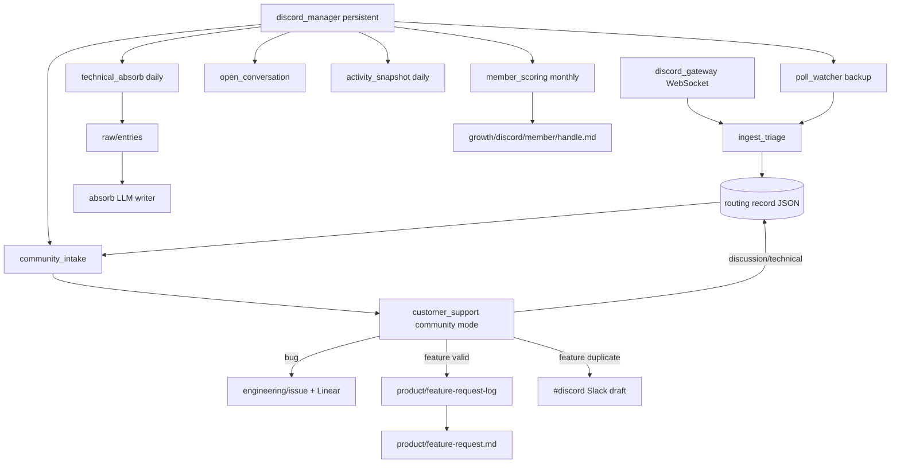
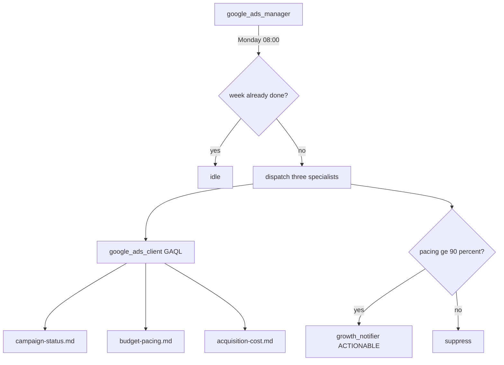

# Growth — Agent Handbook

Growth under `src/company_brain/agents/growth/`. Finance-like shape: **platform
managers** (Discord, Google Ads) plus **workstream managers** (activity, content,
competitor, leads). No parent `growth_manager` — onboarding starts the workstream
managers; Discord/Ads keep their own onboarding.

**Workstream packages** (not platforms): `growth/activity/`, `growth/content/`,
`growth/competitor/`, `growth/leads/`. Same pattern later for HR/legal.

**Posture:** read-only / draft-only at external surfaces — Discord bot **never
posts**; Google Ads **never mutates**; content agents **never post** to X/LinkedIn.
Community members are **not** CRM customers. Event registration is **human-gated**
(`@wiki` / CLI / admin console) — never invented from Luma/Partiful/GCal alone.

**Config:** [`config/growth.yaml`](../../config/growth.yaml) — Discord, `google_ads`,
and workstream sections (`activity`, `content`, `competitor.keywords`, `leads`).
**Env:** `DISCORD_BOT_TOKEN`; `GOOGLE_ADS_*` (see Google Ads section).
**Members:** per-member `bindings.discord_id` (+ optional `discord_handle`) in
[`config/members.yaml`](../../config/members.yaml) for team-member thread suppression.

**CLI:** `company-brain growth onboarding [--no-managers]`, `growth event …`,
`growth *-manager [--once]`, `growth leads enqueue`, `growth draft`, `growth published-pull`.

---

## Growth workstreams — how it runs



### Managers (workstreams)

| Manager | Schedule | Dispatches |
|---------|----------|------------|
| `activity_manager.py` | `activity.poll_interval_minutes` (default 30) | `event_plan` for `event_status=registered` |
| `content_manager.py` | `content.poll_interval_minutes`; weekly pull on `weekly_pull_weekday` | `posting_schedule`, `published_pull` |
| `competitor_manager.py` | monthly (poll + month gate) | `competitor_discover`, `competitor_watch` |
| `lead_manager.py` | `leads.poll_interval_minutes` when queue non-empty | `lead_research` |

### Specialists — Activity (`growth/activity/`)

| Agent | Schedule | Description |
|-------|----------|-------------|
| `event_register.py` | On demand (CLI / `@wiki` / console) | Create `growth/activity/event/{slug}.md` |
| `event_plan.py` | Via manager + on demand | Assisted planning / logistics checklist |
| `partnership_brief.py` | On demand | Partner one-pager + event Partners link |
| `event_wrap.py` | On demand | Wrap page; queue social drafts + lead job |

### Specialists — Content (`growth/content/`)

| Agent | Schedule | Description |
|-------|----------|-------------|
| `draft_writer.py` | On demand | Draft blog / X / LinkedIn (never posts) |
| `published_pull.py` | Weekly via manager | Ingest published items; retire drafts; refresh company voice |
| `trend_watch.py` | On demand | Append `growth/content/trend-watch.md` |
| `posting_schedule.py` | Via content manager | Open drafts + cadence guidance |

### Specialists — Competitor (`growth/competitor/`)

| Agent | Schedule | Description |
|-------|----------|-------------|
| `discover.py` | Monthly via manager | Keyword search seed from `competitor.keywords` |
| `watch.py` | Monthly via manager | Append watch notes on known competitor pages |

### Specialists — Leads (`growth/leads/`)

| Agent | Schedule | Description |
|-------|----------|-------------|
| `lead_research.py` | Via lead manager | Attendee CSV / GitHub stargazers / uploaded lists → CRM |
| `queue.py` | — | Wiki JSON queue under `growth/leads/queue/` (helper) |

**CRM:** segment `lead` (`crm/lead/_index.md` + `crm/contact/{slug}.md`). Research
queries CRM first — if `connection` / `customer` / `investor`, update that contact
(no duplicate lead). Optional `priority` 1–10.

### `@wiki` growth commands

Allow-listed (not AskWiki): `register event`, `plan event`, `partner one-pager`,
`wrap event`, `draft <blog|x|linkedin>`, `research leads from event`. Ambiguous NL
stays Q&A. See Slack `@wiki help`.

### Onboarding (`growth_onboarding.py`)

| | |
|---|---|
| **State** | ephemeral |
| **CLI** | `company-brain growth onboarding [--no-managers]` |
| **Seeds** | activity/content index pages + CRM seeds; competitor discover from keywords |
| **Handoff** | `get_runtime().start` activity / content / competitor / lead managers |

---

## Discord — how it runs

**`discord_manager`** polls on `discord.poll_interval_minutes` (default 15) and
dispatches specialists. **`company-brain discord gateway`** runs the Gateway WebSocket
hot lane separately (like `slack events`). **`poll_watcher`** is REST backup on each
manager pass.



### Manager

**`discord_manager.py`** — persistent manager scoped to Discord (department level).

| | |
|---|---|
| **State** | persistent |
| **Schedule** | Every `poll_interval_minutes` (default **15**); community is 24/7 (`workdays_only: false`) |
| **Every pass** | `poll_watcher`, `community_intake`, `open_conversation` |
| **Daily** | `activity_snapshot` (once per UTC day); `technical_absorb` (after `absorb_batch_hour_utc`, default **06:00 UTC**) |
| **Monthly** | `member_scoring` (first manager pass of calendar month) |

Gateway is **not** embedded — start via `company-brain discord gateway` or after onboarding.

### Specialists — Discord (`growth/discord/`)

| Agent | Schedule | Description |
|-------|----------|-------------|
| `ingest_triage.py` | Gateway hot lane + poll backup | Tier 0/1 classify → routing records; hot-dispatches `community_intake` on bugs/features |
| `poll_watcher.py` | Via manager | REST poll backup for missed Gateway events |
| `community_intake.py` | Via manager + triage hot lane | Open routing records → `customer_support` community mode |
| `open_conversation.py` | Via manager | Rebuild open discussion/technical tracker page |
| `activity_snapshot.py` | Daily via manager | Channel/member activity aggregates |
| `member_scoring.py` | Monthly via manager | LLM batch scores active members; `#growth` alert when score ≥ threshold |
| `technical_absorb.py` | Daily via manager | Enqueue discussion/technical threads → `raw/entries` for absorb |
| `discord_gateway.py` | CLI `discord gateway` | WebSocket listener (not dispatched by manager) |
| `events_router.py` | Via gateway | Routes Gateway events to triage |
| `discord_client.py` | — | REST + Gateway helpers (not an agent) |
| `discord_onboarding.py` | Once (`discord onboarding run`) | $0 estimate + backfill; starts `discord_manager` |

**Onboarding** (`discord_onboarding.py`) — always last in this table:

| | |
|---|---|
| **State** | ephemeral |
| **Schedule** | Once, on first Discord connection |
| **CLI** | `company-brain discord onboarding estimate` ($0 count), `discord onboarding run [--days N] [--all] [--no-manager] [--absorb]` |
| **Backfill** | Default **30 days** (`onboarding_default_backfill_days`) |
| **Handoff** | `get_runtime().start(discord_manager)` when `start_manager=True` |

Backfills via `ingest_triage`, runs `community_intake` + `open_conversation`, optionally
queues absorb (`--absorb`), then starts the manager. Run `discord gateway` separately for
the WebSocket hot lane.

**CLI:** `company-brain discord gateway`, `discord manager`, `discord sync-channels`,
`discord channel list`, `discord onboarding estimate|run`

Connect steps: [`project_install.md`](../../project_install.md) → Discord section.

---

## Routing records

One JSON file per Discord thread (or channel message) on the wiki volume:

```
wiki/growth/discord/routing/{channel_id}/{thread_id}.json
```

Fields align with Slack routing: `kind`, `attention`, `handled`, `extracted`
(permalink, `author_id`, `author_handle`, `message_id`, product guess).

**Triage tiers:**

| Tier | Examples |
|------|----------|
| **skip** | Excluded channels, bot messages, join/leave, spam heuristics |
| **immediate** | Bugs, clear feature requests, technical questions needing tracking |
| **deferred** | Low-signal discussion (still recorded; absorb queue later) |

Channel registry: `config/discord_channels.json` (sync via `discord sync-channels`).
Exclude list: `config/growth.yaml` → `discord.exclude_channels` (names or IDs).

---

## Community routing — `customer_support` community mode

`community_intake.py` builds a `CommunityIntake` dataclass and calls
`operations/customer_support.py` with `community=True`:

| Classification | Destination |
|----------------|-------------|
| **Bug** | `engineering/issue/{slug}.md` + Linear (`customer: false`, `origin: discord`) |
| **Feature (valid)** | Append `product/feature-request-log.md` (`source: discord`, `product: {slug}`); rebuild `product/feature-request.md` |
| **Feature (duplicate / in build)** | Draft technical reply → `#discord` via `discord_review_notifier()`; suppress if team member already in thread |
| **Discussion / technical** | Routing record `kind=discussion_open`; `open_conversation` rebuilds tracker |
| **Spam / noise** | Skipped (`verify` noise path) |

**No CRM writes** for community intake.

**Product inference:** LLM + heuristic against [`config/product_catalog.yaml`](../../config/product_catalog.yaml);
fallback slug `general`. Dedup checks shipped `features` and active `in_build` lists.

**Notifications** (all via `Notifier` / `Signal`):

| Signal | Channel | Severity |
|--------|---------|----------|
| New valid feature request | `#growth` | ACTIONABLE |
| Interesting member (score ≥ threshold, monthly) | `#growth` | ACTIONABLE |
| Duplicate/in-progress feature → draft reply | `#discord` | ACTIONABLE |
| Routine activity / absorb | — | suppressed |

Helpers: `growth/shared/growth_slack.py` → `growth_notifier()`, `discord_review_notifier()`.

---

## Wiki paths

| Path | Title | Write mode | Agent |
|------|-------|------------|-------|
| `growth/activity/_index.md` | Company Activity | update | `event_register` |
| `growth/activity/event/{slug}.md` | (event) | update | activity specialists |
| `growth/content/draft/{slug}.md` | Draft — … | update | `draft_writer` / wrap |
| `growth/content/published.md` | Published Company Content | append | `published_pull` |
| `growth/content/voice/company.md` | Company Voice | append | `published_pull` |
| `growth/content/trend-watch.md` | Trend Watch | append | `trend_watch` |
| `growth/content/posting-schedule.md` | Posting Schedule | update | `posting_schedule` |
| `growth/competitor/_index.md` | Competitors | update | `competitor_discover` |
| `growth/competitor/{slug}.md` | (competitor) | append/update | discover / watch |
| `growth/discord/open-conversation.md` | Open Conversations | update | `open_conversation` |
| `growth/discord/activity.md` | Discord Activity | update | `activity_snapshot` |
| `growth/discord/member/{handle}.md` | `{Handle}` | update | `member_scoring` |
| `growth/google-ads/campaign-status.md` | Campaign Status | update | `campaign_status` |
| `growth/google-ads/budget-pacing.md` | Budget Pacing | update | `budget_pacing` |
| `growth/google-ads/acquisition-cost.md` | Acquisition Cost | update | `acquisition_cost` |
| `product/feature-request-log.md` | Feature Request Log | append | `customer_support` (community) |
| `product/feature-request.md` | Feature Requests | update | `customer_support` (ranked rebuild) |
| `engineering/issue/{slug}.md` | (per issue) | update | `customer_support` (community bugs) |

Member pages carry frontmatter: `interesting_score` (1–5), `discord_id`, `last_scored_at`.

---

## Google Ads — how it runs

Read-only weekly snapshots. Search and Performance Max share the same agents
(campaign type is a column). No historical backfill — onboarding captures the
current snapshot only.



### Manager

**`google_ads_manager.py`** — Persistent manager scoped to Google Ads (checks Ads
according to its specified action schedule, idles otherwise).

- Weekly (default **Monday 08:00** in `google_ads.timezone`) dispatches the
  specialists below; skips if the ISO week already succeeded.
- `#growth` actionable when MTD spend ≥ `pacing_alert_threshold` (default 0.9)
  with days left in the month — not for same-day front-loading alone.
- Repeated auth/API failures (≥2) also alert `#growth`.

### Specialists — Google Ads (`growth/google_ads/`)

| Agent | Schedule | Description |
|-------|----------|-------------|
| `campaign_status.py` | Weekly via manager | Non-removed campaigns: type, status, dates, budget |
| `budget_pacing.py` | Weekly via manager | MTD spend vs period budget (% used / remaining) |
| `acquisition_cost.py` | Weekly via manager | Ads-reported CPA (MTD + last 30 days) |
| `google_ads_client.py` | — | GAQL helpers (not an agent); read-only |
| `google_ads_onboarding.py` | Once (`google-ads onboarding run`) | Snapshot once; starts `google_ads_manager` |

**Onboarding** (`google_ads_onboarding.py`) — always last in this table:

| | |
|---|---|
| **State** | ephemeral |
| **Schedule** | Once, when Ads credentials are connected |
| **CLI** | `company-brain google-ads onboarding run [--no-manager]` |
| **Backfill** | None (snapshot only) |
| **Handoff** | `get_runtime().start(google_ads_manager)` when `start_manager=True` |

**CLI:** `company-brain google-ads manager [--once] [--force]`,
`google-ads onboarding run`

**Env:** `GOOGLE_ADS_DEVELOPER_TOKEN`, `GOOGLE_ADS_CLIENT_ID`,
`GOOGLE_ADS_CLIENT_SECRET`, `GOOGLE_ADS_REFRESH_TOKEN`, `GOOGLE_ADS_CUSTOMER_ID`,
optional `GOOGLE_ADS_LOGIN_CUSTOMER_ID`. Package: `pip install 'company-brain[google-ads]'`.

Connect steps: [`project_install.md`](../../project_install.md) → Google Ads section.

**Budget / CPA notes**

- Period budget: daily budgets are scaled by days-in-month for the monthly cycle;
  Ads may front-load within the period without exceeding the period cap.
- CPA is **Ads-reported** (`cost / conversions`). Product-true conversion CPA is
  deferred until engineering + Ads conversion actions are configured.

---

## Platform boundary

| company-brain owns | Discord owns |
|--------------------|--------------|
| Ingest, triage, wiki docs, Slack draft review | Posting, moderation, member identity |
| Feature-request log + dedup against product catalog | Community CRM / contact promotion |
| Technical discussion → absorb queue | Thread lifecycle in the server |

| company-brain owns | Google Ads owns |
|--------------------|-----------------|
| Wiki snapshots, weekly pacing alert | Budgets, bids, conversion setup, serving |
| Ads-reported CPA display | Optimization / Smart Bidding / keyword tooling |

Deferred: Ads mutates, product-true CPA, keyword research, daily pacing, X/LinkedIn
write APIs, Luma/Partiful integrations, product signup-spike ROI, Bookface, Notion
product-progress page — see [`docs/tabled.md`](../tabled.md).
