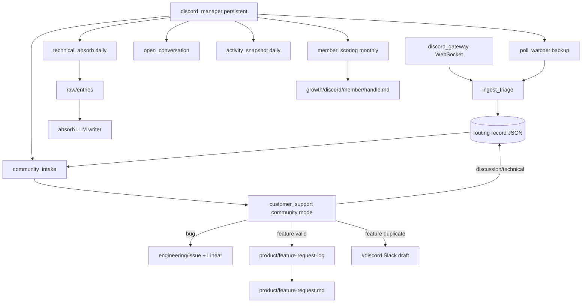

# Growth — Agent Handbook

Open-source **developer community** platforms under
`src/company_brain/agents/growth/`. v1 ships **Discord** only; future platforms
(Google Ads, X, …) get their own managers or fold into a parent `growth_manager`.

**Posture:** read-only at the source — the Discord bot **never posts** to Discord.
Humans draft replies in Slack `#discord` when duplicate/in-progress features need a
community response. Community members are **not** CRM customers (no contact matching).

**Config:** [`config/growth.yaml`](../../config/growth.yaml) — guild, poll interval,
exclude channels, member-scoring thresholds, absorb batch hour.
**Env:** `DISCORD_BOT_TOKEN`
**Members:** per-member `bindings.discord_id` (+ optional `discord_handle`) in
[`config/members.yaml`](../../config/members.yaml) for team-member thread suppression.

---

## Discord — how it runs

**`discord_manager`** polls on `discord.poll_interval_minutes` (default 15) and
dispatches specialists. **`company-brain discord gateway`** runs the Gateway WebSocket
hot lane separately (like `slack events`). **`poll_watcher`** is REST backup on each
manager pass.



### Manager

**`discord_manager.py`** — persistent manager scoped to Discord (department level).

| | |
|---|---|
| **State** | persistent |
| **Schedule** | Every `poll_interval_minutes` (default **15**); community is 24/7 (`workdays_only: false`) |
| **Every pass** | `poll_watcher`, `community_intake`, `open_conversation` |
| **Daily** | `activity_snapshot` (once per UTC day); `technical_absorb` (after `absorb_batch_hour_utc`, default **06:00 UTC**) |
| **Monthly** | `member_scoring` (first manager pass of calendar month) |

Gateway is **not** embedded — start via `company-brain discord gateway` or after onboarding.

### Specialists — Discord (`growth/discord/`)

| Agent | Schedule | Description |
|-------|----------|-------------|
| `ingest_triage.py` | Gateway hot lane + poll backup | Tier 0/1 classify → routing records; hot-dispatches `community_intake` on bugs/features |
| `poll_watcher.py` | Via manager | REST poll backup for missed Gateway events |
| `community_intake.py` | Via manager + triage hot lane | Open routing records → `customer_support` community mode |
| `open_conversation.py` | Via manager | Rebuild open discussion/technical tracker page |
| `activity_snapshot.py` | Daily via manager | Channel/member activity aggregates |
| `member_scoring.py` | Monthly via manager | LLM batch scores active members; `#growth` alert when score ≥ threshold |
| `technical_absorb.py` | Daily via manager | Enqueue discussion/technical threads → `raw/entries` for absorb |
| `discord_gateway.py` | CLI `discord gateway` | WebSocket listener (not dispatched by manager) |
| `events_router.py` | Via gateway | Routes Gateway events to triage |
| `discord_client.py` | — | REST + Gateway helpers (not an agent) |
| `discord_onboarding.py` | Once (`discord onboarding run`) | $0 estimate + backfill; starts `discord_manager` |

**Onboarding** (`discord_onboarding.py`) — always last in this table:

| | |
|---|---|
| **State** | ephemeral |
| **Schedule** | Once, on first Discord connection |
| **CLI** | `company-brain discord onboarding estimate` ($0 count), `discord onboarding run [--days N] [--all] [--no-manager] [--absorb]` |
| **Backfill** | Default **30 days** (`onboarding_default_backfill_days`) |
| **Handoff** | `get_runtime().start(discord_manager)` when `start_manager=True` |

Backfills via `ingest_triage`, runs `community_intake` + `open_conversation`, optionally
queues absorb (`--absorb`), then starts the manager. Run `discord gateway` separately for
the WebSocket hot lane.

**CLI:** `company-brain discord gateway`, `discord manager`, `discord sync-channels`,
`discord channel list`, `discord onboarding estimate|run`

Connect steps: [`project_install.md`](../../project_install.md) → Discord section.

---

## Routing records

One JSON file per Discord thread (or channel message) on the wiki volume:

```
wiki/growth/discord/routing/{channel_id}/{thread_id}.json
```

Fields align with Slack routing: `kind`, `attention`, `handled`, `extracted`
(permalink, `author_id`, `author_handle`, `message_id`, product guess).

**Triage tiers:**

| Tier | Examples |
|------|----------|
| **skip** | Excluded channels, bot messages, join/leave, spam heuristics |
| **immediate** | Bugs, clear feature requests, technical questions needing tracking |
| **deferred** | Low-signal discussion (still recorded; absorb queue later) |

Channel registry: `config/discord_channels.json` (sync via `discord sync-channels`).
Exclude list: `config/growth.yaml` → `discord.exclude_channels` (names or IDs).

---

## Community routing — `customer_support` community mode

`community_intake.py` builds a `CommunityIntake` dataclass and calls
`operations/customer_support.py` with `community=True`:

| Classification | Destination |
|----------------|-------------|
| **Bug** | `engineering/issue/{slug}.md` + Linear (`customer: false`, `origin: discord`) |
| **Feature (valid)** | Append `product/feature-request-log.md` (`source: discord`, `product: {slug}`); rebuild `product/feature-request.md` |
| **Feature (duplicate / in build)** | Draft technical reply → `#discord` via `discord_review_notifier()`; suppress if team member already in thread |
| **Discussion / technical** | Routing record `kind=discussion_open`; `open_conversation` rebuilds tracker |
| **Spam / noise** | Skipped (`verify` noise path) |

**No CRM writes** for community intake.

**Product inference:** LLM + heuristic against [`config/product_catalog.yaml`](../../config/product_catalog.yaml);
fallback slug `general`. Dedup checks shipped `features` and active `in_build` lists.

**Notifications** (all via `Notifier` / `Signal`):

| Signal | Channel | Severity |
|--------|---------|----------|
| New valid feature request | `#growth` | ACTIONABLE |
| Interesting member (score ≥ threshold, monthly) | `#growth` | ACTIONABLE |
| Duplicate/in-progress feature → draft reply | `#discord` | ACTIONABLE |
| Routine activity / absorb | — | suppressed |

Helpers: `growth/shared/growth_slack.py` → `growth_notifier()`, `discord_review_notifier()`.

---

## Wiki paths

| Path | Title | Write mode | Agent |
|------|-------|------------|-------|
| `growth/discord/open-conversation.md` | Open Conversations | update | `open_conversation` |
| `growth/discord/activity.md` | Discord Activity | update | `activity_snapshot` |
| `growth/discord/member/{handle}.md` | `{Handle}` | update | `member_scoring` |
| `product/feature-request-log.md` | Feature Request Log | append | `customer_support` (community) |
| `product/feature-request.md` | Feature Requests | update | `customer_support` (ranked rebuild) |
| `engineering/issue/{slug}.md` | (per issue) | update | `customer_support` (community bugs) |

Member pages carry frontmatter: `interesting_score` (1–5), `discord_id`, `last_scored_at`.

---

## Platform boundary

| company-brain owns | Discord owns |
|--------------------|--------------|
| Ingest, triage, wiki docs, Slack draft review | Posting, moderation, member identity |
| Feature-request log + dedup against product catalog | Community CRM / contact promotion |
| Technical discussion → absorb queue | Thread lifecycle in the server |

Deferred: Notion product-progress page, fine-grained Notion teamspace ACL for
growth/product/engineering — see [`docs/tabled.md`](../tabled.md).
