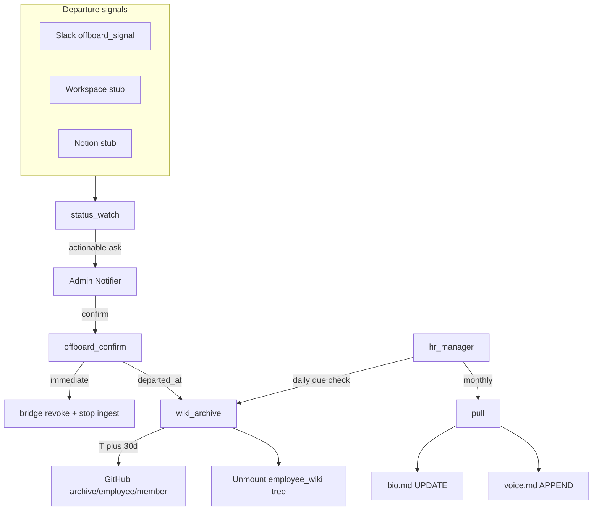

# HR department — agents

People status, employee-wiki maintenance (LinkedIn bio/voice), and departure
hygiene. HR platforms mostly lack APIs — company-brain does not actuate HRIS.

**Config:** [`config/hr.yaml`](../../config/hr.yaml), seed lists
[`config/hr_seed.yaml`](../../config/hr_seed.yaml). Web search:
[`config/web_search.yaml`](../../config/web_search.yaml) (default `lsearch`).
**Env:** wiki-git token for archive branches (same as `wiki_commit`:
`COMPANY_BRAIN_WIKI_GIT_TOKEN`).

## Roster vs members

| File | Who | Weave | Bridge |
|------|-----|-------|--------|
| `config/roster.yaml` | Trial, intern, contractor | Cannot invoke | N/A until promoted |
| `config/members.yaml` | W2 employees | Can invoke | Token + `bridge.departments` |

Department scope: `department` + `bridge.departments` on both files. Employment-type
ingest scopes remain tabled.

## How it runs

Managers (dispatch specialists based on gathered information):

**`hr_manager.py`** — Persistent manager (polls on `hr.manager.poll_interval_minutes`).
- Monthly LinkedIn bio/voice pull for active members with `bindings.linkedin_url`.
- Daily check for departed members due for wiki archive (T+`archive_delay_days`).

## Agents

| Agent | Schedule | Description |
|-------|----------|-------------|
| `hiring_log.py` | On HR events | Append `hr/hiring-log.md` (join / promote / depart; all employment types) |
| `employee_offboarding.py` | CLI / Slack signal | Proposal at `hr/offboard-proposal/{member}.md` (ask only) |
| `status_watch.py` | Via manager / CLI | Multi-signal deactivation → admin ask |
| `offboard_confirm.py` | Admin CLI | `status: departed`, bridge revoke, stop ingest, set `departed_at` |
| `wiki_archive.py` | Via manager (T+30) | Push `archive/employee/{member}` then unmount employee wiki tree |
| `linkedin/pull.py` | Monthly via manager | Public profile → `bio.md` / posts → `voice.md` via default web search (`lsearch`, Claude fallback) |
| `offboard_signal.py` (`operations/slack/`) | Slack `user_change` | Dispatches offboarding proposal when member deactivated |
| `hr_onboarding.py` | Once / per member | Seed lists or single join → wiki bootstrap + hiring log + start manager |

**CLI:**

- `company-brain hr onboard --seed` — first run from `hr_seed.yaml`
- `company-brain hr onboard {member_key}` — new joiner (must exist in members/roster)
- `company-brain hr promote {roster_key}`
- `company-brain hr offboard {member_key}` — proposal only
- `company-brain hr confirm-offboard {member_key}` — admin actuation
- `company-brain hr manager [--once]`

**Stubs (v1):** Google Workspace + Notion deactivation *detection* only (no API removal).

**Tabled:** Employment-type ingest scopes; real Workspace/Notion admin removal; CRM
inbound → hiring log; social beyond LinkedIn WebSearch.
