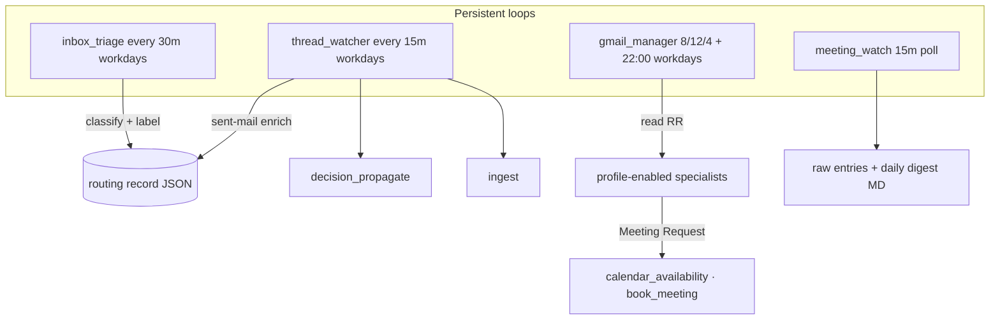
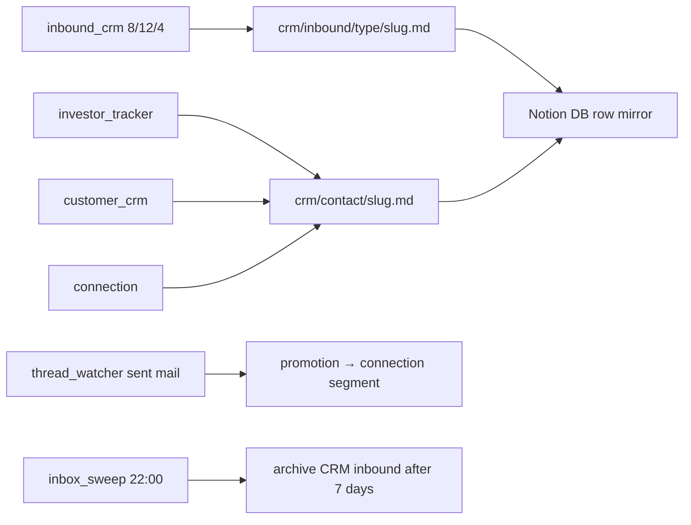
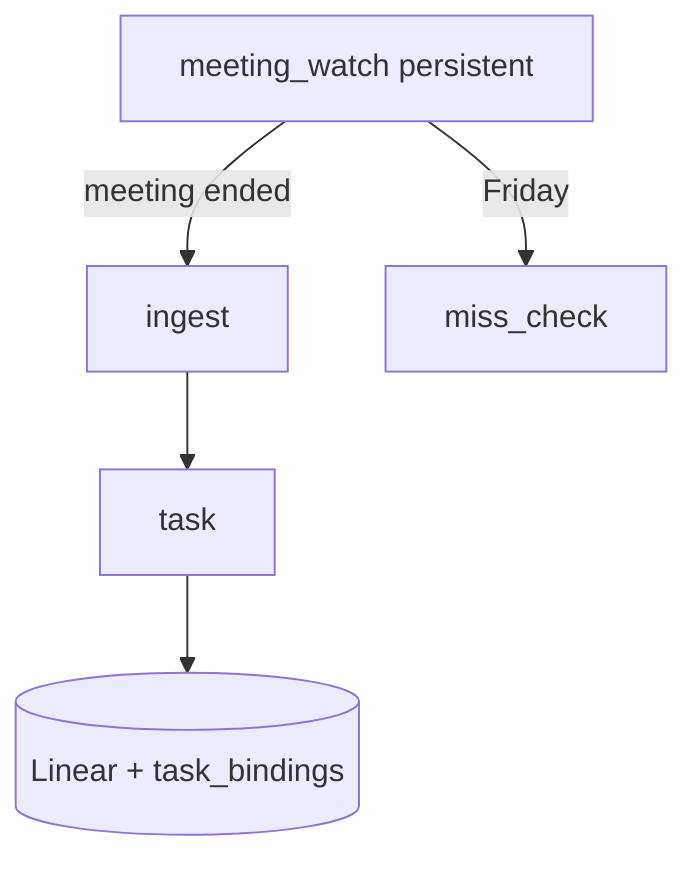
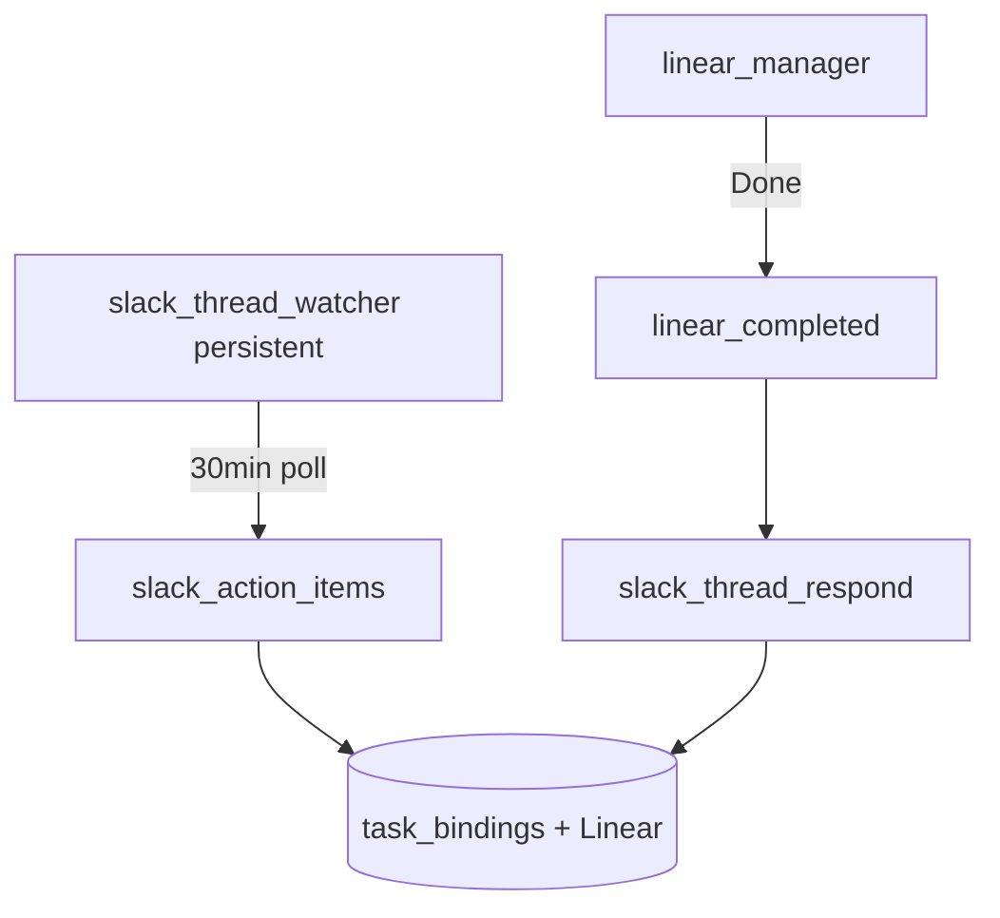
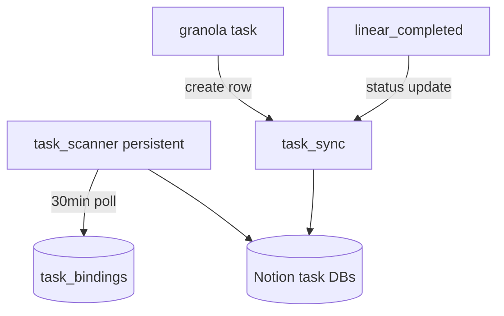

# Operations — Agent Handbook

Catch-all department for general platforms: **Gmail executive assistant** and **Linear**
task workflows. Code lives under `src/company_brain/agents/operations/`.

**Vision:** a team of agents working alongside the user to complete work and document
information in the company. The **executive assistant** package (**Phases 0–5**) is
**shipped** — triage, CRM, Linear tasks, receipt routing, and service profiles.

In the ideal case, every company Gmail account connects to company-brain and ingest
happens automatically once each mailbox is onboarded.

**Config:** [`config/operations.yaml`](../../config/operations.yaml) — profile
definitions in `gmail.profiles`, active default in `gmail.profile`, per-mailbox
overrides in `gmail.mailbox_profiles`. **Env:** `GMAIL_*`, `GRANOLA_*`, `LINEAR_*`, `SLACK_BOT_TOKEN`

**Posture:** Gmail agents **read, label, and draft only — never send**. Finance platforms
stay read-only at the source (see [Finance handbook](finance.md)).

---

## Gmail — how it runs

The Gmail package is a fleet of agents around a **routing record** per message. Only
**`inbox_triage`** reads raw mail on a schedule; specialists act on routing records
keyed by message id.



### Schedules (workdays, configurable)

| Agent / action | Default schedule |
|----------------|------------------|
| `inbox_triage` | Every **30 min** |
| `thread_watcher` | Every **15 min** |
| `gmail_manager` dispatch | **08:00, 12:00, 16:00** |
| `inbox_sweep` | **22:00** (via manager) |
| `ingest_queue_review` | **Monday 08:00** |
| `receipt_router` | **Friday 08:00** |

All times in `config/operations.yaml` → `gmail.schedules`.

---

## Routing records

One JSON file per triaged message on the wiki volume:

```
wiki/operations/gmail/routing/<mailbox>/<message_id>.json
```

Example:

```json
{
  "message_id": "...",
  "thread_id": "...",
  "mailbox": "ceo@company.com",
  "triaged_at": "2026-06-18T12:00:00+00:00",
  "attention": "2. Reply",
  "domain_tags": ["Investor", "Cold Inbound/Partnership"],
  "contact_type": "investor",
  "extracted": { "subject": "...", "from": "..." },
  "handled": { "draft_reply": "2026-06-18T16:00:00+00:00" },
  "disposition": { "mark_read": false, "archive_now": false }
}
```

**Two dimensions:** `attention` (1–4 or none) + `domain_tags[]` (multi-tag allowed).

Specialists query **`unhandled_for(specialist_key, …)`** and mark **`handled[specialist_key]`**
when done. Duplicate mailbox copies get `extracted.duplicate_of` and are skipped by
downstream specialists (except `duplicate_across_mailboxes`).

---

## Label taxonomy

### Visibility

Only **attention labels (1–4)** show next to subjects in the Gmail inbox list
(`messageListVisibility: show`). All domain labels are created with **hide** so they
don't clutter the inbox home view; triage still applies them for search and routing.

### Attention (visible, leave unread unless noted)

| Label | Meaning |
|-------|---------|
| `1. Action` | Requires action (sign, deadline, etc.) |
| `2. Reply` | Needs a reply |
| `3. FYI` | Informational |
| `4. Team On It` | Delegate to team (Linear + Slack) |

### Customer

Single **`Customer`** label — active customers only (wiki CRM list drives triage).
Prospect vs customer disambiguation lives in the routing record / CRM logic.

### Cold inbound (EA profile: nested under `Cold Inbound/`)

| Sub-label | Triage disposition |
|-----------|-------------------|
| `Sales Outreach` | Mark read + archive |
| `Job Seekers` | Mark read + archive |
| `Miscellaneous` | Mark read + archive |
| `Investor Interest` | Keep in inbox → **`inbound_crm`** |
| `Partnership` | Keep in inbox → **`inbound_crm`** |
| `Founder Networking` | Keep in inbox → **`inbound_crm`** |
| `Press & Podcast` | **`inbound_crm`** (+ score-gated Slack `#growth` when configured) |
| `Event Invitations` | **`inbound_crm`** (+ score-gated Slack `#growth` when configured) |
| `Job Seekers` | Mark read + archive at triage; **`inbound_crm`** logs to wiki first |

**Employee profile:** flat **`Cold Inbound`** only (no nested sub-labels).

### Investor rule (EA profile only)

Confirmed investor emails/domains in **`crm/investor/_index.md`** → **`Investor`** label +
`contact_type: investor`. Cold interest → **`crm/inbound/investor-interest/`** via
**`inbound_crm`**. Confirmed investors also get **`crm/contact/{slug}.md`** from
**`investor_tracker`**.

Employee profile: no Investor label; investor detection skipped.

### Other domain labels (hidden)

| Label | Applied by | Notes |
|-------|------------|-------|
| `AI Meeting Notes` | triage | Read + archive immediately |
| `Newsletters/<name>` | triage | Read at triage; archive +1 day in sweep (EA). Employee: flat `Newsletters` |
| `Receipts` | triage | Read at triage; archive +1 day in sweep (Ramp match window) |
| `Meeting` / `Meeting Request` | triage | Calendar invites |
| `Ingest` | thread_watcher | Sent-mail enrichment |
| `Vendor` | triage | Billing/renewal comms |
| `People` | triage | Connections (not investors) |
| `Warm intro` | triage | EA only; confident cases |
| `Decision` | thread_watcher | Real decisions in sent mail (not thanks/pass) |

### Disposition at triage

| Type | mark read | archive now | archive later |
|------|-----------|-------------|---------------|
| AI meeting notes | yes | yes | — |
| Newsletters | yes | — | sweep +1 day |
| Receipts | yes | — | sweep +1 day |
| Auto-archive cold (Sales, Job Seekers, Misc) | yes | yes | — |

Label names and auto-archive list: `config/operations.yaml` → `gmail.labels`.

---

## Service profiles

`gmail_manager` runs for **every** connected account. Triage labels and dispatched
specialists follow the active profile.

| Profile | Use case | Key differences |
|---------|----------|-----------------|
| **`executive_assistant`** (default) | Startup founders / CEO | Full label taxonomy, nested cold inbound & newsletters, all specialists |
| **`employee`** | Employee Gmail | Flat Cold Inbound & Newsletters; no Investor or Warm intro; no investor_tracker, receipt_router |
| **`service_account`** | Purpose inboxes | Attention **1–3** only; minimal domain labels; override per mailbox |

**Set profile:** `gmail.profiles` defines each profile's labels and agents;
`gmail.profile` is the default for `GMAIL_MAILBOX`; override per deploy with
`GMAIL_PROFILE=employee`, or per mailbox in `gmail.mailbox_profiles`. See
[`project_install.md`](../../project_install.md).

---

## Manager

### `gmail_manager.py`

| | |
|---|---|
| **State** | persistent |
| **Schedule** | **08:00, 12:00, 16:00, 22:00** on workdays |
| **Source** | Routing records (`wiki/operations/gmail/routing/`) |

At **8/12/4:** runs **`duplicate_across_mailboxes`** first, then every profile-enabled
specialist in dispatch order. Weekly agents only on their configured day/time.
At **22:00:** **`inbox_sweep`** when enabled for the profile.

Does not read Gmail directly — only dispatches specialists via `get_runtime().run()`.

---

## Persistent Gmail agents (`operations/gmail/`)

### `inbox_triage.py`

| | |
|---|---|
| **State** | persistent |
| **Schedule** | Every **30 min** on workdays |
| **Source** | Gmail REST (`historyId` delta or backfill query) |
| **Destination** | Routing record JSON per message |
| **SDK** | None for classify ($0 heuristics); Gmail REST for modify |

**The only raw-mail reader.** Classifies once, applies visible attention + hidden domain
labels, disposition (read/archive), writes routing record. Does **not** dispatch
specialists. Respects active **service profile** for label set and classification.

### `thread_watcher.py`

| | |
|---|---|
| **State** | persistent |
| **Schedule** | Every **15 min** on workdays |
| **Source** | Gmail sent-folder history delta |

Classifies sent mail: acknowledgment vs **decision** vs **ingest-worthy**. Applies
`Decision` / `Ingest` labels when allowed by profile; enriches routing records; dispatches
**`decision_propagate`** and **`ingest`** when those agents are enabled.

---

## Lifecycle & writers

### `inbox_sweep.py`

| | |
|---|---|
| **State** | ephemeral |
| **Schedule** | **22:00** workdays via manager |
| **Source** | Gmail + routing records |

Archives: `2. Reply` after sent reply; `3. FYI` after opened; Newsletters +1 day;
Meeting after opened; Receipts +1 day. REST only, no LLM.

### `draft_reply.py`

| | |
|---|---|
| **State** | ephemeral |
| **Schedule** | 8/12/4 via manager |
| **Source** | `2. Reply` routing records (simple threads) |
| **Destination** | Gmail draft (never send) |
| **SDK** | Claude Agent SDK + Gmail MCP |
| **Cost gate** | `is_simple_reply_message()` + `changed_since` before LLM |

Creates drafts for low-complexity Reply threads. Skips legal/multi-party/long threads
(handled by **`inbox_task`** → Linear).

### `decision_propagate.py`

| | |
|---|---|
| **State** | ephemeral |
| **Schedule** | Dispatched by `thread_watcher` on real decisions |
| **Destination** | `operations/decisions/timeline.md` |
| **Notion** | Company Timeline |
| **Write mode** | append |

Appends decision section from sent mail. Skips thanks/pass acknowledgments.

### `ingest.py`

| | |
|---|---|
| **State** | ephemeral |
| **Schedule** | `thread_watcher` or manager |
| **Destination** | `raw/entries/*.md` (clear content) or ingest queue flag |

Clear ingest → raw wiki entries for absorb; ambiguous → **`ingest_queue_review`**.

### `ingest_queue_review.py`

| | |
|---|---|
| **State** | ephemeral |
| **Schedule** | **Monday 08:00** via manager |
| **Destination** | `operations/gmail/ingest-queue.md` |
| **Notion** | Ingest Queue |
| **Write mode** | append |

Appends ambiguous items; pings **`#ingest`** on Slack.

### `attachment_router.py`

| | |
|---|---|
| **State** | ephemeral |
| **Schedule** | 8/12/4 via manager |
| **Destination** | `operations/gmail/attachments/{contracts,decks,documents,other}/` |

Fetches attachments from triaged mail onto the wiki volume.

---

## CRM & notifications

Entity-per-person CRM on the wiki (MD source of truth), mirrored to Notion database
rows when `config/notion.yaml` → `crm_databases` is populated. Slack alerts are
**severity-gated** via `Notifier` / `Signal` — never direct Slack calls.



**Wiki layout:** `crm/contact/{slug}.md` (canonical person), segment indexes at
`crm/customer/_index.md` and `crm/investor/_index.md`, typed inbound under
`crm/inbound/{type}/`, derived lookup at `crm/_registry.json`. Vendors stay in
**`finance/vendor/`** (not CRM).

**CLI:** `company-brain crm seed`, `crm rebuild-registry`, `crm sync-notion`.

### `inbound_crm.py` *(EA profile)*

| | |
|---|---|
| **Tags** | All six cold inbound types (press, events, partnership, founder networking, investor interest, job seekers) |
| **Destination** | `crm/inbound/{type}/{date}-{subject-slug}.md` |
| **Write mode** | update (one page per message) |
| **Slack** | Score ≥ threshold → `#growth` for **press + events only** (v1) |
| **Retention** | **`inbox_sweep`** archives from Gmail **7 calendar days** after `triaged_at` |

Replaces the retired log-page agents (`growth_inbound`, `recruiting_inbound`,
`partnership_digest`).

### `investor_tracker.py` *(EA profile)*

| | |
|---|---|
| **Tags** | `Investor`, `Cold Inbound/Investor Interest` |
| **Destination** | Confirmed → `crm/contact/{slug}.md`; interest → `crm/inbound/investor-interest/` (via **`inbound_crm`**) |
| **Write mode** | append on contact interactions |

Index list: **`crm/investor/_index.md`**.

### `customer_support.py`

| | |
|---|---|
| **Tags** | `Customer` |
| **Destination** | Slack `#customer-support` |

Posts summary with source mailbox per customer message.

### `customer_crm.py`

| | |
|---|---|
| **Tags** | `Customer` |
| **Destination** | `crm/contact/{slug}.md` (segment `customer`) |
| **Write mode** | append |

Active customers only; **`crm/customer/_index.md`** drives triage classification.

### `vendor_tracker.py`

| | |
|---|---|
| **Tags** | `Vendor` |
| **Destination** | `finance/vendor/<slug>.md` |
| **Write mode** | append |

Ops comms per vendor. Finance costs in **`subscription_audit`**.

### `connection.py`

| | |
|---|---|
| **Tags** | `People`, `Warm intro` (EA only) |
| **Destination** | `crm/contact/{slug}.md` (segment `connection`) |
| **Write mode** | append |

Excludes `contact_type: investor`. Two-way mail can auto-promote to `connection` via
**`thread_watcher`** + `crm/promotion.py` (dismissive outbound replies excluded).

**Promotion:** `customer` / `investor` segments only via signed contract or manual
index edit — never auto-promoted from inbound.

---

## Cross-platform

### `inbox_task.py`

| | |
|---|---|
| **Tags** | `1. Action`, complex `2. Reply` |
| **Destination** | Linear issue (GraphQL) |
| **Requires** | `LINEAR_API_KEY`, `linear.team_key` in `config/engineering.yaml` |

Simple replies stay with **`draft_reply`**.

### `team_on_it.py`

| | |
|---|---|
| **Tags** | `4. Team On It` |
| **Destination** | Linear issue + Slack `#team-ops` |

No Gmail forward (send forbidden). Team picks up from Slack + Linear.

### `duplicate_across_mailboxes.py`

| | |
|---|---|
| **Schedule** | First in each manager dispatch pass |
| **Source** | Routing records across `gmail.connected_mailboxes` |

Marks secondary copies with `extracted.duplicate_of` so specialists don't double-act.

### `receipt_router.py` *(EA profile)*

| | |
|---|---|
| **Schedule** | **Friday 08:00** |
| **Purpose** | Get receipts into the inbox Ramp watches — not transaction reconciliation |
| **Tags** | `Receipts` + subscription sender list |
| **Forwarding** | Copies missing receipts from other **company-domain** mailboxes via Gmail insert (no external send) |
| **Destination** | `receipt_router.destination_mailbox` (default primary) |
| **Wiki** | `operations/gmail/receipt-route.md` (append) |

Ramp auto-attaches from the destination inbox. This agent only routes mail there;
it does not cross-check Ramp transactions (Ramp owns documentation gaps).
Forwarding logic lives in `receipt_forward.py` (invoked by `receipt_router`).

---

## Linear (via engineering connection layer)

Gmail task agents use the **engineering** Linear client — there is no separate
operations Linear platform folder.

### `engineering/linear/linear_client.py`

Cross-department connection layer (see [Engineering handbook](engineering.md)):

1. **GraphQL API** (default) — `LINEAR_API_KEY` → `api.linear.app/graphql`
2. **Official MCP** — `https://mcp.linear.app/mcp` (Claude SDK agents)
3. **Community CLI** (optional) — `LINEAR_USE_CLI=1` + `linear` on PATH

Used by **`inbox_task`** and **`team_on_it`** for issue creation. Team defaults:
`config/engineering.yaml` → `linear.team_key` / `linear.team_id`.

---

## Google Calendar (`operations/gcal/`)

Connection mirrors Gmail: official Google-hosted Calendar MCP at
`https://calendarmcp.googleapis.com/mcp/v1` plus REST (`gcal_rest.py`) for
deterministic agents. OAuth token can be shared with Gmail when calendar scopes
are on the same consent.

| Agent | Schedule | Description |
|-------|----------|-------------|
| `calendar_availability.py` | On demand | Returns open meeting slots (used by `ext_meeting_scheduler`) |
| `book_meeting.py` | On demand | Creates calendar events with guests + Google Meet link |
| `daily_agenda.py` | **08:00** workdays (opt-in) | Slack DM rundown of today's meetings; **off by default** |

#### Gmail cross-platform (`operations/gmail/`)

| Agent | Schedule | Description |
|-------|----------|-------------|
| `ext_meeting_scheduler.py` | Via `gmail_manager` 8/12/4 | Proposes times (draft) or books meetings for `Meeting Request` threads where the user confirmed |

**`ext_meeting_scheduler`** evaluates meeting importance (investor/customer → high;
cold inbound → low). Low-importance slots avoid booking before significant calendar
events. When it books, thread context is written into the Google Calendar event
description — no separate `meeting_prep` agent. Config: `config/operations.yaml` →
`gcal.*`; enable morning DM with `gcal.daily_agenda.enabled: true` + `slack_user`
(or `GCAL_DAILY_AGENDA=1`).

---

## Granola — how it runs

**`meeting_watch.py`** is the persistent agent (polls calendar every 15 min).
It dispatches **`ingest`** after each meeting ends (+ buffer) and runs
**`miss_check`** weekly as the safety net for any missed meetings.



| Agent | Schedule | Description |
|-------|----------|-------------|
| `meeting_watch.py` | Persistent (15 min poll) | Post-meeting ingest + weekly miss check |
| `ingest.py` | Dispatched per meeting | Raw entries + daily digest wiki page |
| `task.py` | After ingest | Action items → Linear issue + `task_bindings` |
| `miss_check.py` | Weekly (via watch) | Calendar vs ingest gap report |

### Deployment modes

| Mode | API keys | Scope |
|------|----------|-------|
| **business** | One key per member (`GRANOLA_MEMBER_KEYS`) | Personal notes for each roster entry in `granola.members` |
| **enterprise** | Single `GRANOLA_API_KEY` | Public notes (Team-space folders visible to workspace) |

Business mode deduplicates notes by Granola note id across member keys. Enterprise mode
pulls all notes accessible to the company key in one pass.

### Output

1. **Raw entries** — one `raw/entries/*.md` per meeting (tags: `granola`, `meeting`) for absorb.
2. **Daily digest** — `operations/granola/meeting/YYYY-MM-DD.md` (compiled snapshot, `update` mode).

Config: `config/operations.yaml` → `granola.schedule` (`watch_interval_minutes`,
`post_meeting_buffer_minutes`, `miss_check_day`, `miss_check_time`). Client:
`granola/granola_client.py` (REST, read-only). Requires Google Calendar for meeting watch.

### `granola_onboarding.py`

| | |
|---|---|
| **State** | ephemeral |
| **Schedule** | Once, on first Granola connection |
| **Source** | Granola (default **30-day** backfill) |

1. Runs **`ingest`** once per day across the backfill window (oldest first).
2. Starts persistent **`meeting_watch`** via `get_runtime().start()` and exits.

---

## Slack — how it runs

Polls watched channels for threads with action-item language; creates Linear issues
via `task_bindings`. Linear Done → thread completion reply (system propagation).



| Agent | Schedule | Description |
|-------|----------|-------------|
| `slack_thread_watcher.py` | Persistent (30 min poll) | Scan `slack_platform.watched_channels`; dispatch action-item specialist |
| `slack_action_items.py` | Via watcher | Action thread → Linear issue + wiki binding |
| `slack_client.py` | — | Slack Web API (not an agent) |

Config: `config/operations.yaml` → `slack_platform` (`watched_channels`, `action_keywords`,
`poll_interval_minutes`). Requires `SLACK_BOT_TOKEN` with channel history + `chat:write`.

Completion replies: `engineering/linear/linear_completed/slack_thread_respond.py` (dispatched
when a bound Slack task reaches Done in Linear).

---

## Notion — how it runs

Multi-database task registry: scans configured Notion task DBs for rows with a Linear ID
column, links them into `task_bindings`, and propagates Linear status/title back to the
correct database row on completion.



| Agent | Schedule | Description |
|-------|----------|-------------|
| `task_scanner.py` | Persistent (30 min poll) | Query updated task DB rows; link by Linear ID (read-first) |
| `task_sync.py` | Via propagation / Granola ingest | Create or update Notion row for a binding |
| `db.py` | — | Database query/patch helpers (not an agent) |

Config: `config/notion.yaml` → `task_databases` (per-DB `database_id` + column map),
`task_routing` (department/project → database key). Poll interval:
`config/operations.yaml` → `notion_platform.poll_interval_minutes`.

Requires `ntn` CLI authenticated to the workspace. Populate `database_id` after init;
column names must match your Notion schema (`Name`, `Status`, `Linear ID`, etc.).

Started by **`linear_onboarding`** when at least one task database has a `database_id`.
Granola **`meeting_action`** tasks fan out to Notion on create; Linear Done updates the row
via `linear_completed` → `task_sync`.

---

## Onboarding

### `gmail_onboarding.py`

| | |
|---|---|
| **State** | ephemeral |
| **Schedule** | Once, on first Gmail connection |
| **Source** | Gmail (default **30-day** backfill) |

1. Ensures label taxonomy for the mailbox profile.
2. Seeds CRM wiki pages (profile-filtered).
3. Runs backfill triage.
4. Starts persistent **`inbox_triage`**, **`thread_watcher`**, **`gmail_manager`** via
   `get_runtime().start()` and exits.

---

## Deferred work

See [`docs/tabled.md`](../tabled.md) — Operations (Gmail, Slack, Notion, other).
