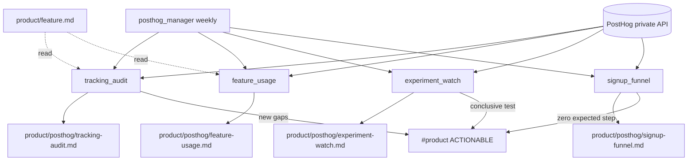

# Product — Agent Handbook

Product under `src/company_brain/agents/product/`. First platform: **PostHog**
(read-only private REST). Wiki section `product/` also holds GitHub-authored
Product Features (`product/feature.md` via engineering `product_features`) and
feature-request pages from ops/growth — those writers stay outside this department.

**Posture:** read-only at PostHog — no flag/experiment mutates, no event capture
from agents. Instrumentation and dashboards live in PostHog; company-brain mirrors
snapshots to the wiki and alerts selectively on `#product`.

**Config:** [`config/product.yaml`](../../config/product.yaml) — `posthog:` schedule,
experiment thresholds, signup funnel names/steps; `slack.product_channel`.
**Env:** `POSTHOG_PERSONAL_API_KEY`, `POSTHOG_PROJECT_ID`, optional `POSTHOG_HOST`
(default `https://us.posthog.com`).

**CLI:** `company-brain posthog manager [--once] [--force]`,
`company-brain posthog onboarding run [--no-manager]`.

---

## PostHog — how it runs

Onboarding is one-shot (not in the diagram): 30-day lookback when prior events
exist, then `start(posthog_manager)`.

---

## Manager

**`posthog_manager.py`** — Persistent manager scoped to PostHog (checks according
to `posthog` schedule in `product.yaml`, default Monday 09:00; idles otherwise).

- Dispatches `tracking_audit`, `feature_usage`, `experiment_watch`, `signup_funnel`
  once per ISO week (StateStore `posthog_manager:week`; `--force` bypass).
- ACTIONABLE `#product` for new missing tracking rows, newly conclusive experiments,
  signup funnel steps with zero events, or ≥2 consecutive API failures.

---

## PostHog (`product/posthog/`)

| Agent | Schedule | Description |
|-------|----------|-------------|
| `tracking_audit.py` | Weekly via manager | Heuristic matched/missing/orphan table: `product/feature.md` × flags/events |
| `feature_usage.py` | Weekly via manager | L7D/L30D event counts for matched features |
| `experiment_watch.py` | Weekly via manager | Experiment table; conclusive = significant or p≥95% and ≥`min_exposures` |
| `signup_funnel.py` | Weekly via manager | Landing → create account (saved insight by name, else config steps) |
| `posthog_onboarding.py` | Once (admin) | Verify API; run all four (30d lookback if data); start manager |

### Destinations

| Agent | Wiki path | Title | Write mode |
|-------|-----------|-------|------------|
| `tracking_audit` | `product/posthog/tracking-audit.md` | Tracking Audit | update |
| `feature_usage` | `product/posthog/feature-usage.md` | Feature Usage | update |
| `experiment_watch` | `product/posthog/experiment-watch.md` | Experiment Watch | update |
| `signup_funnel` | `product/posthog/signup-funnel.md` | Signup Funnel | update |

### Signup funnel contract

Admin defines events/actions in PostHog (optional “Signup” dashboard). Config
defaults: funnel insight name `Landing to signup`; fallback steps = `$pageview`
on `landing_paths` → `signup_event` (`user_signed_up`).

### Related (not PostHog)

| Page / agent | Owner |
|--------------|-------|
| `product/feature.md` | `engineering/github/product_features.py` |
| `product/feature-request*.md` | operations / growth customer support |
