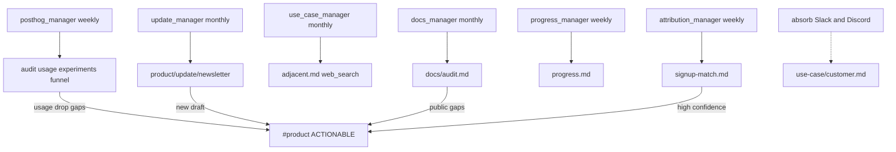

# Product — Agent Handbook

Product under `src/company_brain/agents/product/`. **Hybrid shape** (like growth):
platform managers (PostHog) plus workstream managers (update, use_case, docs,
progress, attribution). No parent `product_manager`.

Wiki section `product/` also holds GitHub-authored Product Features
(`product/feature.md` via engineering `product_features`) and feature-request
pages from ops/growth — those writers stay outside this department.

**Posture:** read-only at PostHog; newsletter **draft-only** (never send); public
docs audit never publishes proprietary features. Absorb (Slack + Discord
`technical_absorb` → `raw/entries`) lands general use-case content on
`product/use-case/customer.md` — no special use-case intake wiring.

**Config:** [`config/product.yaml`](../../config/product.yaml) — `posthog:`,
workstream sections (`update`, `use_case`, `docs`, `progress`, `attribution`),
`slack.product_channel`. Deferred stubs: `admin_api` / `billing` (not wired).
**Env:** `POSTHOG_PERSONAL_API_KEY`, `POSTHOG_PROJECT_ID`, optional `POSTHOG_HOST`.

**CLI:** `company-brain posthog manager|onboarding`;
`company-brain product onboarding`, `product *-manager [--once]`,
`product newsletter|docs-audit|progress|signup-match|use-cases`.

---

## Product workstreams — how it runs

Onboarding is one-shot (not in the diagram): `product_onboarding` seeds pages and
starts workstream managers; `posthog_onboarding` stays separate.

---

## Managers

**`posthog_manager.py`** — Persistent manager scoped to PostHog (schedule in
`product.yaml`, default Monday 09:00; idles otherwise).

- Dispatches `tracking_audit`, `feature_usage`, `experiment_watch`, `signup_funnel`
  once per ISO week (`--force` bypass).
- ACTIONABLE `#product` for new missing tracking, **usage drops**, conclusive
  experiments, zero funnel steps, or ≥2 consecutive API failures.

### Workstream managers

| Manager | Schedule | Dispatches |
|---------|----------|------------|
| `update_manager.py` | Monthly on `update.run_day` | `product_update` |
| `use_case_manager.py` | Monthly | `use_case_track` (seeds customer page) |
| `docs_manager.py` | Monthly | `docs_audit` |
| `progress_manager.py` | Weekly | `progress_compile` |
| `attribution_manager.py` | When activity/signup signature changes | `signup_match` |

---

## PostHog (`product/posthog/`)

| Agent | Schedule | Description |
|-------|----------|-------------|
| `tracking_audit.py` | Weekly via manager | Heuristic matched/missing/orphan table: `product/feature.md` × flags/events |
| `feature_usage.py` | Weekly via manager | L7D/L30D counts; flags drops ≥`usage_drop.drop_ratio` vs prior week when prior ≥`min_prior_l7d` |
| `experiment_watch.py` | Weekly via manager | Experiment table; conclusive = significant or p≥95% and ≥`min_exposures` |
| `signup_funnel.py` | Weekly via manager | Landing → create account (saved insight by name, else config steps) |
| `posthog_onboarding.py` | Once (admin) | Verify API; run all four (30d lookback if data); start manager |

### Destinations

| Agent | Wiki path | Title | Write mode |
|-------|-----------|-------|------------|
| `tracking_audit` | `product/posthog/tracking-audit.md` | Tracking Audit | update |
| `feature_usage` | `product/posthog/feature-usage.md` | Feature Usage | update |
| `experiment_watch` | `product/posthog/experiment-watch.md` | Experiment Watch | update |
| `signup_funnel` | `product/posthog/signup-funnel.md` | Signup Funnel | update |

---

## Update (`product/update/`)

| Agent | Schedule | Description |
|-------|----------|-------------|
| `product_update.py` | Monthly via manager / CLI | Customer newsletter draft under `product/update/newsletter/{YYYY-MM}.md` — never sends |

Style from `growth/content/voice/company.md` + Product Features; checks prior month
draft (wiki or `wiki_commit` work dir when configured). ACTIONABLE when a new draft
is ready for human review/send.

---

## Use case (`product/use_case/`)

| Agent | Schedule | Description |
|-------|----------|-------------|
| `track.py` | Monthly via manager | Web-search **adjacent** use cases → `product/use-case/adjacent.md` (append) |

| Page | Title | Notes |
|------|-------|-------|
| `product/use-case/customer.md` | Customer Use Cases | Seeded; absorb + humans land content (including interviews) |
| `product/use-case/adjacent.md` | Adjacent Use Cases | Web-search discoveries; growth `draft_writer` may read for blogs |

---

## Docs (`product/docs/`)

| Agent | Schedule | Description |
|-------|----------|-------------|
| `audit.py` | Monthly via manager | Fetch `llms.txt` / sitemap / docs vs `product/feature.md` |

Proprietary patterns (`docs.proprietary_patterns`) → “intentionally internal”.
New public gaps → ACTIONABLE `#product`. Set `docs.base_url` in config.

---

## Progress (`product/progress/`)

| Agent | Schedule | Description |
|-------|----------|-------------|
| `compile.py` | Weekly via manager | Rough status from GitHub wiki pages + Linear project completion → `product/progress.md` |

Statuses: `exploring` / `in_progress` / `shipping` / `shipped` / `unknown` — not precise %.

---

## Attribution (`product/attribution/`)

| Agent | Schedule | Description |
|-------|----------|-------------|
| `signup_match.py` | Via manager | Match `growth/activity/event/` to signup spikes |

Signup source (`attribution.signup_source.type`): `wiki_crm` (default), `csv_path`,
`http_json`, or `none`. High-confidence matches → ACTIONABLE `#product`.

---

## Onboarding (`product_onboarding.py`)

| | |
|---|---|
| **State** | ephemeral |
| **CLI** | `company-brain product onboarding [--no-managers]` |
| **Seeds** | use-case / progress / docs audit / signup-match pages |
| **Handoff** | `get_runtime().start` for five workstream managers |

---

### Related (outside product/)

| Page / agent | Owner |
|--------------|-------|
| `product/feature.md` | `engineering/github/product_features.py` |
| `product/feature-request*.md` | operations / growth customer support |
| Investor newsletter | Admin (tabled; not this department) |
