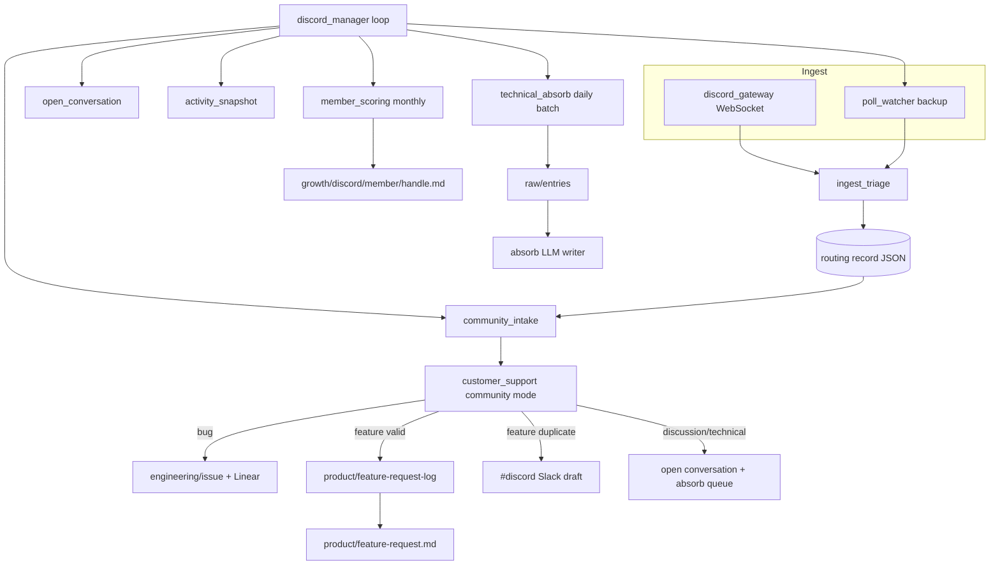

# Discord platform — build plan

**Status:** Locked (design sessions 2026-07-11).  
**Department:** `growth/` (new).  
**Delete this file** after ship when `docs/agents/growth.md`, README, and `project_install.md` are updated.

---

## Scope

Read-only Discord bot for the **open-source developer community**. Ingest technical
discussions, feature requests, and bugs; document in wiki MD → Notion mirror. Community
members are **not** CRM customers (no contact matching). Discord handles suffice for
member profiles.

**In scope:** Gateway ingest, triage, community routing, open-conversation tracker,
feature-request dedup with Slack draft review, monthly member scoring, batch technical
absorb, 30-day onboarding backfill, persistent `discord_manager`.

**Out of scope (v1):** Bot posting to Discord; CRM promotion; Notion product-progress
page (tabled — see `docs/tabled.md`); fine-grained Notion teamspace split (all
`growth` / `product` / `engineering` pages → company-visible teamspace for now).

---

## Architecture (steady state)



Onboarding (`discord_onboarding`) backfills 30 days via the same specialists, then
`get_runtime().start(discord_manager)` — manager idles until its next scheduled pass.

---

## Folder layout

```
src/company_brain/agents/growth/
  discord_manager.py          # persistent manager (department level, Discord-scoped for now)
  discord/
    discord_client.py         # REST + Gateway helpers
    discord_config.py         # reads config/growth.yaml
    discord_gateway.py        # WebSocket events process
    discord_onboarding.py     # one-time backfill + manager handoff
    ingest_triage.py
    community_intake.py
    open_conversation.py
    activity_snapshot.py
    member_scoring.py
    technical_absorb.py
    routing.py                # DiscordRoutingStore
    triage_heuristics.py
    channels_config.py        # guild channels + exclude list
```

Future growth platforms (Google Ads, X, …) get their own managers or fold into a parent
`growth_manager` — do not block v1 on that abstraction.

---

## Manager

### `discord_manager.py`

| | |
|---|---|
| **State** | persistent |
| **Schedule** | `config/growth.yaml` → `poll_interval_minutes` (default 15) |
| **Dispatches** | `poll_watcher`, `community_intake`, `open_conversation`, `activity_snapshot`; monthly gate for `member_scoring`; daily gate for `technical_absorb` |
| **SDK** | None (orchestration) |

Gateway runs as a **separate long-lived process** (like `slack events`), started by
onboarding or `company-brain discord gateway`. Manager does not embed the WebSocket.

---

## Specialists

### `ingest_triage.py`

| | |
|---|---|
| **State** | ephemeral (Gateway hot lane + poll backup) |
| **Source** | Discord Gateway + channel history poll |
| **Destination** | `wiki/growth/discord/routing/{channel_id}/{thread_id}.json` |
| **SDK** | None ($0 heuristics, Slack-parity tiers) |

**Tier behaviour (mirror Slack):**

- **skip** — excluded channels, bot messages, empty, join/leave system events, spam heuristics
- **immediate** — bugs, clear feature requests, technical questions needing tracking
- **deferred** — low-signal discussion (still recorded; absorb queue later)

Routing record fields align with Slack: `kind`, `attention`, `handled`, `extracted`
(permalink, author_id, author_handle, message_id, product guess placeholder).

### `community_intake.py`

| | |
|---|---|
| **State** | ephemeral |
| **Schedule** | Every manager pass |
| **Source** | Open routing records not yet `community_intake` handled |
| **Destination** | Via `customer_support` community mode |
| **SDK** | None |

Builds `CommunityIntake` dataclass (parallel to `CustomerIntake`) and calls extended
orchestrator with `community=True`.

### `open_conversation.py`

| | |
|---|---|
| **State** | ephemeral |
| **Schedule** | Every manager pass |
| **Destination** | `growth/discord/open-conversation.md` |
| **Title** | Open Conversations |
| **Write mode** | update (snapshot) |
| **Notion** | Company-visible teamspace |

Unresolved `discussion` / `technical` threads with no team-member reply.

### `activity_snapshot.py`

| | |
|---|---|
| **State** | ephemeral |
| **Schedule** | Every manager pass (or daily — implementer picks one; prefer daily to reduce churn) |
| **Destination** | `growth/discord/activity.md` |
| **Title** | Discord Activity |
| **Write mode** | update |
| **Notion** | Company-visible teamspace |

Channel message counts, active member counts (7d / 30d), top channels — deterministic
aggregation from routing records + Gateway state.

### `member_scoring.py`

| | |
|---|---|
| **State** | ephemeral |
| **Schedule** | **Monthly** (first manager pass of calendar month) |
| **Destination** | `growth/discord/member/{handle}.md` |
| **Title** | `{Handle}` (display name) |
| **Write mode** | update |
| **SDK** | OpenAI Agents SDK or Claude SDK (batch LLM on aggregated messages per member) |
| **Cost gate** | `should_run` — only members with ≥ N messages in trailing 30 days |

**Frontmatter:** `interesting_score` (1–5), `discord_id`, `last_scored_at`.

**Notify:** `interesting_score >= 4` → `growth_notifier()` once per member per month
(ACTIONABLE). Open-source community → low urgency; monthly cadence is intentional.

### `technical_absorb.py`

| | |
|---|---|
| **State** | ephemeral |
| **Schedule** | **Daily** off-hours batch (non-urgent) |
| **Source** | Routing records classified `discussion` / `technical`, not yet absorbed |
| **Destination** | `raw/entries/*.md` → existing `absorb` pipeline |
| **SDK** | None for queue; absorb uses LLM writer |

Skip `#off-topic` and excluded channels. Mark routing record `handled.technical_absorb`
after enqueue. Dedup by thread_id — one raw entry per thread, update on significant
new replies (re-read thread before enqueue).

### `discord_onboarding.py`

| | |
|---|---|
| **State** | one-time |
| **Backfill** | Default **30 days** (`backfill_days` kwarg) |
| **Handoff** | `get_runtime().start(discord_manager)` when `start_manager=True` |
| **CLI** | `company-brain discord onboarding estimate|run` |

Runs specialists over historical messages (no monthly member scoring on backfill).
Starts Gateway after backfill completes.

---

## Routing — `customer_support` community mode

Extend `src/company_brain/agents/operations/customer_support.py`:

```python
@dataclass
class CommunityIntake:
    source: str = "discord"
    title: str
    body: str
    requester_handle: str = ""
    requester_id: str = ""
    permalink: str = ""
    channel_id: str = ""
    thread_id: str = ""
    message_id: str = ""
```

**`process(intake, *, community: bool = False)`** — when `community=True`:

1. **Skip CRM** — no `record_interaction_on_contact`.
2. **Classify** — reuse `classify_customer_intake` heuristics; add `verify()` noise
   path for spam / non-constructive (skip wiki + Slack).
3. **Bug** — same as customer: `engineering/issue/{slug}.md` + Linear when configured.
   Frontmatter `origin: discord`, `customer: false`.
4. **Feature (valid)** — before append:
   - Load `product/catalog.yaml`.
   - LLM infers `product` slug; default **`general`** if ambiguous.
   - Check catalog: capability **already shipped** (`features`) or **in build**
     (`in_build`) → do **not** append to log; instead draft technical reply.
   - Draft → `#discord` via new `discord_notifier()` (ACTIONABLE, human review only).
   - **Suppress draft** if any message in thread is from a `members.yaml` `discord_id`
     (team member already engaged). Only fire on **first technical message** in a **new**
     conversation.
   - Otherwise append to `product/feature-request-log.md` with tags
     `source: discord`, `product: {slug}`.
   - Call rewritten `rebuild_feature_request_ranked()`.
5. **Discussion / technical** — upsert Discord routing record
   `kind=discussion_open`; `open_conversation` agent rebuilds tracker page.
6. **Notifications** — new valid features → `#growth` (existing `growth_notifier()`).
   Duplicate/in-progress drafts → `#discord` only.

### `rebuild_feature_request_ranked()` rewrite (approved)

Parse `product/feature-request-log.md` entries (including `**Product:**` or frontmatter
tags). Output:

```markdown
# Feature Requests

## {Product Name}
| Rank | Requests | Title |
...

## General
...
```

Customer entries without a product tag → **General** section. Sort within section by
repeat count. Cap 50 rows per section.

---

## Product catalog

**Path:** `product/catalog.yaml` (wiki volume or repo `config/` — prefer **wiki**
`product/catalog.yaml` so it syncs to Notion; seed from repo template on init).

```yaml
products:
  - slug: company-brain
    name: Company Brain
    status: available          # available | in_build | planned
    features:                  # shipped capabilities (dedup check)
      - "Markdown wiki with Notion mirror"
    in_build:                  # active work (dedup → draft reply)
      - "Member bridge MCP"
  - slug: smol-machines
    name: Smol Machines
    status: available
    features: []
    in_build: []
```

**Growth does not maintain a separate product list** — reads this catalog only.

Dedup check (v1): string/fuzzy match + optional small LLM compare request text against
`features` + `in_build` lists. Cost-gate the LLM leg with `changed_since` per thread.

---

## Config

### `config/growth.yaml` (new)

```yaml
discord:
  guild_id: ""
  poll_interval_minutes: 15
  workdays_only: false         # community is 24/7
  exclude_channels:            # channel IDs or names
    - off-topic
  onboarding_default_backfill_days: 30
  member_scoring_min_messages: 3
  interesting_score_threshold: 4
  absorb_batch_hour_utc: 6

slack:
  discord_channel: "#discord"  # draft reply review (human posts to Discord)

env:
  DISCORD_BOT_TOKEN: required
```

### `config/members.yaml` — add per member

```yaml
bindings:
  discord_id: "123456789012345678"    # snowflake — required for thread suppression
  discord_handle: "nickym"            # optional display for wiki pages
```

### `config/notion.yaml` (v1)

```yaml
section_teamspace:
  growth: company    # open conversations, members, activity → company teamspace
  product: company   # temporary: small team visibility (refine in Notion platform work)
  engineering: company
```

### `Smolfile`

Add `discord.com` to `[network] allow_hosts`.

---

## Wiki paths (canonical)

| Path | Title | Write mode | Section |
|------|-------|------------|---------|
| `growth/discord/open-conversation.md` | Open Conversations | update | growth |
| `growth/discord/activity.md` | Discord Activity | update | growth |
| `growth/discord/member/{handle}.md` | `{Handle}` | update | growth |
| `product/catalog.yaml` | — (data file) | update | product |
| `product/feature-request-log.md` | Feature Request Log | append | product |
| `product/feature-request.md` | Feature Requests | update | product |
| `engineering/issue/{slug}.md` | (per issue) | update | engineering |

Routing records: `wiki/growth/discord/routing/{channel_id}/{thread_id}.json`.

---

## Notifications

| Signal | Channel | Severity |
|--------|---------|----------|
| New valid feature request | `#growth` | ACTIONABLE |
| Interesting member (score ≥ 4, monthly) | `#growth` | ACTIONABLE |
| Duplicate/in-progress feature → draft reply | `#discord` | ACTIONABLE |
| Routine activity / absorb | — | suppressed (info) |

All via `Notifier` / `Signal` — never raw Discord or Slack SDK calls from agents.

Add `discord_notifier()` in `growth/shared/growth_slack.py` (or
`operations/shared/operations_slack.py` reading `growth.yaml` — prefer growth-local
helper).

---

## CLI (new)

```
company-brain discord gateway              # start Gateway process
company-brain discord manager              # start discord_manager loop
company-brain discord onboarding estimate  # $0 message count
company-brain discord onboarding run       # backfill + start manager + gateway
```

---

## Build sessions (one concern per thread when possible)

| Session | Deliverables |
|---------|----------------|
| **1 — Scaffold** | `growth/` tree, `config/growth.yaml`, `discord_client.py`, `discord_config.py`, `channels_config.py`, `routing.py`, Smolfile host, env docs stub |
| **2 — Gateway + triage** | `discord_gateway.py`, `ingest_triage.py`, `triage_heuristics.py`, routing records, tests |
| **3 — Community routing** | Extend `customer_support` community mode, `community_intake.py`, `product/catalog.yaml` seed, `rebuild_feature_request_ranked()` rewrite |
| **4 — Feature dedup + drafts** | Catalog dedup check, LLM product inference, `#discord` draft notifier, team-member thread suppression |
| **5 — Open conversations + activity** | `open_conversation.py`, `activity_snapshot.py`, wiki pages |
| **6 — Absorb batch** | `technical_absorb.py`, daily batch, absorb integration |
| **7 — Member scoring** | `member_scoring.py`, monthly schedule, member pages, `#growth` alerts |
| **8 — Manager + onboarding** | `discord_manager.py`, `discord_onboarding.py`, CLI, runtime handoff |
| **9 — Docs ship** | `docs/agents/growth.md`, README, `agent_list.md`, `project_install.md`, remove Discord rows from `docs/tabled.md`, `memory.md`, delete this plan |

**Pre-ship each session:** `ruff check .`, `pytest -q`, `company-brain doctor code`.

---

## Tests (minimum)

- Triage heuristics: skip bot/excluded; classify bug/feature/discussion
- Community intake: no CRM write; spam skipped
- Feature dedup: in_build → draft path, no log append
- Team-member in thread → no `#discord` draft
- `rebuild_feature_request_ranked()` multi-section output
- Open conversation snapshot from routing records
- Onboarding estimate returns counts without writes

---

## Tabled / deferred (do not build in Discord sessions)

| Item | Notes |
|------|-------|
| Notion product progress page | Notion platform agents — sync `product/catalog.yaml` + roadmap |
| Fine-grained Notion teamspaces | Notion platform work — eng/product/growth ACL split |
| `growth_manager` parent | When second growth platform ships |
| Discord customer intake (operations row) | Superseded by this plan — remove on ship |

---

## Design decisions log

| Decision | Choice |
|----------|--------|
| Department | `growth/` new |
| Manager | `discord_manager.py` (not `growth_manager` v1) |
| Bot posture | Read-only; joins all channels minus exclude list |
| Ingest | Gateway primary + poll backup |
| Customer CRM | Skipped for community |
| Bugs | Wiki + Linear |
| Feature log | Shared with customers; `source: discord` tags |
| Product sections | `## {Product}` in ranked page; `general` fallback |
| Product inference | LLM; catalog dedup manual v1 |
| Member scoring | Monthly LLM batch |
| Absorb | Discussion/technical only; daily batch |
| Open tracker | `growth/discord/open-conversation.md` + Notion |
| Notion v1 | company teamspace for growth/product/engineering |
