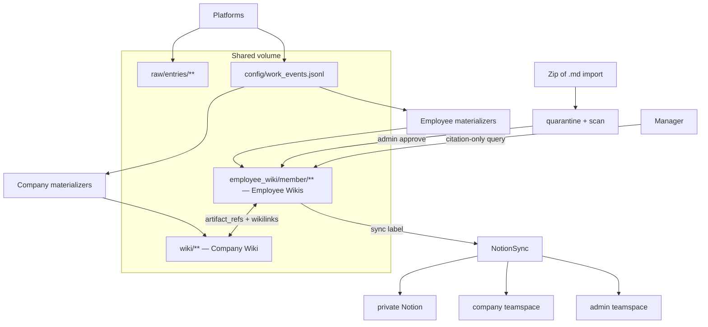

# Employee Wiki — Build Plan

**Status:** Phase A–D shipped (foundation, ledger, Notion sync, zip import). Phase E next.  
**Scope:** MD wiki substrate — foundational layer, larger than any single platform integration.  
**Converges with:** future project onboarding + company wiki generation from project definition.

---

## Goal

Give each employee a **work building** (`employee_wiki/{member}/`) alongside the **company
building** (`wiki/**`). Both are Markdown source-of-truth, Notion-mirrored, cross-linked.

Employee wikis are **documentation, not evaluation**: factual work records that answer manager
questions via citation-only query — reducing "quick clarification?" pings without surveillance.

Platform ingest (Gmail, Granola, Slack, Linear, …) feeds employee wikis through a **ledger +
materializers** pattern — no dual-write from platform agents.

---

## Architecture



### Invariants

1. **MD first, Notion second** — all writes via `write_wiki_page` / employee equivalent.
2. **No MD-side ACL for sharing** — employees share via Notion page permissions on private pages.
3. **Admin MD volume** — full tree admin-readable; members read their mirror in Notion.
4. **Attributed events** — platform agents append to ledger; materializers create pages.
5. **Import always quarantined** — zip of `.md` only; admin approval before promotion.

---

## Volume layout

```
{wiki_parent}/
  wiki/                          # company (existing)
  employee_wiki/
    alice/
      _index.md                  # current / ongoing work (update)
      projects/
        acme-integration.md      # open projects
      work_log/
        2026-Q2.md               # quarterly rollup (append)
      knowledge/
      assets/                    # imported attachments
      imports/
        _quarantine/
      inbox/                     # optional member review queue
    _archived/                   # departed members
      bob/
  raw/entries/
config/
  members.yaml                   # member index (pointers only)
  work_events.jsonl              # append-only event ledger (gitignored)
```

**Env:** `COMPANY_BRAIN_WIKI_DIR`, `COMPANY_BRAIN_EMPLOYEE_WIKI_DIR` (default sibling).  
**Gitignore:** `/employee_wiki/`, `/config/work_events.jsonl`.  
**Smolfile:** mount wiki parent; add `employee_wiki` to shared volume.

---

## Config shapes

### `config/members.yaml`

Index only — pointers to platform rosters elsewhere:

```yaml
members:
  alice:
    email: alice@company.com
    status: active              # active | departed
    employee_wiki: employee_wiki/alice
    notion_teamspace: member_alice
    bindings:
      granola_label: alice
      gmail_mailbox: alice@company.com
      slack_user_id: U0123ABC
      linear_user_id: uuid-…
    ingest:
      granola: full             # full | action_items_only | off
      gmail: work_related
      slack: watched_channels_only
    query_grants:               # who may query alice's not_synced paths
      bob: [projects/acme]
```

### Employee page frontmatter

```yaml
---
member: alice
sync: private                   # private | company | admin_only | location:{key} | not_synced
artifact_refs:
  - linear:ENG-42
  - granola:note-abc
company_links:
  - engineering/tasks/operations/general/{task_id}.md
submit_to_company: none        # none | pending | approved | rejected
sources: [import:notes/acme.md]
duplicate_of: wiki/projects/acme.md   # set when import matched existing canonical page
created: 2026-06-26T…
notion_page_id: …
---
```

### `config/notion.yaml` additions

```yaml
teamspaces:
  admin: ""                     # admin teamspace parent (admin_only sync target)
  member_alice: ""              # per-member personal teamspace
  company: ""                   # company-wide

section_teamspace:
  employee_wiki: admin_only     # default prefix rule — overridden per-page by sync:
```

Extend `NotionSync` to read **`sync:` from frontmatter** (overrides section routing).

---

## Notion `sync:` labels

| `sync` | Notion destination | Typical use |
|--------|-------------------|-------------|
| `private` (default) | Member personal teamspace | Work log, personal knowledge |
| `company` | Company / dept teamspace | Employee-submitted company-facing content |
| `admin_only` | **Admin teamspace** | Import review queue, audit logs, offboarding |
| `location:{key}` | `teamspaces[key]` | Explicit routing |
| `not_synced` | No mirror | Query-only via agent + `query_grants` |

**Sharing between employees:** Notion ACL on private pages — not configured in MD.  
**Managers:** citation-only `company-brain query --about {member}` — no default browse.

---

## Event ledger + materializers

### Ledger entry (`config/work_events.jsonl`)

```json
{
  "event_id": "uuid",
  "ts": "2026-06-26T18:00:00Z",
  "source": "linear",
  "artifact_ref": "linear:ENG-42",
  "primary_member": "alice",
  "contributors": ["bob"],
  "event_type": "task_completed",
  "payload": { "title": "…", "status": "Done" },
  "materialized": { "company": false, "employee": ["alice"] }
}
```

### Materializer rules (examples)

| Source | Company wiki | Employee wiki |
|--------|--------------|---------------|
| Linear issue (assignee) | `engineering/tasks/…` if bound | `work_log/YYYY-QN.md` append + `projects/` if linked |
| Granola meeting | Daily digest (existing) | Primary member + contributor lines |
| Slack thread | — | Only if **importance gate** passes (action-item heuristics) |
| Gmail task | Routing record | Assignee work_log line |

**Slack threshold:** reuse `slack_action_items` keyword/assignment detection; skip minor
messages. Watched channels only.

---

## Zip import pipeline

**Input:** zip of `.md` files only.

```
1. Submit zip → extract to employee_wiki/{member}/imports/_quarantine/{import_id}/
2. Security scan (deterministic, no LLM):
     - secret patterns (API keys, tokens)
     - prompt-injection markers in MD
     - suspicious URLs / exfiltration patterns
     - HTML/script tags embedded in MD
     - zip bomb / oversized file limits
3. Duplicate detection (see below) → duplicate_report.json in quarantine
4. Write admin review page (sync: admin_only) → engineering/admin/import-reviews/{import_id}.md
5. Notifier → admin Slack channel (actionable summary; no malicious payload body)
6. Admin: approve | reject | request_redaction
7. On approve:
     - classify files → propose layout (projects/, knowledge/, work_log/)
     - show before/after map (admin + employee notification)
     - reorganize; rewrite [[wikilinks]]; copy assets/ attachments
     - link duplicates instead of copying (set duplicate_of in frontmatter)
     - optional member_absorb for knowledge/ only (employee prompt, not company absorb)
8. First import per member always requires admin approval
```

### Agent placement

```
src/company_brain/
  wiki/
    employee_store.py          # EmployeeWikiStore (parallel to LocalWikiStore)
    employee_publish.py        # write_employee_wiki_page (sync label aware)
    duplicate_detect.py        # duplicate detection engine
  agents/operations/employee_wiki/   # or top-level cross-cutting folder
    employee_wiki_import.py    # zip import specialist
    import_review.py           # admin queue materializer
    member_absorb.py           # lighter absorb for employee knowledge/
    work_event_materializer.py # ledger → pages (manager dispatches by source)
  agents/operations/employee_wiki_manager.py   # persistent: poll ledger, dispatch materializers
```

Department placement note: employee wiki spans departments — prefer **`agents/employee_wiki/`**
at department level (alongside managers) or `wiki/` helpers + one manager. Final path TBD in
Phase A; helpers live under `wiki/` regardless.

---

## Duplicate detection (#6 — approved)

Run **after security scan, before admin approve**. Output drives admin review UI and
automatic link-vs-copy decisions.

### Match tiers (cheap → expensive)

| Tier | Method | Action |
|------|--------|--------|
| **1 — Exact** | SHA-256 of normalized body (strip frontmatter, whitespace) | Auto-suggest **link only** |
| **2 — artifact_ref** | Imported frontmatter or inline `ENG-42`, Granola id, etc. vs `config/task_bindings.json` + existing page refs | **Link** to bound company/employee page |
| **3 — Title + path** | Normalized title match against `wiki/**` and `employee_wiki/**` index | Flag **likely duplicate** for admin |
| **4 — Fuzzy** | Token overlap / heading similarity above threshold (e.g. 0.85 Jaccard on headings) | Flag **possible duplicate**; never auto-merge |

### Normalization

- Strip YAML frontmatter for hash
- Lowercase titles; collapse whitespace
- Ignore import path prefix (`Daily/`, `PARA/`, etc.)

### Outcomes per file

```yaml
# duplicate_report.json (in quarantine folder)
files:
  - path: notes/acme-spec.md
    verdict: link
    canonical: wiki/projects/acme.md
    match_tier: 2
    artifact_ref: linear:ENG-42
  - path: random/standup.md
    verdict: import
    match_tier: none
  - path: docs/policy-draft.md
    verdict: review
    candidates:
      - wiki/policies/expense.md
    match_tier: 4
```

| Verdict | On approve |
|---------|------------|
| `link` | Create stub in `knowledge/` or skip file; set `duplicate_of` + `company_links` |
| `import` | Reorganize into proposed layout |
| `review` | Admin picks link target, import anyway, or drop |

### Cross-wiki scope

Check against:

1. `wiki/**` (company canonical)
2. `employee_wiki/{member}/**` (same member re-import)
3. `employee_wiki/other/**` — **flag only**, never auto-link without admin (privacy)

### Company absorb submit interaction

When employee later submits a page to company wiki, run duplicate detection again against
`wiki/**` before creating `submit_to_company: pending` entry.

---

## Three ingest modes

| Mode | Agent | LLM | Output |
|------|-------|-----|--------|
| Operational append | `work_event_materializer` | No | `work_log/`, `_index.md`, `projects/` |
| Member absorb | `member_absorb` | Yes (journal prompt) | `knowledge/` |
| Import as-is | `employee_wiki_import` | Optional classify step | Quarantine → reorganized tree |

Company `absorb` unchanged (theme-oriented). Employee absorb preserves voice; chronology OK.

---

## Manager query (citation-only)

```
company-brain query --about alice "What is the status of Acme integration?"
```

- Reads: `employee_wiki/alice/**` (authorized paths) + `company_links` targets
- Returns structured sections: **Deliverables · Open items · Meetings · Linked artifacts**
- Every bullet cites `employee_wiki/...` or `artifact_ref`
- No comparative queries (`alice vs bob`) in v1
- **Audit log** (admin-only, `sync: admin_only`): `{ts, requester, member, question, paths_cited}`

---

## Offboarding

Trigger: `members.{name}.status: departed`

| Step | Action |
|------|--------|
| 1 | Stop ledger materialization for member |
| 2 | Move `employee_wiki/{member}/` → `employee_wiki/_archived/{member}/` |
| 3 | Set all pages `sync: admin_only` (admin teamspace archive) |
| 4 | Revoke `query_grants` inbound/outbound |
| 5 | Update `wiki/people/{member}.md` — departed, link to archive note |
| 6 | Open artifacts → admin reassignment queue (`artifact_refs` without owner) |

Agent: `employee_offboarding.py` (single-use or admin-triggered).

---

## Bidirectional Notion ↔ MD (Phase I — deferred)

Team will edit in Notion; plan now, build later.

| Decision | Default |
|----------|---------|
| Scope | `sync: private`, member-owned pages |
| Cadence | Pull every 15–30 min |
| Conflict | Notion wins if member edited within N hours; else materializer append wins |
| Flag | `sync_conflict: true` in frontmatter for manual resolution |
| Prerequisite | `notion_page_id` on every employee page from Phase C |

---

## Build phases

### Phase A — Foundation

| # | Task | Files | Done when |
|---|------|-------|-----------|
| A.1 | Employee wiki volume + env resolver | `config.py`, `.gitignore`, `sfile` | `resolve_employee_wiki_dir()` works |
| A.2 | `members.yaml` schema + loader | `config/members.yaml`, `members_config.py` | Load member index; validate bindings |
| A.3 | `EmployeeWikiStore` + `write_employee_wiki_page` | `wiki/employee_store.py`, `employee_publish.py` | Write MD with employee frontmatter defaults |
| A.4 | Company `people/` stub generator | `wiki/people.py`, `member_bootstrap.py` | `wiki/people/{member}.md` links to employee tree |

**Verify:** ✅ `tests/test_employee_wiki.py`

---

### Phase B — Event ledger + first materializer

| # | Task | Files | Done when |
|---|------|-------|-----------|
| B.1 | Append-only `work_events.jsonl` CRUD | `wiki/work_events.py` | Events persist; idempotent `event_id` |
| B.2 | `employee_wiki_manager` persistent poll | `agents/employee_wiki/employee_wiki_manager.py` | Dispatches materializers when unmaterialized events exist |
| B.3 | Linear assignee materializer | `work_event_materializer.py` | Linear completion → alice `work_log/YYYY-QN.md` |
| B.4 | Quarterly work_log path helper | `wiki/employee_paths.py` | Correct quarter slug from date |

**Verify:** ✅ `tests/test_employee_wiki.py` (ledger + materializer + manager)

**Not yet wired:** `employee_wiki_manager` persistent loop must be started separately;
Linear completion records ledger events via `linear_completed` when member resolves.

---

### Phase C — Notion sync labels

| # | Task | Files | Done when |
|---|------|-------|-----------|
| C.1 | `sync:` frontmatter routing in `NotionSync` | `notion/sync.py` | private/company/admin_only/location/not_synced |
| C.2 | Admin teamspace in `config/notion.yaml` | config + docs | `admin_only` mirrors to admin teamspace |
| C.3 | Per-member teamspace discover-or-create on onboarding | `employee_wiki_onboarding.py` | New member → Notion personal root |
| C.4 | `not_synced` skip mirror | `notion/sync.py` | Page stays MD-only in Notion terms |

**Verify:** Pages with each `sync` value land in correct Notion parent (mock `ntn`).

---

### Phase D — Zip import + duplicate detection

| # | Task | Files | Done when |
|---|------|-------|-----------|
| D.1 | Zip extract + quarantine | `employee_wiki_import.py` | Files land in `_quarantine/{import_id}/` |
| D.2 | Security scan | `import_scan.py` | Secrets/injection flagged; Slack alert |
| D.3 | **Duplicate detection** | `duplicate_detect.py` | Tiers 1–4; `duplicate_report.json` |
| D.4 | Admin review page + Slack notify | `import_review.py` | Admin sees report; approve/reject |
| D.5 | Reorganize + wikilink rewrite + assets | import approve path | Company-fitting layout; `duplicate_of` stubs |
| D.6 | First-import gate | config state | Second import by same member: configurable auto-path |

**Verify:** Fixture zip with duplicate of existing `wiki/projects/x.md` → link stub, not copy.

---

### Phase E — Platform materializers

| # | Task | Source | Done when |
|---|------|--------|-----------|
| E.1 | Granola post-meeting | existing ingest hook | Ledger event + primary/contributor lines |
| E.2 | Gmail inbox/team-on-it | task bindings | Assignee work_log line |
| E.3 | Slack (gated) | slack_action_items threshold | Only action items materialize |
| E.4 | `_index.md` snapshot updater | materializer | Current work section refreshed |

**Verify:** Each platform emits at most one work_log line per actionable item; Slack skips noise.

---

### Phase F — Manager query + audit

| # | Task | Files | Done when |
|---|------|-------|-----------|
| F.1 | Scoped query over employee paths | `query/employee_scope.py` | Respects `query_grants` |
| F.2 | Citation-only response format | query CLI / agent | Structured sections + paths |
| F.3 | Admin audit log page | append to `wiki/admin/query-audit.md` | Each manager query logged |

**Verify:** Manager query returns citations only; no access to `not_synced` without grant.

---

### Phase G — Company absorb submit

| # | Task | Files | Done when |
|---|------|-------|-----------|
| G.1 | Employee submit action | frontmatter workflow | `submit_to_company: pending` |
| G.2 | Admin approve → company summary | absorb or materializer | Factual summary in `wiki/**`; link back |
| G.3 | Duplicate re-check on submit | `duplicate_detect.py` | No duplicate company pages |

---

### Phase H — Offboarding

| # | Task | Files | Done when |
|---|------|-------|-----------|
| H.1 | `employee_offboarding` agent | `employee_offboarding.py` | Archive + revoke + people/ update |
| H.2 | Artifact reassignment queue | admin wiki page | Open refs surfaced |

---

### Phase I — Notion → MD pull (deferred)

See bidirectional section above. Build when team Notion editing becomes daily workflow.

---

## Testing strategy

| Layer | Approach |
|-------|----------|
| `duplicate_detect` | Fixture MD pairs; assert tier + verdict |
| `work_events` | Append, idempotency, materialized flag |
| Materializers | Mock ledger events; assert work_log output |
| Import pipeline | Zip fixture with secret file → scan fails; duplicate → link |
| Notion sync | Mock `NotionClient`; assert parent per `sync:` |
| Query scope | Grant matrix tests; deny `not_synced` without grant |

---

## Documentation updates (per phase)

- `docs/plans/employee-wiki.md` — this file (status line per phase)
- `docs/agents/` — new handbook section or `docs/agents/employee_wiki.md`
- `README.md` — palace metaphor + employee wiki bullet under architecture
- `project_install.md` — member onboarding, zip import, Notion personal teamspace
- `.cursor/rules/access-control.mdc` — employee wiki + sync labels + query grants
- `memory.md` — prepend on each shipped phase

---

## Relationship to future project onboarding

This plan is the **wiki substrate**. Later:

1. **Project onboarding** generates company `wiki/projects/{name}/**` from a project spec.
2. **Member onboarding** creates `employee_wiki/{member}/` + Notion teamspace + `people/` stub.
3. **Employee `projects/`** pages link to company project pages via `company_links`.
4. Platform materializers attach as integrations come online.

The system must be usable with **MD + Notion only** — no platform required.

---

## Tabled (v1 out of scope)

- Cross-member comparative queries
- Per-page Notion ACL automation beyond teamspace + manual share
- Obsidian live sync / vault API
- Auto-promotion to company wiki without submit

See `notepad.md` — employee wiki tabled section.

---

## Execution order

```
Phase A  →  Phase B  →  Phase C
                ↓
            Phase D (import + duplicate detection)
                ↓
            Phase E (platform materializers, incremental)
                ↓
         Phase F + G (query + company submit)
                ↓
            Phase H (offboarding)
                ↓
            Phase I (Notion pull — when needed)
```

**Start here:** Phase A.1 (`resolve_employee_wiki_dir`).
