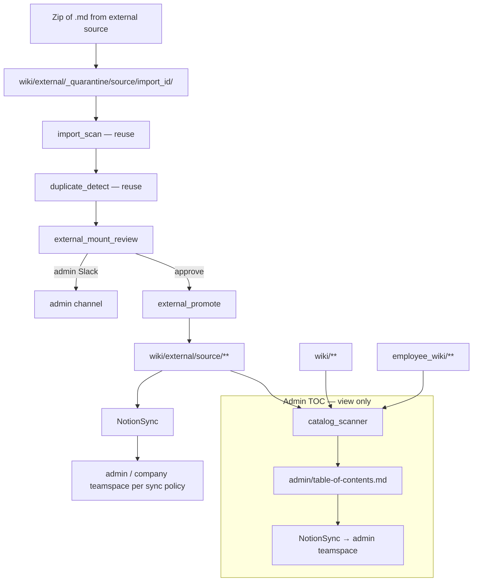

# External Wiki Mount + Admin Content TOC — Build Plan

**Status:** Shipped (Phases A–D).  
**Scope:** Company-level one-shot import of external Markdown wikis + admin-facing
Notion table of contents (view-only).  
**Deferred:** Live sync / bidirectional pull; admin content management UI; employee offboarding (Phase H).

---

## Goal

Let an admin **mount a one-shot external Markdown wiki** (e.g. a friend's startup
operations knowledge shared as a zip) into the **company building** at
`wiki/external/{source}/`, after security scan, duplicate detection, and admin approval.

Separately, give the admin a **Notion table of contents** that catalogs everything
4r7a knows about — company wiki, employee wikis, external mounts, raw intake — for
**browsing only**. Management stays in Markdown (source of truth); a management UI
is out of scope for this plan.

---

## Use case

> Nicky wrote up startup operations knowledge and shares it with a friend running a
> startup. The friend uses 4r7a and wants to mount that knowledge to help with their
> work — without duplicating pages that already exist, and without importing secrets
> or malicious content.

---

## Architecture



### Invariants

1. **MD first, Notion second** — promoted pages use `write_wiki_page`; Notion mirrors after.
2. **Company-level only** — external mounts land under `wiki/external/{source}/`, never directly in employee wikis.
3. **One-shot** — no live sync in v1; re-mount is a new import with a new `import_id`.
4. **Provenance always stamped** — every promoted page carries source metadata in frontmatter.
5. **Admin approval required** — every external mount (no auto-approve in v1).
6. **TOC is read-only** — regenerated catalog for browsing; no edit/actuation from Notion.

---

## Volume layout

```
wiki/
  external/
    _quarantine/
      {source}/
        {import_id}/
          ...extracted .md...
          duplicate_report.json
          scan_report.json
    {source}/                    # promoted content (one tree per source key)
      _index.md                  # source landing page (auto-generated on promote)
      operations/
      ...
  external/
    ...
  admin/                         # top-level section (same tier as engineering, operations)
    table-of-contents.md         # fleet-wide view-only catalog (regenerated)
    import-reviews/              # employee zip import reviews (migrate from engineering/admin/)
    external-mount-reviews/
      {import_id}.md             # per external mount review pages

employee_wiki/                   # unchanged; separate substrate
config/
  external_sources.yaml          # source registry (pointers + mount history)
```

**Gitignore:** quarantine paths under `wiki/external/_quarantine/` if desired (or keep
in volume only — same posture as employee quarantine).

---

## Config shapes

### `config/external_sources.yaml`

Index of mounted external wikis (pointers only — no zip bytes):

```yaml
sources:
  nicky_startup_ops:
    label: "Nicky — Startup Ops"
    contact: nicky@example.com
    description: "Shared operations playbook from Nicky's company"
    default_sync: company          # company | admin_only | not_synced
    mounts:
      - import_id: abc123
        mounted_at: "2026-06-30T12:00:00Z"
        mounted_by: admin
        file_count: 42
        quarantine_path: external/_quarantine/nicky_startup_ops/abc123/
        promote_prefix: external/nicky_startup_ops/
        status: active             # active | superseded | rejected
```

### `config/operations.yaml` (add block)

```yaml
external_wiki:
  import:
    max_zip_bytes: 52428800
    max_file_bytes: 1048576
    max_files: 500
    require_admin_approval: true
    admin_channel: ""              # falls back to employee_wiki.import.admin_channel
  catalog:
    rebuild_on_mount: true         # regenerate table-of-contents after promote
    rebuild_on_sync: false         # optional: rebuild after company-brain sync
    include_employee_wiki: true    # list employee trees in TOC (paths only)
    include_raw_entries: false     # v1: skip raw/entries noise
```

### Promoted page frontmatter

```yaml
---
title: Onboarding checklist
section: external/nicky_startup_ops
type: page
source: external
external_source: nicky_startup_ops
external_path: operations/onboarding.md    # path inside the zip
import_id: abc123
mounted_at: "2026-06-30T12:00:00Z"
sync: company                              # or admin_only / not_synced
duplicate_of: null                         # set when link-stub instead of copy
---
```

---

## External mount pipeline

**Input:** zip of `.md` files + a registered `source` key.

```
1. Admin registers source in external_sources.yaml (or CLI prompts for new source)
2. Submit zip → extract to wiki/external/_quarantine/{source}/{import_id}/
3. Security scan (reuse import_scan.py — deterministic, no LLM)
4. Duplicate detection (reuse duplicate_detect.py) → duplicate_report.json
     - Check against wiki/** (incl. prior external/{other}/ mounts)
     - Same-member re-import: external/{source}/** only
     - Other external sources: flag only, never auto-link without admin
5. Write admin review page → admin/external-mount-reviews/{import_id}.md
6. Notifier → admin Slack (actionable summary; no malicious payload body)
7. Admin: approve | reject | per-file decisions (link | import | drop)
8. On approve:
     - Promote files → wiki/external/{source}/...
     - Rewrite [[wikilinks]] within the mount
     - Link duplicates instead of copying (duplicate_of + company_links stubs)
     - Write/update external/{source}/_index.md landing page
     - Append mount record to external_sources.yaml
     - Trigger table-of-contents rebuild
9. On reject: quarantine retained N days (configurable) then purge
```

### Default sync policy

| Content type | Default `sync:` | Rationale |
|--------------|-----------------|-----------|
| External mount pages | `company` (configurable per source) | Friend's ops knowledge is usually company-wide reference |
| Admin review pages | `admin_only` | Import/mount audit trail |
| Content TOC | `admin_only` | Admin browse surface (`admin/table-of-contents.md`) |

Admin can override per source via `default_sync` in `external_sources.yaml` or per-file
at approve time.

---

## Admin content TOC (Notion, view-only)

### Purpose

A single **table of contents** the admin can open in Notion to see what 4r7a contains:
company wiki sections, external mounts, employee wiki buildings (path listing only),
and key control/audit pages. **Browse only** — no edit workflow from this page.

### Page

- **MD path:** `admin/table-of-contents.md`
- **Notion:** mirrors to **admin teamspace** (`teamspaces.admin`)
- **Section routing:** `section_teamspace` maps `admin` → admin teamspace (top-level section, not under engineering)

### Regeneration

`content_catalog.py` + `content_catalog_agent.py` (or a function called from promote/sync):

1. Walk `wiki/**` (exclude `_quarantine`, control files)
2. Optionally walk `employee_wiki/**` (top-level member keys + page counts; no body)
3. Read `config/external_sources.yaml` for mount metadata
4. Group by: Company sections | External mounts | Employee buildings | Admin audit pages
5. Emit markdown TOC with wiki paths + Notion links (from `notion_page_id` frontmatter when present)
6. `write_wiki_page(..., section="admin", mode=update)` → NotionSync

### TOC shape (example)

```markdown
# 4r7a Content Catalog

_Last rebuilt: 2026-06-30 12:00 UTC. View-only — edit content in the wiki MD volume._

## Company wiki (142 pages)

### operations (38)
- [[operations/gmail/triage|Gmail Triage]] · Notion
- ...

### external (42)
#### nicky_startup_ops (mounted 2026-06-30)
- [[external/nicky_startup_ops/operations/onboarding|Onboarding checklist]] · Notion
- ...

## Employee wikis (3 buildings)
- **alice** — 28 pages · `employee_wiki/alice/`
- **bob** — 12 pages · `employee_wiki/bob/`

## Admin audit
- [[admin/external-mount-reviews/abc123|Mount review abc123]]
- [[admin/import-reviews/...|Employee import reviews index]]  # optional rollup
```

### Not in v1

- Filtering, search UI, or Notion database — flat markdown page only
- Member-readable TOC (admin-only)
- Management actions from Notion (approve, delete, re-sync) — specced later

---

## Agent placement

```
src/company_brain/
  wiki/
    import_scan.py              # reuse as-is
    duplicate_detect.py         # reuse; add external scope helpers if needed
    external_paths.py           # quarantine/promote path helpers
    external_promote.py         # approve path (fork import_promote patterns)
    content_catalog.py          # TOC builder
  agents/employee_wiki/         # existing employee import (unchanged)
  agents/operations/            # or top-level cross-cutting:
    external_wiki/
      external_wiki_import.py   # zip → quarantine → scan → dup → review
      external_mount_review.py  # admin page + Slack
      content_catalog_agent.py  # rebuild admin/table-of-contents.md
```

**Department placement:** external mount spans company wiki + admin — prefer
`agents/external_wiki/` at department level (alongside `employee_wiki/`) or under
`agents/operations/external_wiki/`. Final path TBD in Phase A; wiki helpers live
under `wiki/` regardless.

---

## Relationship to employee zip import

| | Employee import (shipped) | External mount (this plan) |
|--|---------------------------|----------------------------|
| Target | `employee_wiki/{member}/` | `wiki/external/{source}/` |
| Who initiates | Member (admin-gated) | Admin only |
| Registry | `config/state.json` import counts | `config/external_sources.yaml` |
| Review page | `admin/import-reviews/{id}` | `admin/external-mount-reviews/{id}` |
| Default sync | `private` | `company` (configurable) |
| Shared code | `import_scan`, `duplicate_detect`, promote patterns | same |

Do **not** merge the two pipelines into one agent — different targets, provenance, and
sync defaults. Share helpers only.

---

## Phases

### Phase A — Foundation

| # | Task | Files | Done when |
|---|------|-------|-----------|
| A.1 | `external_paths.py` | `wiki/external_paths.py` | quarantine, promote, review, landing paths |
| A.2 | `external_sources.yaml` schema + loader | `config/external_sources.yaml`, `external_sources_config.py` | load/save mount records |
| A.3 | `operations.yaml` block | config + docs | limits + catalog settings |

### Phase B — Mount pipeline

| # | Task | Files | Done when |
|---|------|-------|-----------|
| B.1 | Zip extract + quarantine | `external_wiki_import.py` | Files land in `_quarantine/{source}/{import_id}/` |
| B.2 | Security scan | reuse `import_scan.py` | Same block/warn rules as employee import |
| B.3 | Duplicate detection | reuse `duplicate_detect.py` | Tiers 1–4; `duplicate_report.json` |
| B.4 | Admin review + Slack | `external_mount_review.py` | Review page + actionable ping |
| B.5 | Promote path | `external_promote.py` | Approve → `wiki/external/{source}/**`; link stubs; provenance frontmatter |
| B.6 | Source landing page | promote path | `external/{source}/_index.md` auto-written |

**Verify:** Fixture zip duplicating an existing `wiki/operations/x.md` → link stub, not copy.

### Phase C — Admin content TOC

| # | Task | Files | Done when |
|---|------|-------|-----------|
| C.1 | Catalog walker | `content_catalog.py` | Lists company + external + employee summaries |
| C.2 | TOC page writer | `content_catalog_agent.py` | Writes `admin/table-of-contents.md` |
| C.3 | Notion admin mirror | section_teamspace + teamspaces.admin | TOC visible in admin Notion teamspace |
| C.4 | Rebuild hook | import approve + CLI command | TOC updates after mount; `company-brain catalog` manual rebuild |

**Verify:** After mount, admin opens Notion admin teamspace → sees updated TOC with external section.

### Phase D — Docs + config wiring

| # | Task | Files | Done when |
|---|------|-------|-----------|
| D.1 | Handbook section | `docs/agents/external_wiki.md` or extend operations | Agents documented |
| D.2 | README + project_install | onboarding step for external mount | Admin runbook |
| D.3 | access-control.mdc | external mount + TOC posture | Rule updated |
| D.4 | `section_teamspace` + path migration | `config/notion.yaml`, `employee_paths.py`, `import_review.py` | `admin` → admin teamspace; move employee import reviews from `engineering/admin/` to `admin/` |

---

## Testing strategy

| Layer | Approach |
|-------|----------|
| `external_promote` | Fixture zip; assert paths, frontmatter, link stubs |
| `duplicate_detect` | External zip vs existing company page → `link` verdict |
| `import_scan` | Reuse existing tests |
| `content_catalog` | Mock wiki trees; assert TOC sections and counts |
| End-to-end | Zip → quarantine → approve → page exists under `external/{source}/` + TOC entry |

---

## Deferred (explicitly out of v1)

| Item | Notes |
|------|-------|
| **Live sync / re-mount diff** | One-shot only; second mount = new `import_id` |
| **Notion → MD pull** | Same deferral as employee wiki Phase I |
| **Admin management UI** | Edit/approve/delete from Notion — specced later |
| **Member-visible external mounts** | Default `company` sync puts content in company teamspace; admin controls via Notion permissions |
| **Employee offboarding** | Phase H — separate plan; keep in mind, not blocked by this work |
| **Cross-install trust/signing** | v1 trusts admin who submits the zip; no cryptographic provenance |

---

## Documentation updates (per phase)

- `docs/plans/external-wiki-mount.md` — this file (status line per phase)
- `docs/agents/` — handbook entry for external wiki agents
- `README.md` — external mount bullet under architecture
- `project_install.md` — admin mount step
- `.cursor/rules/access-control.mdc` — external sources + admin TOC
- `memory.md` — prepend on each shipped phase

---

## Execution order

```
Phase A  →  Phase B (mount pipeline)
                ↓
            Phase C (admin TOC)
                ↓
            Phase D (docs + Notion routing)
```

**Start here:** Phase A.1 (`external_paths.py` + `external_sources.yaml`).

---

## Open questions (resolve in Phase A)

1. **Source key naming** — slug from label (`nicky_startup_ops`) or admin-supplied? Default: slug, unique check against registry.
2. **Supersede prior mount** — when re-mounting same source, mark old mount `superseded` but keep files, or replace tree? Default: supersede metadata only; admin chooses `replace` vs `merge` at approve (v1: `replace` subtree only).
3. **Employee wiki in TOC** — list buildings + counts only (no page titles) to respect privacy? Default: yes, paths/counts only unless admin enables `include_employee_titles: true`.
