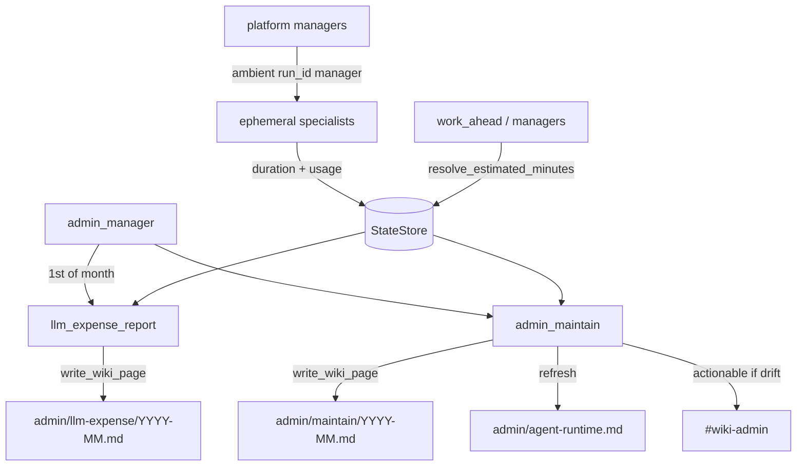

# LLM telemetry + admin monthly maintenance — design + build plan

Temporary plan. Delete after ship when handbooks / `memory.md` / `project_install.md` /
`docs/tabled.md` are updated. Design settled 2026-07-15 (FogLAMP inspiration → 4r7a-native).

**Weight:** make agent cost and duration visible enough to stay work-ahead and budget-honest,
without adopting FogLAMP’s TypeScript/Vercel stack. Extends existing `llm/budget.py` /
`run_budget.py` / Notifier patterns.

---

## Settled decisions

### Telemetry core (Python, StateStore + wiki)

- **Token dimensions:** when SDKs expose them, record cache / reasoning (etc.) alongside
  input/output; unknown models → `estimated_usd: null` + doctor WARN, never silent `$0`.
- **`run_id` + ambient context:** contextvars (same pattern as `RunBudget`). Managers set
  `manager=…`, `run_id=…` (optional `reason=…`) so nested `record_usage` inherits tags.
- **`session_id` (optional):** when the caller has one (Slack thread ts, Weave id, etc.).
- **Verify rollup:** persist `ok` / `rework` / `noise` counts next to agent usage over time.
- **Duration:** wall clock for **ephemeral specialists only** — dispatch → job finished
  (`BaseAgent.execute()`). Do **not** time persistent managers for scheduling.
- **Manager LLM $:** still counted — **direct** (usage where `agent` is the manager) +
  **attributed** (specialist usage with ambient `manager=`). Grand total = each
  `record_usage` once (no double-count).
- **Soft work-ahead (A+B):** StateStore rolling last-N durations → p50/p95;
  `resolve_estimated_minutes(agent, config_fallback=…)` uses measured **p95** when N≥5,
  else yaml. Suggest drift in admin maintain; do not auto-rewrite schedule yaml.
- **Human-readable runtimes:** wiki `admin/agent-runtime.md` (**update** mode) — ephemeral
  specialists table (p50/p95 minutes, sample count, config fallback). Refreshed by monthly
  maintain (optional light refresh after executes if cost-gated).

### Monthly maintenance (two agents, one period)

Dispatched by **`admin_manager`** on a shared monthly cadence (ordered):

1. **`llm_expense_report`** — monthly wiki page `admin/llm-expense/{YYYY-MM}.md`
   (**update**), title e.g. **Jul 2026 Agent Expenses**. By agent / category
   (runtime vs builder) / model; dims when present; verify summary; duration vs config.
2. **`admin_maintain`** (v1 thin) — writes `admin/maintain/{YYYY-MM}.md` with drift list
   (duration vs config, budget pressure, verify fail rates); **requests** an admin coding
   session via Notifier (`actionable` → `#wiki-admin`). No auto PRs / yaml edits.
   Deeper optimization scout stays **tabled**.

Notify: expense/maintain → `#wiki-admin` actionable only when over budget or large drift;
routine months stay quiet (info/silent).

### Explicitly out of v1

- FogLAMP Scan / viral architecture cards
- ClickHouse / external APM dashboard
- Per-LLM-step latency
- Auto-rewriting schedule yaml
- Monthly optimization scout (tabled — `docs/tabled.md` Admin / LLM ops)

---

## Architecture

```
src/company_brain/llm/
  budget.py / tracking.py     # dimensions, unknown-model honesty
  run_context.py (new)        # run_id, ambient manager/session contextvars
  duration.py (new)           # record specialist execute duration; resolve_estimated_minutes
src/company_brain/agents/
  base.py                     # start/stop duration for ephemeral agents; verify rollup hook
  scheduling/work_ahead.py    # consumers use resolve_estimated_minutes
  admin/
    admin_manager.py          # monthly wake → expense then maintain
    llm_expense_report.py
    admin_maintain.py
```

Wiki paths (kebab, singular topic folders):

| Path | Title | Mode |
|------|-------|------|
| `admin/agent-runtime.md` | Agent Runtime | update |
| `admin/llm-expense/{YYYY-MM}.md` | {Mon} {YYYY} Agent Expenses | update |
| `admin/maintain/{YYYY-MM}.md` | Maintain — {YYYY-MM} | update |

Config: monthly schedule under `config/operations.yaml` or a small `admin` block; reuse
`#wiki-admin` notifier pattern.

---

## Steady-state flow



Onboarding agents stay out of the diagram.

---

## Ship order (build sessions)

1. **Telemetry core** — DONE — `run_context` ambient tags; usage dimensions + unknown-model
   honesty in `record_usage` / tracking hooks; tests.
2. **Specialist duration** — DONE — time ephemeral `execute()`; StateStore rolling stats;
   `resolve_estimated_minutes`; Linear stale-audit work_ahead consumer; tests.
3. **Verify rollup + optional session_id** — persist verdict counts; pass session when
   callers have one.
4. **Admin monthly pair** — `admin_manager`, `llm_expense_report`, `admin_maintain`;
   wiki pages; Notifier gating; handbook + `memory.md`.
5. **Docs ship** — admin handbook, README map if needed, remove nothing from tabled except
   confirm optimization scout remains; delete this plan.

---

## Deferred (tabled)

| Item | Notes |
|------|-------|
| Monthly optimization scout | After expense + maintain ship; human-behavior + deep proposals |
| Ramp LLM vendor reconcile | Existing finance/LLM tabled row |
| Latent Briefing | Existing GLM/runtime tabled row |

---

## Post-ship checklist

- [ ] `docs/agents/admin.md` — manager + two specialists + mermaid
- [ ] `memory.md` dated entry
- [ ] `docs/tabled.md` — optimization scout row remains; no duplicate “system review” row
- [ ] `project_install.md` only if new CLI/env
- [ ] Delete `docs/plans/llm_telemetry.md`
