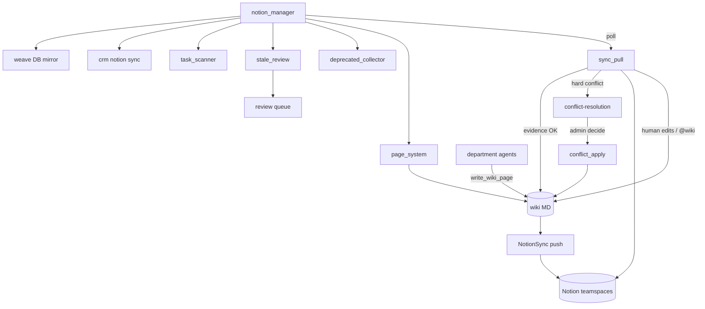

# Notion platform — design + build plan

Temporary plan. Delete after ship when handbooks / `memory.md` / `project_install.md` /
`docs/tabled.md` are updated. Design settled 2026-07-12 (notepad vision + planning rounds).

**Weight:** same class as Slack — Notion is the human visualizer / edit surface for the
company MD wiki; agents own MD; sync keeps both aligned.

---

## Settled decisions

### Data contract

- **MD remains the durable source of truth.** Agents and Notion-triggered fills write MD
  first (`write_wiki_page`), then mirror via `NotionSync`.
- **Notion is the primary human read/edit UI.** Humans may edit Notion; a pull path
  brings those edits into MD.
- Tree shape: **Notion page hierarchy ≡ MD wiki paths** when sync is established.

### Agent-owned factual pages vs human edits

- **Signature-gated overwrite:** an agent reasserts only when its factual cost-gate
  signature changed (new PRs, txns, etc.). Unchanged signature → preserve human Notion
  edits and pull them into MD.
- **Short-horizon human override:** human edits after an agent write, before the next
  signature-changing agent run → human wins locally in Notion; **MD note only** (why /
  what changed). Do **not** add a Notion conflict row for this class.
- **Later factual refresh:** when the agent later has new ground truth → agent version
  wins. Still try to record why the human had diverged, without losing factual truth in MD.

### Teamspaces (default)

- **Two defaults:** `admin` (finance, legal, admin) and `company` (engineering, product,
  growth — whole-company learning).
- Admins may later split engineering / product / growth into their own teamspaces via
  config; not required for install.
- Update `config/notion.yaml` defaults: map `engineering` / `product` (and growth when
  present) → `company` unless an optional split key is set.

### Conflict Resolutions (urgent, separate artifact)

- Hard conflicts that cannot be auto-merged land in **Conflict Resolutions** (MD running
  log + Notion database).
- **In queue:** incompatible human↔human edits; structural conflicts unsafe to auto-fix;
  factual↔human when intent is unclear; failed merges.
- **Out of queue:** short-horizon human override of agent factual pages (MD note only).
- **Evidence tie-break:** Slack / Granola / Gmail may auto-resolve when sources (a) agree,
  (b) directly address the disputed claim, and (c) are from in-scope department people
  (or admin). Hedged / contradictory / off-topic → escalate to admin.
- Admin chooses truth → **apply agent** writes MD (then Notion mirror).

### Conflict-adjacent review queue (separate)

- Stale-but-active pages (need updates, not archive) go here — not Slack spam.
- Also a home for judgment items that are not “pick which fact is true.”
- Distinct from Conflict Resolutions (urgency + schema differ).

### `@wiki` in Notion

- Plain text `@wiki …` in the page body (not a bot identity).
- Sync/edit watcher detects it → action on **that page only**.
- Anyone who can edit the page may write `@wiki`; autofill / move uses knowledge scoped
  to that **teamspace**.
- Instructions may request fill and/or move. **No blanket autofill.**
- Persist an **`external`** (or equivalent) frontmatter flag when inferred; never
  auto-fill external-facing docs unless `@wiki` explicitly asks.

### Page system manager

- Misplaced = **human** put a Notion page in the wrong place (MD won’t be “wrong” if sync
  is correct).
- Infer topic + audience from Slack / meetings / email when needed; move to correct
  location; leave a stub link at the old location; delete stub after ~1 week.
- MD path follows the move via sync.
- Fill only via `@wiki` on the current page (see above).

### Deprecated collector (Archive)

Archive under an **Archive** parent in the matching admin/company teamspace when **all**:

1. No MD edits (for the eligibility window)
2. Explicit `status: done` / end date
3. No Notion edits for N days (stand-in for views — API lacks reliable view counts)
4. No shared link for this page

MD content is retained; Notion moves to Archive. Still queryable via agents / Slack
`@wiki` / admin.

### Find / retrieval

- Slack `@wiki` (`ask_wiki`) already searches MD and cites Notion URLs — **enough for
  “where do I find X?”**
- Notion platform does not build a separate search UI. Keep bindings healthy so citations
  work. Optional later: improve `ask_wiki` / wiki-index ranking (backlinks, freshness) on
  the Slack/wiki side.

### Employee Notion opt-in

- Member Notion OAuth = **employee wiki mirror only**.
- No auth → no employee Notion mirror (MD still exists).
- Member edits on mirrored employee pages ingest with the same checks/gates as employee
  MD imports.
- Company teamspace members keep Notion edit authority; trust + peer review.

### Onboarding

- `notion_onboarding` lives under `operations/notion/`.
- Admin install orchestrator calls it **ahead of other platforms** (exact department
  platform order ironed later).
- **Alongside strategy:** build clean 4r7a tree next to existing messy pages; admin
  deletes old tree after review.
- **Confirm gate:** warn that reorg is large; without confirm → **ingest Notion → MD
  allowed**, **do not** establish structured mirror/sync.
- Empty workspace: create structure agents will need later.

### Manager coherence

- Persistent **`notion_manager`** polls the **whole** Notion surface: wiki tree sync,
  `@wiki` detection, page moves, archive, conflicts/review, **and** existing tracks
  (task DBs, CRM DBs, Weave change-request DB). Existing specialists stay; they sit under
  one manager loop.

---

## Architecture (steady state)

Onboarding excluded from the diagram (prose only).

---

## Agents (target tree)

Under `src/company_brain/agents/operations/notion/`:

| Agent | Role | Notes |
|-------|------|-------|
| `notion_manager.py` | Persistent manager | Lives at `operations/notion_manager.py` (dept-level); poll + dispatch |
| `sync_pull.py` | Pull Notion → MD | Diff, merge, signature-aware human override notes, enqueue conflicts |
| `page_system.py` | Misplaced / stub links | Move + 1-week stub cleanup; no blanket fill |
| `deprecated_collector.py` | Archive eligibility | All four conditions; Archive parent |
| `stale_review.py` | Stale → review queue | Conflict-adjacent |
| `conflict_resolution.py` | Evidence tie-break + enqueue | Slack / Granola / Gmail |
| `conflict_apply.py` | Apply admin choice | MD first, then sync |
| `notion_onboarding.py` | Once | Alongside tree; confirm-gated mirror; last in handbook section |
| `task_scanner.py` / `task_sync.py` | Existing | Fold under manager poll |
| `db.py` / `platform_config.py` | Helpers | Not agents |

Shared push stays in `company_brain.notion.sync.NotionSync` (library, not an agent).

---

## Wiki / Notion artifacts

| Path / DB | Title | Mode | Purpose |
|-----------|-------|------|---------|
| `operations/notion/conflict-resolution.md` | Conflict Resolutions | append (newest on top) | Running log of hard conflicts + resolutions |
| Notion DB `conflict_resolution_database` | Conflict Resolutions | — | Admin picks winner; apply agent reads status |
| `operations/notion/review.md` (or DB) | Notion Review | append / DB | Stale + conflict-adjacent judgment |
| Notion parent **Archive** (per teamspace) | Archive | — | Deprecated pages |

Exact review artifact (MD log vs Notion DB) can match Conflict Resolutions shape for UI
consistency — prefer Notion DB if admin already lives in Notion for Weave approvals.

Frontmatter additions (as needed):

- `external: true` — external-facing; no autofill without `@wiki`
- `agent_signature` / `agent_written_at` — signature-gated overwrite
- `human_override_note` — short-horizon human win provenance in MD
- `status` / `end_date` — archive eligibility
- `notion_page_id` / `synced_hash` — existing

---

## Config / rules to update when building

- `config/notion.yaml` — default teamspaces; `section_teamspace` eng/product → company;
  `conflict_resolution_database`; review DB; Archive parent ids; discovery alongside.
- `config/operations.yaml` — `notion_platform` poll intervals, archive windows, stub TTL.
- `.cursor/rules/wiki-data-flow.mdc` — bidirectional pull + conflict policy (MD still SoT).
- `.cursor/rules/access-control.mdc` — two-teamspace default; optional splits.
- `docs/agents/operations.md` — Notion section rewrite (manager diagram; onboarding last).
- `project_install.md` — Notion early in connect sequence; confirm-gated reorg.
- `docs/tabled.md` — remove/update rows as slices ship (see below).

---

## Build sessions (ship order)

### Session 1 — Teamspace defaults + config ✅

- Default admin + company; route eng/product/growth under company.
- Document optional split keys; migrate comments in `notion.yaml`.
- `resolve_teamspace_parent` + handbook / access-control defaults.

### Session 2 — Bidirectional page sync ✅

- `sync_pull` + `sync_policy` (signatures / human override notes / conflict mark).
- Merge-when-compatible; signature-gated agent reassert in `NotionSync`.
- `notion_manager` at `operations/notion_manager.py` (dept-level; rule-aligned).
- Tests: `tests/test_notion_bidirectional_sync.py`.

### Session 3 — `@wiki` in Notion ✅

- Detect `@wiki` on pulled pages; fill/move current page only; teamspace-scoped context;
  MD first; `external` flag.
- Tests: ignore without directive; scoped fill; move + path rename.

### Session 4 — Conflict Resolutions ✅

- MD log + Notion DB; evidence gather from wiki (Slack/Granola/Gmail absorb); auto-resolve bar;
  `conflict_apply`.
- Tests: escalate vs auto; apply writes MD.

### Session 5 — `page_system` ✅

- Misplaced human pages (`page_relocate_to`); stub link + `stub_ttl_days` cleanup.
- Tests: move + stub expiry.

### Session 6 — Review queue + deprecated collector

- Stale → review queue.
- Archive when all four conditions; Archive parent per teamspace.
- Tests: eligibility matrix (fail if any condition missing).

### Session 7 — `notion_onboarding`

- Empty vs existing; alongside tree; confirm gate (ingest-only without confirm).
- Handoff: start `notion_manager` via `get_runtime().start()`.

### Session 8 — Manager coherence

- Fold task_scanner, CRM Notion sync triggers, Weave DB mirror into `notion_manager` poll.
- Single handbook diagram; one poll config story.

### Session 9 — Docs ship

- `operations.md`, README map if needed, `project_install.md`, `memory.md`, remove shipped
  `docs/tabled.md` rows, delete this plan.
- Pre-ship: `ruff`, `pytest`, `company-brain doctor code`.

---

## Tabled items this plan absorbs

From `docs/tabled.md` (remove or rewrite when the matching session ships):

| Item | Session |
|------|---------|
| Conflict resolution / source of truth | 4 ✅ shipped |
| Human-added pages ingest | 2 + 7 |
| Review queue UX for actionable outputs | 6 (stale/review; may still leave accounting/CRM promotions as follow-on) |
| Product progress page | Still deferred unless pulled into Session 8+ — keep tabled until product asks |
| Notion → MD write-back (employee_wiki) | Related to Session 2 patterns; employee-specific gates stay in employee wiki plan |
| Human vs agent Notion/MD sync lag | Addressed by signature gate + pull; update bridge note when bridge ships |
| Version control | Remains cross-cutting tabled |

---

## Explicit non-goals (this plan)

- Notion-side search catalog / find UI (Slack `@wiki` is enough).
- Blanket autofill of thin pages.
- Replacing Notion teamspace ACL with MD-side ACL.
- Money-movement or write APIs on finance platforms.
- Full wiki versioning/rollback (separate tabled item).

---

## Open only for build time (not blocking plan)

- Exact Notion API for last-edited / share-link detection (implement with graceful degrade).
- Review queue: MD append vs Notion DB — prefer DB if admin UX matches Weave.
- Archive window `N` days default (suggest 30 to match “remain visible ≥ 1 month” spirit
  before Archive move, combined with done/end date).
- Admin install orchestrator filename/location (later platform-order session).

---

## Preference

User prefers **text** answers in planning (not IDE multiple-choice). Keep that in build
sessions when asking follow-ups.
