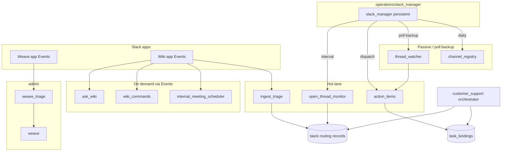
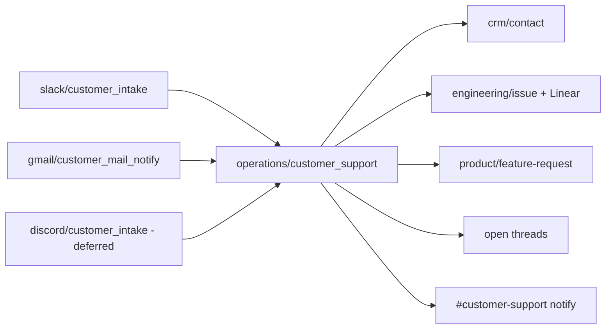

# Slack platform — design + build plan

**Status:** agreed design (2026-07-10). Delete this file after ship when handbooks,
`memory.md`, `project_install.md`, and `docs/tabled.md` are updated.

**Scope:** Full Slack platform — passive ingest, Events API, `@wiki` interactive app,
`@weave` system-change app (structure-first v1), customer support orchestrator,
open threads, onboarding with cost estimate, HR offboarding signals, unified issue
home, product wiki section. Bugs expected; prioritize structure and component wiring.

---

## Locked decisions

| Topic | Decision |
|-------|----------|
| Bots | Passive ingest (no @). **`@wiki`** = query + do. **`@weave`** = system changes. Two separate Slack apps. |
| Weave v1 | Option **A**: triage → change-request MD + Notion → `config_only` opens PR; **no** live agent pause/resume. Option B tabled. |
| Weave approval | `config_only`: auto-dispatch PR for any W2 in `members.yaml`. `agent_behavior` / `security_ingest`: admin Notion approval required. Roster **never** dispatches Weave. |
| Customer support | Single `operations/customer_support.py` orchestrator. Classify → wiki MD → route. Bugs → Linear; feature requests → ranked product page; discussions → open threads only (no Linear). Gmail/Discord notify `#customer-support`. |
| ask_wiki | Humans only; internal channels only. Connect channels = ingest/read-only, no Q&A. Answers include **Notion citation links**. Channel ACL maps to wiki prefixes + teamspace. |
| Open threads | Gmail-style attention tiers + `wiki/operations/slack/routing/{channel}/{thread_ts}.json`. Wiki employee open-thread page first → Notion. `thumbsup`/`ok` = ack; `white_check_mark` = done. |
| Ingest urgency | Three-tier pipeline (tier 0 $0 signals → tier 1 batched classify → hot/cold lanes). **Slack Events API** for hot lane; poll backup. |
| Out-of-scope channels | Admin CLI only (`company-brain slack channel …`). Memes / non-work channels excluded from ingest. |
| Events transport | Socket Mode for local installs; HTTP for cloud. |
| Channel join | Wiki bot auto-joins all internal channels. Connect channels: admin enable in `config/slack_channels.json`, join when tagged. |
| Tokens | `SLACK_WIKI_*` required; `SLACK_WEAVE_*` optional add-on. Migrate `SLACK_BOT_TOKEN` → wiki token. |
| Rate limits | Per-user on `@wiki` / `@weave`; no limits for `members.yaml` `role: admin`. |
| Meetings | `internal_meeting_scheduler`: partial book when some calendars missing; admin calendar fallback when attendee has no gcal binding. |
| Task propagation | MD first, then fan-out (same as Linear completion path via `task_bindings`). |
| Onboarding | $0 message-count estimate → admin picks 30-day default or full-history operational backfill. Optional second opt-in: run **absorb** on raw entries from backfill. |
| Roster vs members | `config/roster.yaml` for trial/intern/contractor; promote to `members.yaml` (W2) via `company-brain hr promote`. |
| Product wiki | New `product/` section. Move `engineering/github/product-feature.md` → `product/feature.md`. Feature requests: ledger + ranked snapshot. |
| Issues | Unified home `engineering/issue/{slug}.md`. GitHub→Linear via native integration; `issue_sync.py` daily via `github_manager`. |
| HR | `hr/hiring-log.md`, `hr/employee_offboarding.py`, `operations/slack/offboard_signal.py`. Multi-signal + admin confirm. |
| Weave location | `admin/weave_triage.py`, `admin/weave.py` — new `admin/` department. |

---

## Architecture

### Steady-state (post-onboarding)



### Customer support fan-in



### Weave flow (v1)

```mermaid
flowchart LR
  M[@weave mention] --> WT[weave_triage]
  WT --> MD[admin/change-request/id.md]
  MD --> NDB[Notion change-request DB]
  WT -->|config_only + members.yaml| WV[weave]
  WT -->|agent_behavior / security_ingest| WAIT[await admin approve in Notion]
  WAIT --> WV
  WV --> PR[PR on private org repo]
  WV --> VM[smolvm verify optional]
```

---

## Config additions

### `config/operations.yaml` — extend `slack_platform`

```yaml
slack_platform:
  poll_interval_minutes: 30
  workdays_only: true
  events:
    mode: socket          # socket | http
    http_path: /slack/events/wiki
  rate_limits:
    wiki_queries_per_user_hour: 30
    weave_submissions_per_user_day: 5
  reactions:
    acknowledge: [thumbsup, ok_hand]
    done: [white_check_mark]
  debounce_minutes: 3     # tier-1 batch window per channel
  onboarding:
    default_backfill_days: 30
    absorb_on_backfill: false   # second admin opt-in at runtime
  # channel_read_scope moved to slack_channels.json + section_teamspace
```

### `config/slack_channels.json` (new, machine registry)

```json
{
  "version": 1,
  "channels": {
    "C01234567": {
      "name": "#finance",
      "ingest_mode": "hot",
      "is_connect": false,
      "tags": ["department:finance"],
      "wiki_prefixes": ["finance/", "crm/customer/"],
      "teamspace": "finance",
      "ask_wiki_allowed": true,
      "customer_support": false,
      "last_activity_at": "2026-07-10T12:00:00Z"
    }
  }
}
```

`ingest_mode`: `hot` | `cold` | `out_of_scope`. Connect channels default `customer_support: false` until admin enables.

Mirror summary: `wiki/operations/slack/channel-registry.md` (human-readable, rebuilt by `channel_registry` agent).

### `config/roster.yaml` (new)

```yaml
people:
  jane_contractor:
    email: jane@contractor.com
    employment_type: contractor   # trial | intern | contractor | ...
    slack_user_id: U...
    bindings: {}
    ingest:
      slack: limited
```

Promotion: `company-brain hr promote {key}` → creates `members.yaml` entry, removes from roster.

### `config/members.yaml` — extend

```yaml
members:
  alice:
    email: alice@company.com
    role: admin          # admin | member  (W2 only)
    status: active       # active | departed
    bindings:
      slack_user_id: U...
      gmail_mailbox: ...
      gcal_calendar_id: primary
      linear_user_id: ...
      notion_user_id: ...
      github_handle: ...
```

### `config/notion.yaml` — add

```yaml
teamspaces:
  product: ""
section_teamspace:
  product: product

change_request_database:
  database_id: ""
  columns:
    title: Title
    status: Status          # submitted | triaged | approved | dispatched | done | rejected
    requester: Requester
    change_class: Class     # config_only | agent_behavior | security_ingest
    slack_thread: Slack thread
    pr_url: PR
```

### Env vars (`project_install.md` + `.env.example`)

| Var | Required | App |
|-----|----------|-----|
| `SLACK_WIKI_BOT_TOKEN` | Yes | Wiki bot |
| `SLACK_WIKI_APP_TOKEN` | Yes (local Socket Mode) | Wiki app |
| `SLACK_WEAVE_BOT_TOKEN` | No (add-on) | Weave bot |
| `SLACK_WEAVE_APP_TOKEN` | No | Weave app |

Deprecate `SLACK_BOT_TOKEN` with migration shim in `slack_client.py` (read wiki token first, fall back once).

---

## Agent tree

### New departments

```
src/company_brain/agents/
  admin/
    weave_triage.py
    weave.py
  hr/
    employee_offboarding.py
    hiring_log.py          # optional materializer for hr/hiring-log.md
```

### Operations — changes

```
operations/
  slack_manager.py         # NEW persistent manager
  customer_support.py      # NEW cross-platform orchestrator
  slack/
    slack_client.py          # extend: wiki vs weave tokens
    events_router.py         # NEW Events API entry
    ingest_triage.py         # NEW tier 0+1
    thread_watcher.py        # RENAME from slack_thread_watcher
    action_items.py          # RENAME from slack_action_items
    open_thread_monitor.py   # NEW
    channel_registry.py      # NEW
    ask_wiki.py              # NEW
    wiki_commands.py         # NEW (@wiki threads, etc.)
    internal_meeting_scheduler.py
    customer_intake.py       # NEW Slack Connect specialist
    offboard_signal.py       # NEW → dispatches hr/employee_offboarding
    stale_channel_monitor.py # NEW monthly suggest-only
    slack_onboarding.py      # NEW
  gmail/
    customer_mail_notify.py  # RENAME from customer_support.py
```

### Engineering — changes

```
engineering/github/
  issue_sync.py              # NEW daily via github_manager
  product_features.py        # WIKI_PATH → product/feature.md
```

### CLI additions

| Command | Purpose |
|---------|---------|
| `company-brain slack channel list` | Channel registry |
| `company-brain slack channel tag {id} out-of-scope` | Admin only |
| `company-brain slack channel enable-connect {id}` | Admin enable Connect ingest |
| `company-brain slack onboarding estimate` | $0 message count + cost breakdown |
| `company-brain slack onboarding run [--days N] [--all] [--absorb]` | Backfill |
| `company-brain hr promote {roster_key}` | Roster → members.yaml |
| `company-brain hr offboard {member_key}` | Manual offboard trigger |

---

## Wiki paths (canonical)

| Path | Title | Write mode | Agent |
|------|-------|------------|-------|
| `operations/slack/channel-registry.md` | Slack Channel Registry | update | `channel_registry` |
| `operations/slack/routing/{channel}/{thread_ts}.json` | — | update | routing store |
| `employee_wiki/{member}/open-thread.md` | Open Threads | update | `open_thread_monitor` |
| `product/feature.md` | Product Features | append | `product_features` (moved) |
| `product/feature-request.md` | Feature Requests | update | `customer_support` ranker |
| `product/feature-request-log.md` | Feature Request Log | append | `customer_support` |
| `engineering/issue/{slug}.md` | Issue title | update | `issue_sync`, `customer_support` |
| `engineering/issue/_index.md` | Issue Index | update | rebuilt |
| `admin/change-request/{id}.md` | Change Request — {requester} | update | `weave_triage` |
| `hr/hiring-log.md` | Hiring Log | append | `hiring_log` / HR agents |

Add `name_migrate.py` entries:

- `engineering/github/product-feature.md` → `product/feature.md`

---

## Access control (Slack channel ACL)

Add to `.cursor/rules/access-control.mdc` on ship:

- **Fourth human read path:** `@wiki` `ask_wiki` in internal Slack channels, scoped by `config/slack_channels.json` `wiki_prefixes` + `section_teamspace` rules (deny `admin_only`, `not_synced`, other depts' `location:*`).
- **Connect channels:** ingest allowed when admin-enabled; `ask_wiki` **denied**.
- **Weave:** any channel; authorization is requester identity (`members.yaml` vs `roster.yaml`), not channel ACL.

Add to `.cursor/rules/agent-organization.mdc`:

- `admin/` and `hr/` department folders with examples.

---

## Build sessions (one ship unit per session when possible)

### Session 1 — Foundation + manager

**Goal:** Manager pattern, renames, routing record store, token split.

- [x] `slack_manager.py` persistent loop; fold `thread_watcher` dispatch under it
- [x] Rename `slack_thread_watcher` → `thread_watcher`, `slack_action_items` → `action_items`
- [x] Rename `gmail/customer_support` → `customer_mail_notify`; update imports, tests, handbook
- [x] Split `slack_client.py` for wiki/weave tokens; deprecate `SLACK_BOT_TOKEN`
- [x] `SlackRoutingStore` → `wiki/operations/slack/routing/…`
- [x] `config/slack_channels.json` loader + `channel_registry.py` skeleton
- [x] Tests for manager dispatch + routing store
- [x] `vmspec.toml`: no new hosts (slack.com already allowed)

### Session 2 — Events API + ingest triage

**Goal:** Hot lane, tier 0+1, out-of-scope respect.

- [x] `events_router.py` — Socket Mode + HTTP handlers for wiki app
- [x] `ingest_triage.py` — tier 0 signals, debounced tier 1 batch classify
- [x] Auto-join internal channels on `member_joined_channel` / startup scan
- [x] Admin CLI: channel list, tag out-of-scope, enable-connect
- [x] Wire passive messages → routing records; respect `ingest_mode`
- [x] Poll remains backup path in `thread_watcher`

### Session 3 — Open threads + attention tiers

**Goal:** Pending response / action pending / reactions.

- [x] `open_thread_monitor.py` — scan routing records, attention tiers (mirror Gmail 1–4)
- [x] Reaction handlers via Events API (`thumbsup`, `ok_hand`, `white_check_mark`)
- [x] `employee_wiki/{member}/open-thread.md` writer + Notion sync
- [x] Extend `action_items` to use routing records (dedup with open threads)

### Session 4 — Customer support orchestrator

**Goal:** Unified classify → wiki → route.

- [ ] `operations/customer_support.py` orchestrator
- [ ] `slack/customer_intake.py` specialist (Connect + internal customer channels)
- [ ] Wire `customer_mail_notify` → orchestrator (notifier path)
- [ ] Bug → `engineering/issue/` + Linear; feature request → ledger + ranker; discussion → open thread
- [ ] `#customer-support` notifier via `customer_support_notifier()`
- [ ] `product/feature-request.md` + `product/feature-request-log.md`

### Session 5 — `@wiki` interactive

**Goal:** ask_wiki + commands + rate limits.

- [ ] `ask_wiki.py` — channel ACL, read wiki, answer with Notion citations (OpenAI Agents SDK + `oa.make_model()`)
- [ ] `wiki_commands.py` — `threads`, help; block in Connect channels
- [ ] Rate limits per `members.yaml` role (admin exempt)
- [ ] `internal_meeting_scheduler.py` — partial calendar (option 2); gcal via member bindings

### Session 6 — Product move + issue sync

**Goal:** Unified issue home + product section.

- [ ] Move `product-feature.md` → `product/feature.md`; update `product_features` agent, handbook, `name_migrate.py`
- [ ] `engineering/github/issue_sync.py` — daily `gh issue list`, upsert `engineering/issue/{slug}.md`, rebuild index
- [ ] Register in `github_manager` daily dispatch
- [ ] `config/notion.yaml` `product` teamspace + `section_teamspace`

### Session 7 — Weave (structure v1)

**Goal:** Two-app weave path; PR-only dispatch.

- [ ] Weave Slack app + `events_router` weave branch
- [ ] `admin/weave_triage.py` — classify change class, write `admin/change-request/{id}.md`, Notion DB row
- [ ] Roster cannot invoke; members.yaml W2 can auto-dispatch `config_only`
- [ ] `admin/weave.py` — open PR on private repo; `verify_in_sandbox` when `COMPANY_BRAIN_SANDBOX=vm`
- [ ] Notion approval webhook/poll for `agent_behavior` / `security_ingest` → dispatch weave
- [ ] Notifier on PR opened / approval needed

### Session 8 — Onboarding + HR signals

**Goal:** Backfill + offboarding structure.

- [ ] `slack_onboarding.py` — estimate ($0 count), 30-day default / `--all`, optional `--absorb`
- [ ] Hand off to `slack_manager` via `get_runtime().start()`
- [ ] `config/roster.yaml` + `company-brain hr promote`
- [ ] `hr/employee_offboarding.py` + `hr/hiring-log.md` materializer
- [ ] `slack/offboard_signal.py` — Slack deactivation → HR agent (proposal only)
- [ ] Table Google Workspace + Notion removal signals (stubs OK in v1)
- [ ] `docs/tabled.md`: bridge token revoke stays until offboard ships

### Session 9 — Docs + hygiene

**Goal:** Steady-state docs before deleting this plan.

- [ ] `docs/agents/admin.md`, `docs/agents/hr.md`; expand `operations.md` Slack section
- [ ] `agent_list.md`, `README.md` map, `project_install.md` (wiki bot required, weave optional)
- [ ] `memory.md` entry
- [ ] Remove shipped rows from `docs/tabled.md`; add Weave hot-reload row (option B)
- [ ] `ruff check .`, `pytest -q`, `company-brain doctor code`
- [ ] Delete `docs/plans/slack.md`

---

## Onboarding cost estimate (Session 8 detail)

**$0 estimate command** counts per channel (respecting `out_of_scope`):

- Top-level messages + thread replies in window (or all time for `--all`)
- Outputs: message count, thread count, projected tier-1 batch count, projected raw-entry count
- Token estimate formula (configurable coefficients in `slack_platform.onboarding`)

**Backfill modes:**

| Flag | Operational ingest | Absorb |
|------|-------------------|--------|
| default (30 days) | Yes | No |
| `--all` | Yes, full history | No |
| `--absorb` | (combined with above) | Yes, on raw entries produced |

Operational ingest writes structured pages directly; absorb is opt-in encyclopedia synthesis.

---

## `docs/tabled.md` changes

### Remove on ship (Slack session)

- Overall agent scheduling design (operations/slack) — addressed by this plan
- Agent filename rename pass
- Open threads pending response
- Feedback intake (→ weave path)
- Question the wiki
- Batch absorb by urgency — design locked; implement tier lanes
- Feedback & system modification intake (operations/notion) — merged into Weave
- `employee_offboarding` — ship HR agent

### Add / keep

| Item | Notes |
|------|-------|
| Weave hot-reload / agent pause-resume | Option B; after v1 PR-only weave stable |
| Bridge token revoke on offboard | After `hr/employee_offboarding` ships |
| Discord customer intake | Community platform |
| Google Workspace offboard signal | Stub in v1, full implementation later |
| Notion user removal signal | Stub in v1 |
| HR roster scopes by employment type | Deferred HR design session |

---

## Testing notes

- Mock Slack Events payloads for triage, reactions, app_mention
- ACL tests: finance channel cannot read `admin/` paths
- Roster user `@weave` → rejected
- W2 member `config_only` → weave dispatched without admin
- `agent_behavior` → waits for Notion approved
- Rename regressions: `test_slack_action_items.py` → `test_action_items.py`
- `issue_sync` fixture with `gh` JSON mock

---

## Pre-ship checklist (every session)

```bash
ruff check .
ruff format --check .
pytest -q
company-brain doctor code
```

Use **no-sus-agent-doctor** skill before merge for: Events auth, Weave PR path, offboarding, customer Connect ingest, rate limits.

---

## Out of scope (this plan)

- Discord `customer_intake` (interface only)
- Weave live agent pause/resume (tabled B)
- Full Google Workspace / Notion offboard integrations (stubs OK)
- `stale_channel_monitor` can ship in Session 3 or 8 if time; low priority vs core loop
