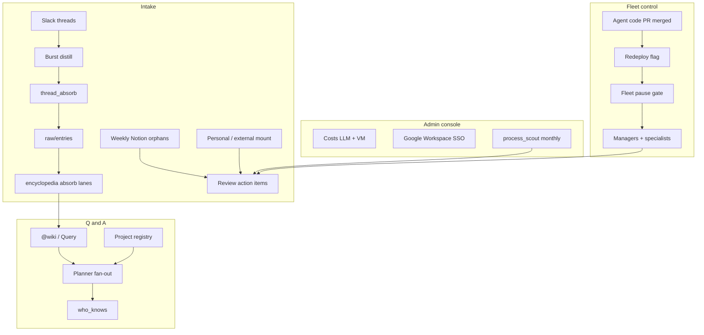

# Tabled revisit — 2026-07

Temporary build script from the tabled-features design debate (2026-07-22).
Delete this file after sessions A–L ship and outcomes are folded into steady-state docs.

**Weight:** Clear the deferred backlog into an ordered program: deploy/edit safety first, then console triage, then wiki/Q&A quality, then ops intelligence and admin scouts — without widening bridge, employee↔Notion sync, or write-heavy platform actuation.

---

## Settled decisions

### Repo / deploy / edit lifecycle

- **No in-wiki versioning/rollback agents.** GitHub history via daily `wiki_commit` + manual volume restore is enough.
- **Wiki volume is not edited on GitHub.** Content changes go through CLI/agents. Company-brain **agent code** may be edited via PR.
- **Redeploy cue:** on merge (or admin-approved agent PR) to the company 4r7a repo, set a durable flag (`config/state.json`; optional admin wiki note). Install/admin skill checks at next 4r7a-relevant session → pause if needed → redeploy managers → clear flag.
- **Fleet pause gate** (shared by Weave, admin console, coding-agent skill): `pause_requested` → wait for managers/specialists idle (alert on timeout; no force-kill by default) → `paused` → edit/redeploy → resume.
- **Upstream sync:** monthly; fetch public 4r7a → open PR on private company repo with always-safe core paths + paths matching install profile / connected platforms; admin resolves conflicts; never auto-merge; Weave never targets public 4r7a.
- **Empty wiki repo:** if wiki remote missing during install foundation, default `gh repo create <org>/company-wiki --private --empty` (name overridable in install profile).

### Absorb / Q&A / connectors

- **Encyclopedia absorb lanes:** `urgent` / `normal` / `bulk` in config; taggers include `thread_absorb`, knowledge paste, Notion orphan ingest; process under monthly token budget; no absorb while fleet `paused`.
- **Soft length guidance only** for encyclopedia (~800–1200 words in absorb prompt + `config/wiki.yaml`); keep growing only with clear reason; no hard `verify` fail.
- **`@wiki` planner fan-out v1:** parallel wiki retrieve + routing/CRM (if channel allows) + department practices/skills; max 3 fetches; fail closed to single retrieve; no code-repo search in v1.
- **Project registry:** MD page listing project key → wiki prefixes + optional Slack channels + Notion teamspace; channels may set default `project:` in `slack_channels.json`; humans/leads edit; no auto-discovery in v1.
- **Custom source connectors v1:** scheduled ingest → `raw/entries` or curated wiki tables under allow-listed prefix (YAML connector spec). Live DB query from `@wiki` stays tabled.
- **Semantic / embedding hybrid search:** stays tabled until lexical retrieve fails in practice.

### Admin console / auth / costs

- **Review page:** all admin-attention action items (conflicts, stale, import/mount, accounting/CRM drafts, process_scout pages, orphans, offboard checklists, etc.); triage + deep-links; not a second write SoT.
- **Stay HTMX on private mesh**; no public expose; no SPA unless HTMX hits limits later.
- **Costs:** LLM usage + cloud VM runtime estimate (heartbeats × rate or provider API); monthly rollup; label estimates until invoice reconcile.
- **SSO:** Google Workspace OIDC; multi-admin allow-list in config; password session = local-dev fallback only.
- **Console Pause/Resume** wired to the shared fleet gate; show idle/busy/paused per manager.

### Employee wiki / Notion / ingest

- **Agents/`@wiki` read MD always.** Notion URLs are citations when binding is fresh.
- **`@wiki sync now`** (or equivalent) kicks sync for the named platform/scope on demand.
- **Table** all Notion ↔ employee-wiki sync (including Notion→MD write-back and work logs in Notion).
- **Citation-only Query** (console + CLI): `query_grants` + admin bypass; snippet + Notion cite (or MD path if unbound); expand one result; works on `archive/employee/{member}` after offboard.
- **Personal wiki mounts:** reuse external mount pipeline with `kind: personal` → `employee_wiki/{member}/`, default `sync: private`, `migrate-names` on promote, admin review.
- **Notion orphan discovery:** weekly crawl of configured teamspace roots; unbound pages → review (Adopt / Ignore / Archive); never auto-adopt.

### Ops intelligence

- **`security_triage`:** heuristic-first security mail; never archive; `alert` + append wiki log; LLM only for borderline.
- **Warm intro:** introducer must be on CRM **confirmed** connections; label + wiki log; optional draft never send; low confidence = no-op.
- **Linear Done → archive:** only Gmail threads with stored `inbox_task` binding; idempotent; no inbox sweep.
- **`who_knows`:** derived index from Slack/people/Granola; `@wiki`/Query may suggest people; no DMs; respect connect-channel exclusions.
- **Slack burst distill:** segment long threads before `thread_absorb` enqueue; short threads keep current path.

### Process mining / self-heal / product / external / HR / docs

- **One `process_scout` (monthly):** observe workflows/logs → admin review pages (console-visible); draft proposals only; never auto-merge / never widen access. Absorbs optimization scout + process artifacts + company process mining.
- **Self-heal v1:** on verify failure / alert-class error → optional sandbox → draft fix PR or Weave-queue item; no auto-merge; cloud builder loop stays tabled.
- **Ramp LLM vendor reconcile:** add Ramp card spend into `llm/reconcile.py` (Mercury already wired); surface drift on Costs when present.
- **Discord feature-dedup v2:** normalize + fuzzy title match in `progress_compile`; Discord is evidence only.
- **External wiki:** admin one-shot + personal kind; **table** live sync, crypto provenance, member self-mount (members submit zip for admin review).
- **Wiki operators remaining:** cross-building maintenance only (catalog, broken links, orphan MD, migrate-names suggestions, stale `admin_only` audit) — not a second optimization scout.
- **Quarterly doc hygiene:** drift report + stale plans + migrate-names reminder → admin review page; humans/coding agent apply edits.
- **Offboard:** checklist compiler for admin; no Workspace/Notion account deletion from 4r7a.
- **Customer newsletter:** wiki MD draft only; delivery channel TBD (no Gmail draft).
- **HR social:** `hr.social_profiles[]` config; LinkedIn WebSearch only implemented puller for now.

---

## Architecture

| Area | Pieces |
|------|--------|
| Fleet control | Shared pause/redeploy state; Weave + console + install skill clients |
| Deploy | `upstream_sync` (monthly), install foundation `company-wiki` create |
| Console | Review, Costs (LLM+VM), Pause/Resume, Query; Google Workspace OIDC |
| Absorb | Lane tags + budget; burst distill → `thread_absorb` → encyclopedia absorb |
| Q&A | Planner fan-out; project registry; `@wiki sync now`; who_knows hints |
| Ingest | Personal mount kind; weekly Notion orphan crawl; ingest connectors (YAML) |
| Gmail/Linear | `security_triage`, warm intro, Done→archive bound thread |
| Admin scout | `process_scout`, wiki maintenance ops, doc hygiene, offboard checklist |
| Finance/Product | Ramp reconcile; progress Discord dedupe |

Config touchpoints (expected): `install_profile.yaml`, `admin_console.yaml`, `operations.yaml`, `wiki.yaml`, `members.yaml` / CRM, `hr` config, `slack_channels.json`, `state.json`, Notion teamspace roots.

---

## Steady-state — how it runs

Onboarding / one-shot install paths are out of this diagram (foundation `company-wiki` create, first SSO setup).

---

## Ship order

| Session | Ship unit | Primary outcome |
|---------|-----------|-----------------|
| **A** | Redeploy cue + fleet pause/resume (+ console controls) | **Shipped 2026-07-22** |
| **B** | `company-wiki` create + monthly upstream sync PR | **Shipped 2026-07-22** |
| **C** | Console Review (all admin action items) + Costs (LLM+VM) | Triage + cost visibility |
| **D** | Google Workspace SSO + multi-admin allow-list | Auth |
| **E** | Encyclopedia absorb lanes + soft length + burst distill | Wiki quality |
| **F** | `@wiki` planner fan-out + project registry + `@wiki sync now` | Q&A |
| **G** | Personal wiki mount kind + weekly Notion orphan discovery | Ingest |
| **H** | Citation-only Query (console/CLI) | Admin query |
| **I** | Gmail `security_triage` + warm intro + Linear-Done archive | Ops mail |
| **J** | `who_knows` index | Expertise hints |
| **K** | Ramp LLM reconcile + Discord progress dedupe | Finance/product |
| **L** | `process_scout` + self-heal draft PRs + wiki maintenance ops + doc hygiene + offboard checklist + `social_profiles` stub | Admin cluster |

Build **one session per thread**. Prefer A first (redeploy was flagged for soonest build).

---

## Per session (sketch)

### Session A — Redeploy + pause
- Files: fleet pause module (runtime or admin), `state.json` keys, Weave + console + install skill hooks, heartbeats busy/idle/paused
- Tests: pause waits for idle; redeploy flag set/clear; console/skill same gate
- Docs: admin handbook, install skill, `memory.md`

### Session B — Wiki repo + upstream
- Files: `install_foundation` / credentials, `upstream_sync` agent (monthly), install profile name override
- Tests: create skipped when remote exists; PR path filter by profile
- Docs: `project_install.md`, admin handbook

### Session C — Review + Costs
- Files: admin console routes/templates, aggregators over review MD/state, VM cost estimate
- Tests: action-item union; cost rollup labeling estimates
- Docs: admin handbook

### Session D — SSO
- Files: OIDC Google Workspace, admin allow-list, password local-only
- Tests: allow-list gate; local fallback
- Docs: `project_install.md`

### Session E — Absorb lanes + burst + soft cap
- Files: `wiki.yaml` / operations absorb config, `thread_absorb` burst path, absorb lane ordering + budget, absorb prompt soft cap
- Tests: lane priority; burst on long threads; pause blocks absorb
- Docs: operations handbook

### Session F — Planner + registry + sync now
- Files: `ask_wiki` planner, project registry page + channel default, sync-now command
- Tests: fan-out cap 3; fail closed; sync kicks named platform
- Docs: operations handbook

### Session G — Personal mount + orphans
- Files: external/employee mount `kind`, weekly orphan crawl → review
- Tests: personal → employee_wiki; orphan never auto-adopt
- Docs: external_wiki + employee_wiki handbooks

### Session H — Citation Query
- Files: console Query + CLI; `query_grants`; archive path
- Tests: grant enforcement; citation shape
- Docs: employee_wiki / admin handbook

### Session I — Gmail/Linear
- Files: `security_triage.py`, warm intro in triage, Linear completion → archive binding
- Tests: never archive security; warm intro confirmed-only; archive idempotent
- Docs: operations handbook

### Session J — who_knows
- Files: index builder + `@wiki`/Query hint
- Tests: connect channels excluded; threshold
- Docs: operations handbook

### Session K — Ramp reconcile + Discord dedupe
- Files: `llm/reconcile.py` Ramp path; `progress_compile` dedupe
- Tests: vendor match; duplicate collapse
- Docs: finance/product handbooks

### Session L — Admin cluster
- Files: `process_scout`, self-heal draft PR path, wiki maintenance ops, doc hygiene, offboard checklist, `hr.social_profiles`
- Tests: scout → review page only; self-heal no auto-merge; checklist no actuation
- Docs: admin/hr handbooks, `memory.md`, prune this plan when done

---

## Deferred (stays in `docs/tabled.md`)

- Weave coding beyond allow-list / auto-merge
- Latent Briefing (KV) — GLM-5 / Kimi later
- Member bridge MCP + setup docs + local→cloud migration + `propose_practice_update`
- Semantic / embedding hybrid search
- Notion ↔ employee wiki sync (all) + work logs in Notion
- Live external sync / cryptographic provenance / member self-mount
- Live custom-source query plugins
- Cloud builder maintenance loop (self-heal v2)
- Admin console SPA / public expose
- Google Ads mutates / product-true CPA / Smart Bidding tools
- Richer PostHog / write-back / daily watch / naming contract
- HR roster by employment type
- Hiring log auto-track (CRM inbound)
- Company admin API analytics / Billing provider
- Customer newsletter **delivery** (channel TBD; wiki draft stays)

**Removed from backlog (won’t build):** in-wiki versioning; bidirectional GitHub↔wiki content sync; Bookface API; X write/rich ingest; Luma/Partiful; full Ramp receipt cross-check; per-page Notion ACL automation; cross-member comparative query; auto-promote employee→company; Workspace/Notion offboard API deletion; customer newsletter Gmail draft.

---

## Branch audit residue (silent defaults accepted at gate)

- Upstream PRs use admin/`gh` on private company 4r7a repo
- Redeploy flag in `config/state.json` (+ optional admin wiki note)
- Pause timeout → alert; no force-kill by default
- Soft encyclopedia cap ~800–1200 words guidance
- Orphan crawl = configured teamspace roots only
- Warm intro uses existing CRM confirmed connections
- Self-heal PRs = draft + no auto-merge (same as Weave)
- Console action items = union of all admin-attention queues above
- Rollback for bad agent deploys = revert PR / redeploy prior revision
- Notification severities: security `alert`; scout/orphan/warm-intro `actionable`; routine absorb silent/info

---

Scope locked. Say **Session A** (or another session letter) to start building.
